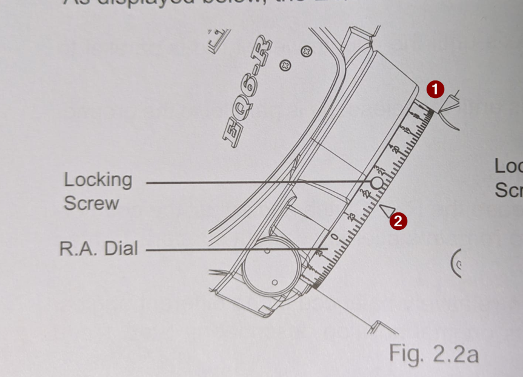

Il punto 1 è  il riferimento principale che viene usato per impostare la scala dell'ascensione retta (R.A. dial) 

Quando la montatura viene stazionato sul meridiano locale, qui inserisci l'orario del meridiano locale (ad esempio 23h) in corrispondenza del riferimento, ed è il punto che userai per azzerare o leggere la scala durante lo stazionamento e nell'uso normale della montatura.​

Il punto 2 invece serve come riferimento secondario, tipicamente ruotato di 90°, che corrisponde alla posizione in cui l'asse di ascensione retta è perpendicolare al meridiano locale. Questo riferimento è utile per alcune procedure di allineamento, ad esempio quando viene ruotato la montatura di 6 ore (90° rispetto al meridiano) per centrare la Polare nel reticolo del cannocchiale polare, o per verificare i movimenti dell'asse di R.A.. 
In molti casi, il secondo riferimento è utile nei controlli della meccanica e nei setup software, ma per l'impostazione della scala nel puntamento e nella stazionamento usi solo il riferimento principale (quello davanti a te, punto 1).​

In sintesi:

- Il riferimento sopra la montatura (punto 1) serve per impostare la scala di ascensione retta durante lo stazionamento sul meridiano locale.
    
- Il riferimento ruotato (punto 2) è un ausilio per movimenti di 90° (6h) sull'asse di R.A. e in procedure di controllo e verifica.
    

Posizionando l'orario del meridiano locale sul riferimento principale, la montatura viene prearata per il puntamento preciso degli oggetti celesti con le coordinate equatoriali. Il secondo riferimento ti torna utile solo in particolari procedure avanzate o di verifica.