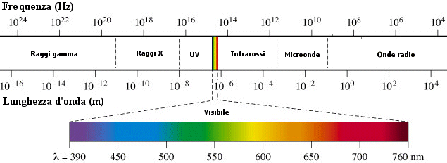
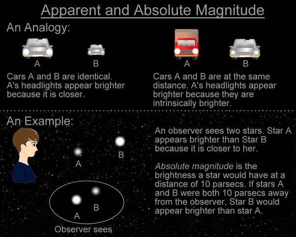
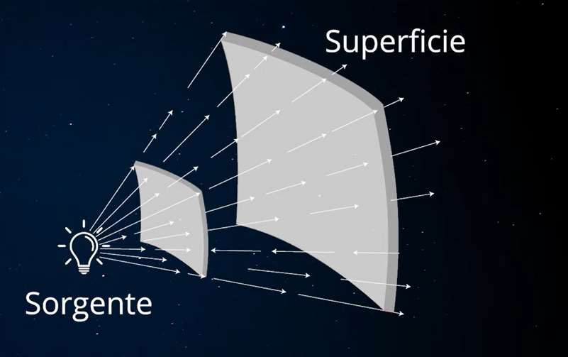
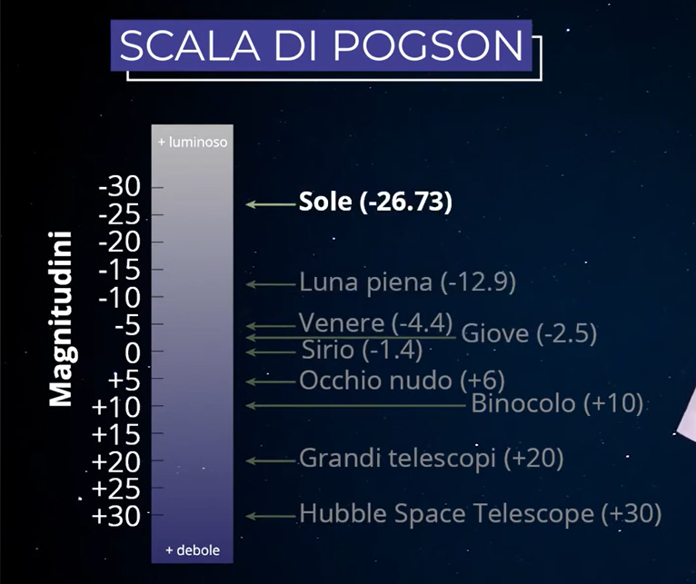

## 🗓️ Informazioni
- **Data creazione:** 2025-11-01 11:52
- **Ultima modifica:** 2025-11-01 11:52
- **Autore:** [[Modifiche Tiriolo Luca]] - Fonte : https://starwalk.space/it/news/what-is-magnitude-in-astronomy

---

Conoscendo la luminosità di un oggetto celeste, puoi determinare se questo oggetto è visibile o meno. 

- Ma come si misura effettivamente questa luminosità? 
- Quale misurazione viene utilizzata in quale caso? 

# Che cos'è la magnitudine?

In astronomia, **la magnitudine è una misura di quanto un oggetto appare luminoso o tenue nel cielo.** Abbiamo usato il termine “appare” perché la magnitudine non indica la luminosità reale dell’oggetto, ma quanto **appare** luminoso a un osservatore.

Non bisogna mai confondere la magnitudine con la **luminosità** (L) — la potenza totale della luce che un oggetto emette in tutte le direzioni ogni secondo.

Quando gli astronomi parlano di luminosità, specificano solitamente quale parte dello spettro luminoso stanno misurando. La luce è suddivisa in diverse regioni in base alla lunghezza d’onda, come ultravioletta (corta), blu o visibile (quella che l’occhio umano percepisce). Per misurazioni coerenti, gli astronomi utilizzano filtri standard che isolano queste lunghezze d’onda, noti come bande U, B e V (ultravioletta, blu e visiva). La banda V corrisponde approssimativamente alla sensibilità dell’occhio umano ed è la più usata.

**Se non diversamente indicato, tutti i valori di magnitudine si riferiscono alla banda V (visiva).**

## Magnitudine assoluta vs. magnitudine apparente

Gli astronomi distinguono due tipi principali di magnitudine: apparente e assoluta.

- **Magnitudine apparente** (m, spesso semplicemente “magnitudine” o _mag_) è la luminosità di un corpo celeste vista dalla Terra.
- **Magnitudine assoluta** (M) è la luminosità che un oggetto avrebbe se si trovasse a una distanza fissa di 10 parsec dalla Terra. Gli astronomi scelsero questa distanza perché era vicina alla media delle distanze stellari conosciute nel 1902. **Per pianeti e piccoli corpi del Sistema Solare si usa il simbolo H**, che rappresenta la luminosità che l’oggetto avrebbe se si trovasse a una unità astronomica (UA) sia dal Sole che dall’osservatore, completamente illuminato — cioè con Sole, oggetto e osservatore perfettamente allineati.

##### Formula di Pogson

L'equazione matematica della magnitudine apparente è attualmente definita dalla **formula di Pogson:**

==LA MAGNITUDINE APPARENTE DIPENDE DAL RAPPORTO DI FLUSSO DI LUMINOSITA' OVVERO DALLA LUMINOSITA'== 

$$m_2 - m_1 = -2.5 \log_{10}\left(\frac{F_2}{F_1}\right)$$

==IL FLUSSO DIPENDE DA QUALE APPARATO DI MISURA SCELGO, MENTRE IL RAPPORTO DEI FLUSSI NON DIPENDE DALL'APPARATO DI MISURA==

==VEGA è stella con magnitudine apparente uguale a ZERO==

==PER MISURARE IL FLUSSO INTRINSICO DI UNA STELLA, MISURO QUELLO DI VEGA E LO METTO NELLA FORMULA DI POGSON==

Di norma il **flusso** è misurato solo in un intervallo dello spettro elettromagnetico, per cui si riporta un’indicazione della lunghezza d’onda a cui è stata fatta la misura. Ad esempio il simbolo "mv" indica una misura nella banda "V" (centrata a λ = 5510 Å).

Poiché le stelle si comportano, con buona approssimazione, come dei corpi neri (un corpo ideale che assorbe tutta la radiazione incidente su di esso, vedi [[Corpo Nero]]) la loro luminosità è data dalla **formula di Stefan-Boltzmann**: 

==LA LUMINOSITA' DIPENDE DALLA TEMPERATURA E DALLA DIMENSIONE DEL CORPO== 
$$L=4πR^2σT^4$$

dove R è il raggio della stella, T la temperatura della fotosfera in gradi assoluti (K) e $$σ=5,67⋅10^{−8}Wm^{−2}K^{−4})$$ la costante di Stefan-Boltzmann:

È importante sottolineare che la magnitudine assoluta di un oggetto è misurata senza estinzione (o offuscamento) della sua luce dovuta all'assorbimento da parte della materia interstellare e della polvere cosmica.

Quindi, la magnitudine apparente dipende dalla luminosità intrinseca di un oggetto, dalla sua distanza e dall'estinzione che riduce la sua luminosità. La magnitudine assoluta ci permette di confrontare la luminosità intrinseca degli oggetti (in un dato spettro di riferimento) posizionando ipoteticamente tutti gli oggetti a una distanza di riferimento standard dall'osservatore.

#### **Magnitudine assoluta**

La **magnitudine assoluta** (M) di una stella (in generale di un corpo celeste) è definita come la magnitudine apparente che la stella avrebbe se si trovasse a una distanza di 10 parsec dall’osservatore. La magnitudine assoluta è una vera stima della luminosità; infatti una stella più luminosa di un’altra ha un valore di M più piccolo. 

Prendiamo il nostro ==Sole e Rigel==. 

Il Sole appare molto più luminoso di Rigel nel nostro cielo quindi la sua **magnitudine apparente** è maggiore (==magnitudine -26,8 e 0,18==, rispettivamente). 

Tuttavia, se posizionassimo sia il Sole che Rigel a ==10 parsec dalla Terra==, Rigel risulterebbe notevolmente più luminoso. 

==Questo perché la stella distante ha una **magnitudine assoluta** superiore: -7,8 contro 4,83 per il Sole.==
A 10 PARSEC
SOLE  --> 4,83
RIGEL --> -7,8

Ecco alcuni altri esempi:

- **Alpha Centauri**: M = 4,8
- **Canopo**:  M = -5,6
- **Deneb**:  M = -7,1
- **Nettuno**: m = 7,8 (media) vs M = -6,9 (in genere i pianeti vengono posti ad 1 parsec)

I valori di magnitudine apparente sono espressi come un numero senza unità; quando si vede qualcosa come "Antares ha una magnitudine di 1,09", significa che si intende la magnitudine apparente. Questo può essere scritto più concisamente come "Antares (mag 1,09)", "Antares (1,09 m)" o "Antares (m = 1,09)". Quando si fa riferimento a tipi di magnitudine diversi dall'apparente, gli astronomi specificano il tipo scrivendo il tipo di magnitudine con una frase o una lettera abbreviata: "Antares ha una magnitudine assoluta di -5,28" o "Antares (M = -5,28)". Utilizzano anche le lettere nelle formule.

A proposito, la **magnitudine apparente** può essere misurata sia a occhio nudo sia con strumenti, e può riferirsi alla luminosità in qualsiasi parte dello spettro (visivo, fotografico, ultravioletto, infrarosso, ecc.). In questo contesto, “apparente” significa “vista dalla posizione dell’osservatore, indipendentemente dallo strumento utilizzato”. Quando ci riferiamo specificamente alla luminosità percepita dall’occhio umano, usiamo il termine “magnitudine visiva”. Tuttavia, molte fonti popolari usano questi termini in modo intercambiabile, anche se non sono esattamente sinonimi.

### Magnitudine di una sorgente estesa

==M33 è molto più luminosa di M77, ma M77 è più facile da vedere perché la sua luce è concentrata in un'area più piccola.==

**Fatto interessante:** gli occhi sono migliori nel rilevare la luce da una fonte diffusa, o sparsa, (come le galassie) rispetto a una fonte puntiforme (come una stella).

Le relazioni sin qui fornite si riferiscono a oggetti puntiformi, come, data la loro grande distanza, possono essere considerate tutte le stelle.

La luminosità totale di una sorgente astronomica estesa, come ad esempio un pianeta, una galassia, un ammasso stellare o una cometa, sono espresse dalla loro **magnitudine integrata**, che si ricava a partire dalla magnitudine superficiale (**msup**), che indica la magnitudine di una porzione standard (di norma pari a  1 arcsec2) della sorgente estesa. Se un oggetto esteso ha msup uniforme, detta **A** la sua area (espressa nelle medesime unità dell’area a cui si riferisce la msup) avremo:

$$m_{integrata}=m_{sup}−2.5⋅\log{A}$$

Se un oggetto esteso e uno puntiforme hanno la stessa magnitudine, vuol dire che riceviamo da essi la stessa quantità totale di luce; tuttavia l’oggetto esteso sarà molto più difficile da osservare di quello puntiforme, poiché la sua luce è dispersa su un’area.

La magnitudine superficiale ci fornisce un’indicazione di quanto la sorgente estesa è facilmente osservabile in contrasto con la luminosità intrinseca del cielo.

La luminosità del cielo notturno allo Zenith nella banda V è  Vcielo ~21.9  mag/arcscec^2

#### Come sono distribuite le stelle per magnitudine?

Potresti aver notato che ci sono molte più stelle più deboli di quelle più luminose nel nostro cielo notturno. Ecco una suddivisione semplificata del numero di stelle per le loro magnitudini:

- **Magnitudine da –1,5 a –0,5**: 2 stelle
- **Magnitudine da –0,5 a 0,5**: 6 stelle
- **Magnitudine da 0,5 a 1,5**: 14 stelle
- **Magnitudine da 1,5 a 2,5**: 71 stelle
- **Magnitudine da 2,5 a 3,5**: 190 stelle
- **Magnitudine da 3,5 a 4,5**: 610 stelle
- **Magnitudine da 4,5 a 5,5**: 1.929 stelle
- **Magnitudine da 5,5 a 6,5**: 5.946 stelle

Da notare che questi numeri rappresentano tutte le stelle visibili a occhio nudo in tutto il cielo. Poiché possiamo vedere solo metà del cielo in un dato momento, il numero effettivo di stelle che puoi vedere in un momento è diverso.

[[Esercizio - Calcolo Luminosità Apparente]]

https://www.youtube.com/watch?v=IBDcWy7VtUo