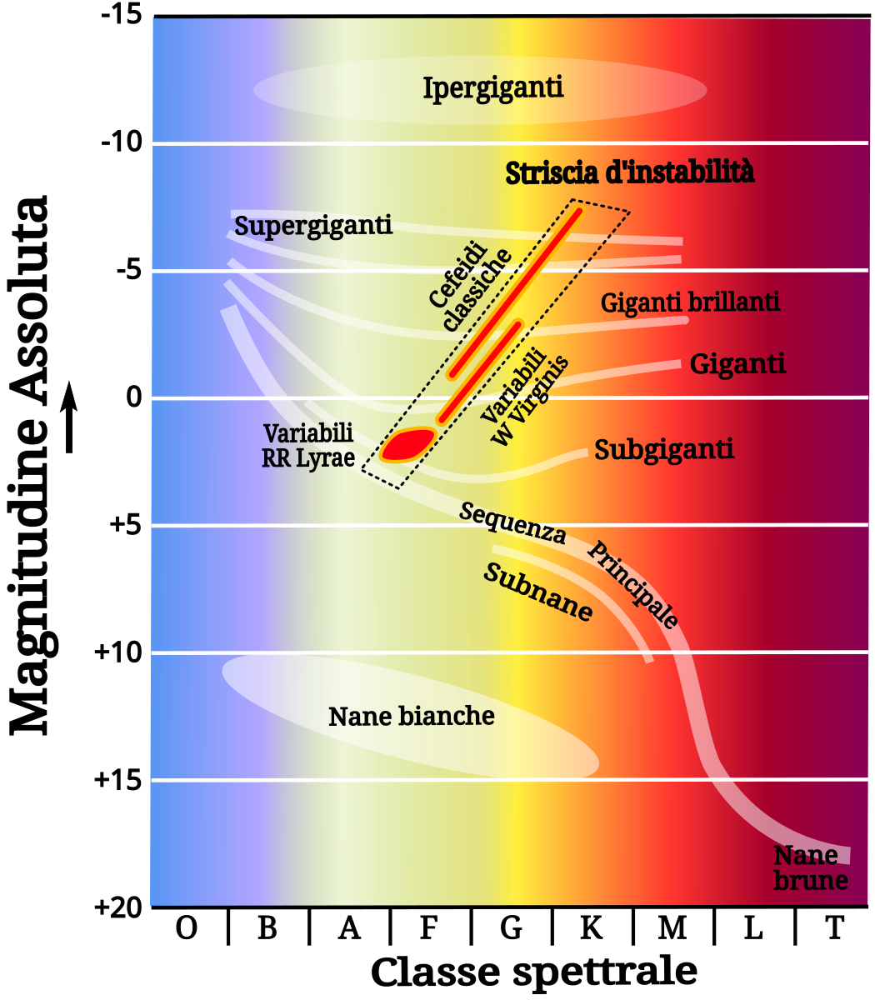

# Untitled

## 🗓️ Informazioni
- **Data creazione:** 2025-11-01 09:13
- **Ultima modifica:** 2025-11-01 09:13
- **Autore:** [[Tiriolo Luca]]

---

# Indice
- [[2.7 La misura delle distanze#Parallasse Trigonometrica]]
- [[2.7 La misura delle distanze#Il fitting della sequenza principale]]
- [[2.7 La misura delle distanze#Candele Standard]]
- [[2.7 La misura delle distanze#Relazione Tully Fisher]]

---

# Unità di misura delle distanze

1. Sistema Internazionale di Misura (metro, chilogrammo e secondo) vs Sistema CGS (centimetro, grammo e secondo)
2. Unità Astronomica (Distanza Terra - Sole) $$1,5 \cdot 10^{11} \ metri$$
3. Anno Luce (Distanza percorsa dalla luce in un anno) $$9 \cdot 10^{15} \ metri $$
4. Parsec $$3 \cdot 10^{16} \ metri$$

# Parallasse Trigonometrica

Misurare la luminosità intrinseca di una stella è legata alla sua distanza.

Uno dei compiti più difficile per un astronomo è definire le distanze.

Uno dei metodi più utilizzati è la parallasse trigonometrica

 Il metodo della parallasse trigonometrica è basato sul moto annuale apparente delle stelle causato dal moto orbitale della Terra. Con questo metodo possiamo misurare dalla Terra distanze fino a circa 30 pc;
 

$$d = \frac {d}{\tan p}$$
Approssimando
$$d \approx \frac {d}{ p°}$$

$$d = \frac {206.265}{ p''} AU$$

$$d = \frac {1}{ p''} pc$$

Dove

L' **Unità Astronomica** (AU) è la distanza media tra Terra e Sole

$$1 AU \approx 150\ milioni\ di\ metri \approx 1.5 \cdot 10^{11} \ m  $$

**Parsec** (parallax-second) è la distanza a cui guardo la distanza Terra Sole quando p è 1 secondo d'arco

$$1 pc \approx 30\ mila \ miliardi\ di\ metri \approx 3.0 \cdot 10^{16} \ m  $$

Un anno luce
$$1 ly \approx 9\ milioni \ di \ miliardi\ di\ metri \approx 9.0 \cdot 10^{15} \ m  $$

Perciò

- **1 parsec = 3.26 anni luce = 206 265 AU**
    
- **1 anno luce ≈ 63 241 AU ≈ 0.307 parsec**
    
- **1 AU ≈ 8,3 minuti luce** 

# Il fitting della sequenza principale

Confrontando la **sequenza principale** di un ammasso aperto a distanza nota (ad esempio le _Iadi_) nel diagramma _magnitudine assoluta – colore_, con la sequenza principale nel diagramma _magnitudine apparente – colore_ di un ammasso di cui **non si conosce la distanza**, si può risalire alla distanza di quest’ultimo.

La **quantità di spostamento verticale** necessaria per far coincidere le due sequenze principali è il **modulo di distanza** dell’ammasso aperto a distanza incognita, indicato con **M − m**.

---

### Formula

$$m - M = 5 \cdot \log \left( \frac{r}{10\ \text{pc}} \right) + A(r)$$

dove:

- *m* = magnitudine apparente
    
- *M* = magnitudine assoluta
    
- *r* = distanza in parsec
    
- *A(r)* = assorbimento interstellare lungo la linea di vista

# Candele Standard

- Cepheidi
- Supernovae
- GRB

Le **candele standard** (in inglese _standard candles_) sono oggetti astronomici la cui **luminosità assoluta è nota** o può essere determinata con grande precisione.  
Sapendo quanta luce **producono realmente**, possiamo confrontarla con quanta luce **riceviamo** sulla Terra.  
La differenza tra luminosità intrinseca e apparente permette di calcolare direttamente la **distanza**, grazie alla legge del flusso:

$$ \frac{L}{4\pi d^{2}}$$

dove

- $L$ = luminosità assoluta dell’oggetto,
    
- $F$ = flusso osservato,
    
- $d$ = distanza.
    

Questo concetto è centrale nella costruzione della **scala delle distanze cosmiche**, come discusso anche in testi standard di astrofisica.

## **1. Cefeidi**

Le stelle Cefeidi sono variabili pulsanti: la loro **luminosità assoluta è legata al loro periodo di pulsazione** (Legge periodo-luminosità di Leavitt).

$$M = a \log P + b$$

Sono eccellenti candele standard per distanze fino a decine di milioni di anni-luce.

## **2. Supernovae di tipo Ia**

Le supernovae Ia sono le **candele standard più potenti e importanti** nell’astrofisica moderna.  
Esplodono tutte con quasi la stessa luminosità assoluta perché raggiungono la massa limite di Chandrasekhar (~1.4 masse solari).

Sono visibili fino a miliardi di anni-luce e sono state fondamentali per scoprire l’**accelerazione dell’espansione dell’Universo**.

## **3. Stelle HB (ramo orizzontale) e RR Lyrae**

- Le **RR Lyrae** hanno luminosità molto costante → ottime candele standard nella Via Lattea e nelle galassie vicine.
    
- Le stelle del **ramo orizzontale** vengono usate in ammassi globulari e galassie nane.
    

## **4. Giganti rosse sulla “punta della RAMO RGB” (TRGB)**

La luminosità della punta del ramo delle giganti rosse è molto ben definita → ottima candela standard per galassie vicine.

# Relazione Tully Fisher

La relazione di Tully–Fisher (TFR) è una relazione empirica ampiamente verificata tra la massa o la luminosità intrinseca di una galassia a spirale e la sua velocità di rotazione asintotica o la larghezza della riga di emissione. Poiché la luminosità osservata di una galassia dipende dalla distanza, questa relazione può essere utilizzata per stimare le distanze delle galassie a partire dalle misure della loro velocità di rotazione

