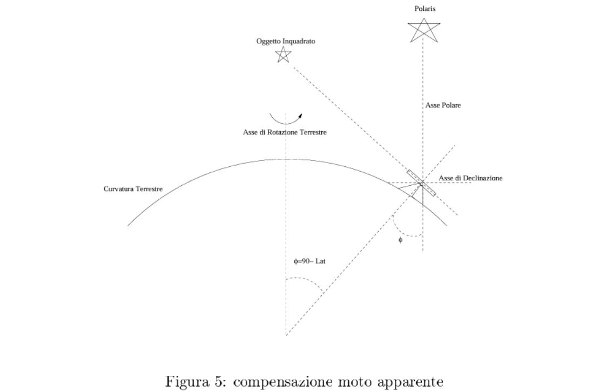
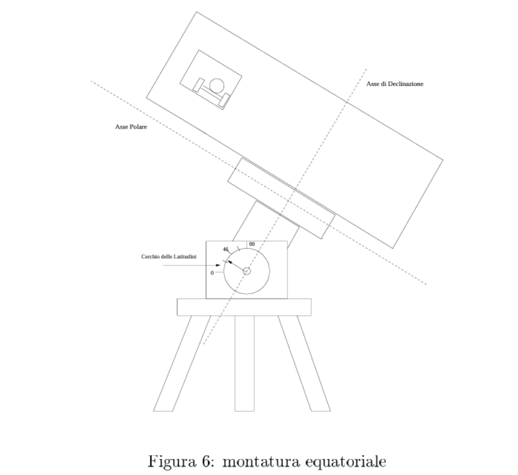
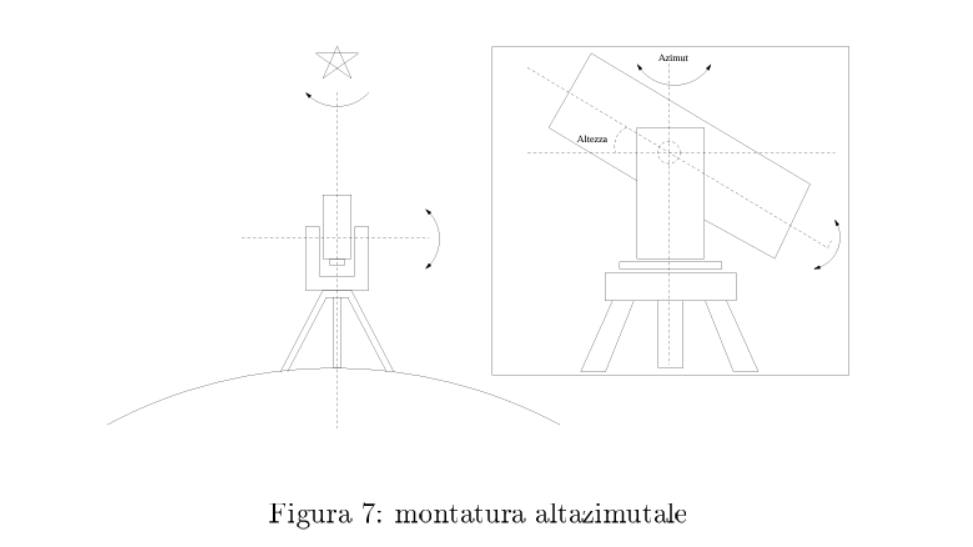

## 🗓️ Informazioni
- **Data creazione:** 2026-01-06 19:04
- **Ultima modifica:** 2026-01-06 19:04
- **Autore:** [[Tiriolo Luca]]

I telescopi devono poter essere puntati con facilità verso qualsiasi punto del cielo. Inoltre, per permettere l'osservazione di oggetti deboli, che richiedono esposizioni fotografiche molto lunghe, devono essere dotati di un movimento automatico che compensi il movimento apparente della sfera celeste. 
A questo scopo i telescopi sono dotati di opportune montature che permettono il movimento attorno a due assi tra loro perpendicolari. 
Le principali montature sono sostanzialmente di due tipi: **equatoriali** e **altazimutali**. 

Nel primo caso, i due assi sono detti asse polare e asse di declinazione: l'asse polare viene diretto parallelamente all'asse terrestre, mentre l'altro viene orientato sull'astro in esame. Una volta orientato correttamente l'asse di declinazione, per mantenere l'asse ottico del telescopio puntato sull'oggetto in esame, basta far ruotare il telescopio attorno all'asse polare con la stessa velocità di rotazione della Terra. 

Nelle montature altazimutali, un asse è orizzontale e l'altro è verticale, permettendo un movimento in altezza e in azimut (cioè parallelamente all'orizzonte). Questi telescopi hanno quindi bisogno di due movimenti per poter seguire le stelle, a differenza dei telescopi con montature equatoriali che hanno bisogno di un movimento soltanto. Il puntamento di un telescopio con montatura altazimutale risulta molto più complesso del puntamento di un telescopio equatoriale. Per questa ragione appena negli anni settanta lo sviluppo dell'informatica ha reso possibile la progettazione di montature altazimutali di precisione e grazie alla loro maggiore stabilità rispetto a quelle equatoriali è stata possibile la costruzione dei maggiori telescopi oggi a disposizione.

