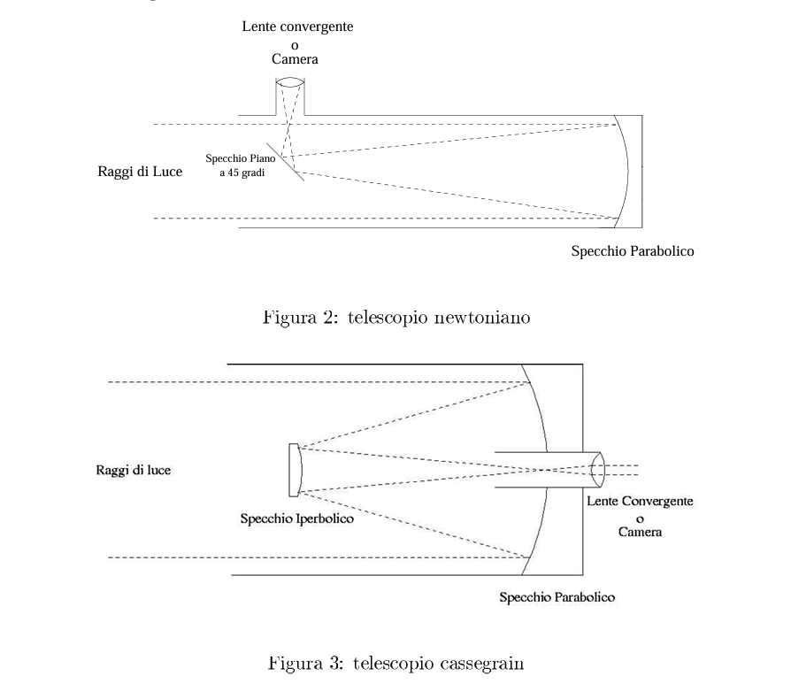

## 🗓️ Informazioni
- **Data creazione:** 2026-01-06 18:56
- **Ultima modifica:** 2026-01-06 18:57
- **Autore:** [[Tiriolo Luca]]

# Riflettori Newtoniani

Ha come obiettivo uno specchio concavo metallico che forma un'immagine degli oggetti posti all' infinito (come possono considerarsi gli oggetti astronomici) in corrispondenza del suo piano focale. 
Poiché uno specchio sferico presenta la cosiddetta **aberrazione sferica** (cioè i raggi non vengono messi a fuoco tutti esattamente nello stesso punto e questo produce un'immagine sfocata), l'obiettivo, nei telescopi newtoniani, è uno **specchio parabolico**, che non presenta questo tipo di aberrazione. I raggi riessi dallo specchio parabolico (primario) vengono deviati per mezzo di uno specchio piano (secondario), in modo che l'immagine degli oggetti osservati si formi al di fuori del tubo che sorregge lo specchio primario, in posizione comoda per l'osservazione.

# Riflettori Cassegrain

Uno schema ottico migliore di quello newtoniano è sicuramente quello del telescopio Cassegrain, in cui lo specchio primario è ancora parabolico e invece il secondario è convesso e di forma **iperbolica**. I raggi da esso riflessi vengono focalizzati in un punto dove si forma l'immagine degli oggetti osservati. Si hanno così due fuochi: il primo è quello fornito dallo specchio parabolico; il secondo è quello dove convergono i raggi dopo la riflessione sullo specchio iperbolico. I raggi luminosi escono da un foro nello specchio primario e così l'immagine può essere osservata comodamente con un oculare da dietro tale specchio. L'esempio più famoso di telescopio cassegrain è quello di Monte Palomar entrato in servizio nel 1948, che grazie ai suoi cinque metri di diametro per lungo tempo è stato il più grande telescopio al mondo. Più recentemente è stato introdotto un nuovo sistema ottico, il RitcheyChretien, che con degli specchi leggermente modificati rispetto allo schema Cassegrain riesce a compensare le aberrazioni e a fornire delle immagini di qualità superiore. Per questo motivo tutti i più grandi telescopi attualmente in uso, compreso quello spaziale, sono stati costruiti secondo questo schema.