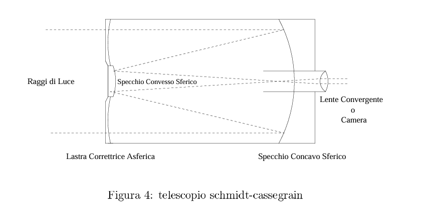

## 🗓️ Informazioni
- **Data creazione:** 2026-01-06 19:01
- **Ultima modifica:** 2026-01-06 19:01
- **Autore:** [[Tiriolo Luca]]

I telescopi con specchi principali parabolici hanno il vantaggio di avere una buona correzione dell'aberrazione sferica assiale, ma lo svantaggio di presentare forti aberrazioni extrassiali. I telescopi Schmidt risolvono questo problema utilizzando uno specchio principale sferico, ma facendo passare la luce attraverso una lastra di forma opportuna per correggere l'aberrazione sferica. Il telescopio catadiottrico più famoso è senz'altro lo Schmidt-Cassegrain, composto da uno specchio primario sferico e da un secondario sferico convesso inserito in una lastra correttrice posta all'imboccatura del tubo. L'immagine si forma posteriormente al tubo, dietro un foro praticato al centro dello specchio primario.

