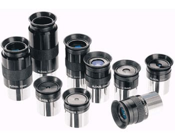

## 🗓️ Informazioni
- **Data creazione:** 2026-01-06 18:42
- **Ultima modifica:** 2026-01-06 18:42
- **Autore:** [[Tiriolo Luca]]

L'obiettivo produce nel suo piano focale una immagine reale piccola e capovolta, che per poter essere osservata deve essere ingrandita. Questo è infatti lo scopo dell'altro elemento ottico fondamentale del telescopio, chiamato oculare proprio perché consente l'osservazione visuale degli oggetti astronomici inquadrati dal telescopio. I parametri fondamentali che lo caratterizzano sono: 
-  La sua **lunghezza focale**. Ogni oculare ha una propria lunghezza focale, come l'obiettivo del telescopio. La combinazione di un oculare con una determinata lunghezza focale ad un obiettivo con la propria lunghezza focale determina l'ingrandimento complessivo del sistema, secondo la relazione $I = f′ f′′$ , dove I è l'ingrandimento, $f′$ è la focale dell'obiettivo e $f′$′ è la focale dell'oculare. Diminuendo la focale dell'oculare aumentano gli ingrandimenti ottenuti e perciò l'ingrandimento non dipende dal diametro dell'obiettivo, ma solo dalla sua focale. In realtà esiste un limite sino al massimo ingrandimento realmente utilizzabile perché aumentando la scala a cui viene vista l'immagine fornita dall'obiettivo, questa si fa via via meno luminosa e meno nitida. 
- L'**estrazione pupillare.** Rappresenta la distanza alla quale deve essere posto l'occhio dell'osservatore dall'oculare per vedere l'intero campo di vista a fuoco. Dipende dalle caratteristiche costruttive dell'oculare stesso, ed è direttamente proporzionale alla sua lunghezza focale, per cui si riduce al crescere degli ingrandimenti totali. 
- Il **campo di vista**. Esistono due concetti legati tra loro, ovvero il campo reale ed il campo apparente. Il campo reale è la dimensione angolare della porzione di cielo visibile nell'oculare applicato al telescopio. Il campo apparente è invece il diametro angolare in gradi del cerchio di luce visibile dall'occhio, ed è fissato dalle caratteristiche costruttive dell'oculare stesso, indipendentemente dal campo reale.

