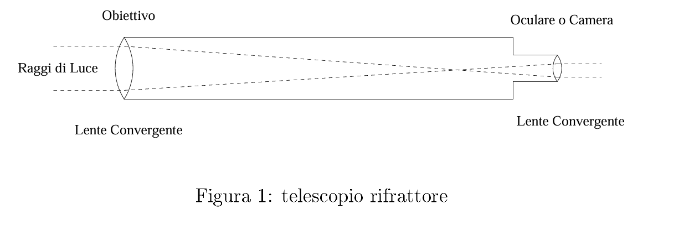

## 🗓️ Informazioni
- **Data creazione:** 2026-01-06 18:52
- **Ultima modifica:** 2026-01-06 18:52
- **Autore:** [[Tiriolo Luca]]

Il rifrattore usa il principio ottico della rifrazione della luce. L'obiettivo è costituito da una lente che costituise un sistema ottico convergente in grado di creare un immagine dell'oggetto inquadrato in corrispondenza del piano focale. Quando si introduce la legge di Snell per la rifrazione della luce2 si da per scontato che questa legge sia la stessa indipendentemente dalla lunghezza d'onda della luce incidente. In realtà lunghezze d'onda diverse, e quindi raggi di luce di colori diversi, vengono deviati in misura differente e quindi focalizzati in punti diversi. In pratica una lente non ha un solo fuoco, ma una serie di fuochi per le varie lunghezze d'onda e tale situazione genera un difetto nell'immagine, che viene chiamato aberrazione cromatica. In pratica osservando una stella si vede che le sue componenti cromatiche vengono focalizzate in punti diversi dando origine ad un'immagine sfrangiata in cui si possono riconoscere i colori dell'arcobaleno. Per ovviare a questo difetto sono stati ideati schemi ottici più sofisticati in cui si fa spesso ricorso ad un sistema di due o più lenti appositamente disegnate, che permettono di ridurre notevolmente l'e etto dell'aberrazione cromatica.

