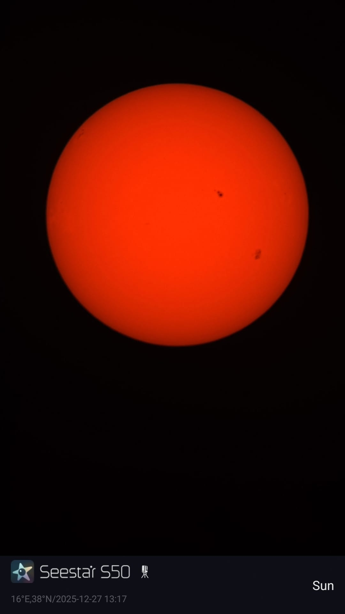

# Il Sole in 5 minuti

## Cos’è il Sole

Il Sole è una **stella**, cioè una gigantesca sfera di gas caldissimo. Per noi è speciale non perché sia unica nell’universo, ma perché è la **stella più vicina** e quindi possiamo studiarla meglio di tutte le altre.

> [!tip] Idea semplice
> Il Sole è il “motore energetico” del Sistema Solare.

## Perché è importante

Senza il Sole non avremmo:
- luce diurna,
- gran parte dell’energia che alimenta il clima terrestre,
- fotosintesi,
- condizioni favorevoli alla vita come la conosciamo.

## Cosa vediamo a occhio nudo

A occhio nudo il Sole sembra:
- un disco molto brillante,
- stabile,
- uniforme.

In realtà non è affatto uniforme:
- ha macchie,
- ruota,
- ha un campo magnetico,
- lancia materia nello spazio,
- attraversa periodi di maggiore e minore attività.

## Le 4 idee base da ricordare

### 1. Il Sole produce energia nel suo interno
Nel nucleo, l’idrogeno viene trasformato in elio. Questa è la sorgente di energia del Sole.

### 2. L’energia impiega tantissimo tempo a uscire
L’energia prodotta all’interno non arriva subito fuori: attraversa strati differenti del Sole prima di emergere.

### 3. La parte visibile è solo uno “strato”
Quello che chiamiamo “superficie” è in realtà la **fotosfera**, cioè lo strato da cui ci arriva la maggior parte della luce visibile.

### 4. Il Sole è magneticamente attivo
Macchie solari, brillamenti e altre strutture dipendono soprattutto dal suo campo magnetico.

> Il Sole ci sembra semplice solo perché lo vediamo come un disco accecante. In realtà è una stella complessa, dinamica e in continuo cambiamento.
