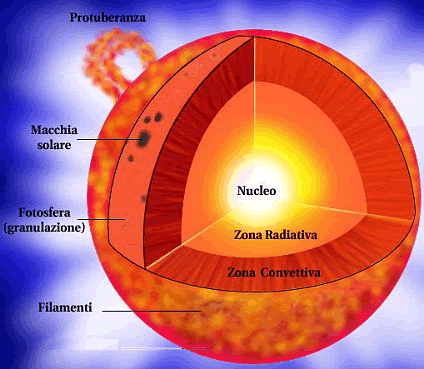
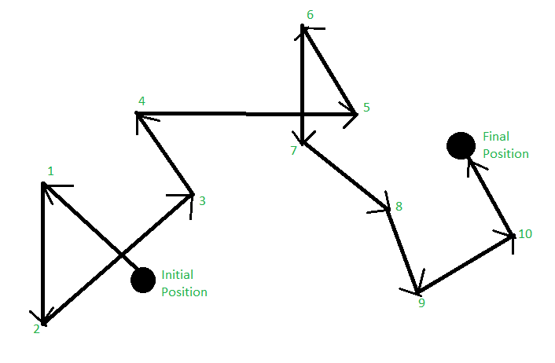

# Struttura interna del Sole

## Visione d’insieme

Per capire il Sole, conviene dividerlo in tre grandi zone:
- **nucleo**,
- **zona radiativa**,
- **zona convettiva**.

## 1. Nucleo

Il nucleo è la parte più interna del Sole.

Qui:
- temperatura e pressione sono enormi,
- si produce l’energia del Sole,
- l’idrogeno viene trasformato in elio.

> [!important] Idea chiave
> Il Sole splende perché nel suo interno avvengono reazioni nucleari.

Nel nucleo gli atomi di idrogeno vengono “spinti” a unirsi e il risultato finale è la formazione di elio con liberazione di energia.

## 2. Zona radiativa

Dopo il nucleo, l’energia attraversa la **zona radiativa**.

Qui l’energia si sposta soprattutto sotto forma di radiazione.

## 3. Zona convettiva

Nella parte più esterna dell’interno solare troviamo la **zona convettiva**.

Qui il gas caldo:
- sale verso l’alto,
- si raffredda,
- poi ridiscende.

È un movimento simile a quello dell’acqua che bolle in una pentola.

- il **gas caldo che sale** = acqua calda che sale,
- il **gas più freddo che scende** = acqua che ridiscende.

## Perché è importante

La convezione lascia tracce visibili in superficie, per esempio la **granulazione**, cioè quella trama a piccole celle che vediamo nella fotosfera con immagini ad alta risoluzione.

> Il Sole non è fermo: al suo interno l’energia viene prodotta, trasportata e rimescolata continuamente.

## Mini schema da ricordare

```text
Nucleo -> produce energia
Zona radiativa -> l’energia attraversa lentamente il Sole
Zona convettiva -> il gas caldo sale e il gas più freddo scende
```

L’energia del Sole nasce nel **nucleo**, nella regione più interna, e poi deve attraversare due grandi zone: prima la **zona radiativa**, poi la **zona convettiva**, che nel Sole attuale inizia circa a **0,714 raggi solari**. Questo significa che l’energia non passa dal centro alla superficie in modo diretto: deve compiere un viaggio lunghissimo attraverso materia densissima e opaca.



Nella **zona radiativa** l’energia si sposta soprattutto sotto forma di radiazione, ma non come un raggio laser che corre dritto verso l’esterno. I fotoni vengono continuamente **assorbiti e riemessi** (o diffusi) dal plasma, cambiando direzione di continuo: è il cosiddetto **random walk**, cioè un “cammino a zig-zag”. Per questo motivo la loro avanzata verso l’esterno è lentissima. La convezione comincia solo più fuori, quando la radiazione non riesce più a trasportare energia in modo efficiente.


La **convezione** entra in gioco quando il gradiente di temperatura reale diventa più ripido di quello adiabatico [[Gradiente adiabatico e reale]]. In forma semplice, il criterio è:

$$  
\left|\frac{dT}{dr}\right|_{\text{act}} >  
\left|\frac{dT}{dr}\right|_{\text{ad}}  
$$


In parole povere: se la temperatura cala troppo rapidamente verso l’esterno, il gas caldo sotto diventa galleggiante, sale, e il gas più freddo scende. A quel punto l’energia non viene più trasportata soprattutto dai fotoni, ma dal **movimento del plasma stesso**.

**Formula del trasporto convettivo** che sia corretta ma ancora leggibile, userei questa:

$$  
F_{\text{conv}} \approx \rho, c_P, \langle v_r ,\Delta T \rangle  
$$

dove:
- ($F_{\text{conv}}$) è il flusso di energia trasportato dalla convezione,    
- ($\rho$) è la densità del gas,    
- ($c_P$) è il calore specifico a pressione costante,    
- ($v_r$) è la velocità verticale media delle celle convettive,    
- ($\Delta T$) è quanto una bolla di gas è più calda o più fredda dell’ambiente circostante.
    

Il significato fisico è molto intuitivo: **più materiale caldo sale velocemente, e più è diverso in temperatura dall’ambiente, più energia trasporta verso l’alto**. 

**Mixing-length theory** il flusso convettivo cresce circa come

$$  
F_{\text{conv}} \propto (\nabla - \nabla_{\text{ad}})^{3/2}  
$$

cioè aumenta molto rapidamente appena il gradiente reale supera quello adiabatico. Questo spiega perché, nella maggior parte della zona convettiva solare, la convezione è estremamente efficiente.


### Quanto tempo impiega davvero un fotone a uscire dal centro del Sole?

Qui conviene essere molto preciso: **non è del tutto corretto immaginare “lo stesso fotone” che parte dal centro e arriva in superficie**, perché nel plasma solare i fotoni vengono continuamente assorbiti e riemessi. Quindi, più che del viaggio del “singolo fotone”, è meglio parlare del **tempo con cui l’energia riesce a diffondere verso l’esterno**.

Le stime che si trovano in letteratura **non sono tutte uguali**. Una stima semplice da random walk, usando valori medi del Sole, dà circa **3 × 10^4 anni**. NASA riassume il fenomeno dicendo che i fotoni impiegano **decine di migliaia di anni** a raggiungere la superficie. Un calcolo più raffinato citato in letteratura astronomica porta invece a circa **1,7 × 10^5 anni**, cioè **170.000 anni**, per il Sole attuale. Altri testi di struttura stellare riportano perfino un ordine di grandezza di **10^7 anni** quando ragionano in termini più globali di trasporto radiativo/riaggiustamento termico dell’energia interna: è una delle ragioni per cui online si trovano numeri diversi.

**“L’energia prodotta nel centro del Sole non esce subito: nel suo interno viene continuamente rimbalzata, assorbita e riemessa. Per arrivare in superficie impiega almeno decine di migliaia di anni, probabilmente dell’ordine di centinaia di migliaia. Una volta uscita dalla superficie, però, la luce arriva alla Terra in circa 8 minuti.”** 

