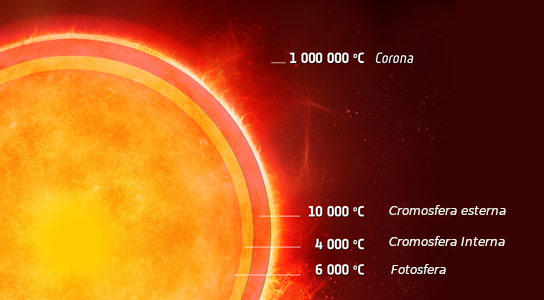
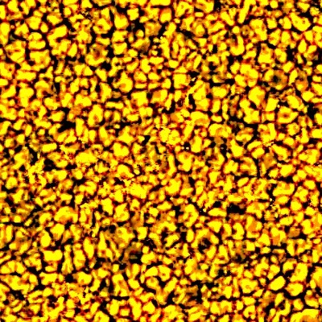
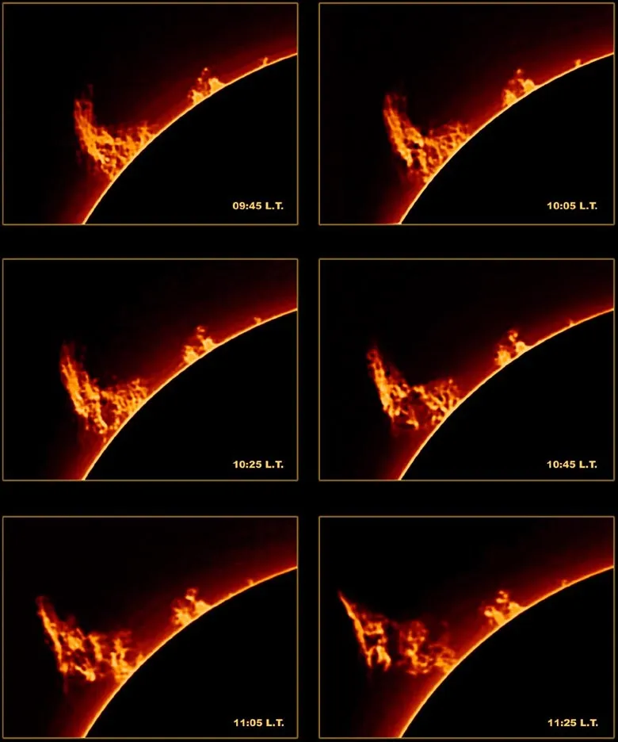
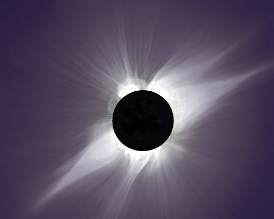

# Atmosfera del Sole

## Prima idea importante

Il Sole **non ha una superficie solida** come un pianeta roccioso.

Quello che vediamo normalmente è la **fotosfera**, cioè lo strato da cui proviene gran parte della luce visibile.

## I principali strati dell’atmosfera solare

- **Fotosfera**
- **Cromosfera**
- **Regione di transizione**
- **Corona**



---

### Temperature degli strati esterni del Sole

Quando diciamo che la **superficie del Sole** è a circa **5777 K**, in realtà stiamo parlando della sua **temperatura efficace**, cioè della temperatura media del disco visibile che emette la maggior parte della luce che osserviamo.

Per dirlo in modo semplice a lezione:

- **Fotosfera**: circa **5777 K** come **temperatura efficace** del Sole, cioè la temperatura del “disco visibile” nel suo insieme. Se guardi il gas della fotosfera in dettaglio, scende da circa **6500 K** alla base fino a circa **4400 K** nella parte alta.
   
- **Cromosfera**: sopra la fotosfera la temperatura torna a salire. Nel tuo PDF va da circa **4400 K a 10.000 K**; fonti NASA la descrivono spesso come una regione che sale fino a circa **20.000 °C** nella parte alta. Non è una contraddizione: dipende da dove misuri e da come definisci il confine alto della cromosfera rispetto alla regione di transizione.

- **Corona**: tipicamente è dell’ordine di **1-2 milioni di K**, ma in regioni attive può essere anche più calda. Il tuo PDF parla di temperature che **superano 10^6 K**; NASA riporta valori fino a circa **2 milioni di °C** come tipici e anche più alti in certe strutture.

 **5770 K non è “la temperatura massima possibile sopra la superficie”**, ma è la temperatura efficace della **fotosfera**, cioè dello strato da cui ci arriva la maggior parte della luce visibile. Sopra la fotosfera, il plasma non è riscaldato solo “per contatto” con lo strato sotto, ma riceve energia anche in altri modi.

Il riscaldamento degli strati alti è legato a due famiglie di processi. 
La prima sono i **moti convettivi** sotto la superficie: il ribollire del plasma genera **onde** che risalgono verso l’alto; quando diventano intense, possono trasformarsi in **onde d’urto** e depositare energia, riscaldando cromosfera e strati superiori.
La seconda è il **campo magnetico**: nel plasma solare il magnetismo può trasportare energia attraverso **onde di Alfvén/MHD** e liberarla tramite correnti e dissipazione.

Per la **corona**, oggi la spiegazione più accettata è che il riscaldamento derivi soprattutto da **processi magnetici**, ma il dettaglio preciso è ancora un problema aperto della fisica solare. Le due idee principali sono:

1. **onde magnetiche/Alfvén** che portano energia verso l’alto e poi la dissipano;
    
2. **riconnessione magnetica** su piccola scala, cioè minuscoli rilasci improvvisi di energia magnetica.  
    Le missioni moderne, come **Parker Solar Probe** e **Solar Orbiter**, stanno proprio cercando di capire quanto pesa ciascun meccanismo.
    
**La corona è caldissima ma rarissima**. “Temperatura alta” significa che **ogni particella** ha molta energia media, non che ci sia tantissima materia o tantissima luce. Infatti la corona, pur essendo molto più calda della fotosfera, è molto più **tenue** e molto meno luminosa; la sua emissione totale è circa **un milione di volte meno intensa** di quella della fotosfera. Quindi non c’è contraddizione: è un gas estremamente caldo, ma molto poco denso.


## 1. Fotosfera

È la parte che vediamo normalmente come “disco solare”.
Quando si osserva direttamente il Sole ad occhio nudo, la fotosfera ci appare liscia ed uniforme. Ma basta un piccolo telescopio, anche amatoriale (**Attenzione ad oscurare l'oculare utilizzando un filtro solare! Si rischiano gravi danni alla vista!**), o meglio la proiezione dell'immagine ingrandita su uno schermo, per accorgersi che la fotosfera possiede una struttura fine. Essa appare formata da una moltitudine di granuli brillanti, separati da spazi più scuri; a questa struttura si dà il nome di **granulazione**.




Le dimensioni dei granuli sono dell'ordine di 700 km. Nei granuli la materia risale e nelle zone circostanti discende. La velocità di questi moti varia da 1 a 2 km/sec.  
Per questo motivo si pensa che la granulazione sia la manifestazione superficiale della zona convettiva sotto la fotosfera solare.  
Ciascun granulo _esiste_ in media per un tempo che va da 5 a 10 minuti, dopo il quale esso si decompone per cedere il posto ad un altro granulo.  
La fotosfera, sotto questo aspetto, sembra una caldaia di riso in ebollizione; da qui il nome di _grani di riso_ dato anche ai granuli.
### Cosa si osserva
- granuli,
- macchie solari,
- bordo del disco ben definito.

### Granulazione
La fotosfera mostra una specie di trama granulosa.

Questi granuli sono la manifestazione visibile della convezione che arriva quasi in superficie:
- le zone più chiare corrispondono a gas caldo che sale,
- le zone più scure a gas un po’ più freddo che scende.

> [!tip] Formula parlata
> La fotosfera è il “volto visibile” del Sole.

---

## 2. Cromosfera

È lo strato sopra la fotosfera.

Normalmente è difficile da osservare in luce bianca, ma può mostrarsi bene in particolari lunghezze d’onda, soprattutto in **H-alfa**.

La cromosfera si estende da circa 500 a circa 2000 km di altezza. Il nostro termometro da viaggio segna che la temperatura del gas aumenta fino a circa una decina di migliaia di gradi. Una teoria che potrebbe spiegare questo aumento di temperatura è che le spicole siano strutture associate a campi magnetici attraverso i quali si incanala l’energia proveniente dal basso.

Ma i fenomeni più interessanti e spettacolari che possiamo osservare in questa regione dell’atmosfera sono senza dubbio le **protuberanze solari**. Si tratta di enormi getti di gas che si innalzano per migliaia di chilometri, fino ad inoltrarsi nella corona solare. Quando la gravità del sole riesce ad attrarli nuovamente a sé tali getti ricadono verso il basso formando una struttura arcuata i cui piedi affondano saldamente nella fotosfera. Se osservate con opportuni filtri, queste strutture sono visibili sul disco solare anche in assenza di eclissi e appaiono come _filamenti_ scuri, giacché il gas che le costituisce è più freddo di quello circostante.



### Cosa si può vedere
- protuberanze sul bordo,
- strutture filamentose,
- regioni attive,
- spicole.

### Colore e nome
Il nome cromosfera significa “sfera colorata”, perché durante le eclissi totali può apparire come un sottile bordo rossastro.

---

## 3. Regione di transizione

È una fascia molto sottile tra cromosfera e corona.

Qui succede una cosa sorprendente: la temperatura aumenta molto rapidamente.

> Di solito si pensa che andando lontano dalla “superficie” tutto debba raffreddarsi. Nel Sole non è così.

---

## 4. Corona

La corona solare si estende, oltre la cromosfera, fino a distanze di milioni di chilometri ed è costituita da un gas estremamente rarefatto, qualche milionesimo di microgrammo per centimetro cubo. Questo spiega il fatto che essa non sia normalmente visibile, così come invece lo è la fotosfera, ma appare in tutto il suo splendore solo durante le eclissi totali di Sole, con una luminosità circa uguale a quella della Luna piena.

La temperatura della corona solare è di qualche milione di gradi. Questo fatto comporta un elevatissimo grado di ionizzazione del gas che è quindi un plasma. I gas ionizzati della corona solare subiscono fortemente l'influsso dei campi magnetici solari, sia di quello globale, sia di quello molto intenso associato alle **macchie solari** .
La conseguenza è che la forma della corona e la sua estensione possono cambiare fortemente in concomitanza con l'attività solare
_con il Sole attivo si presenta di forma circolare e simmetrica, mentre è fortemente asimmetrica nei periodi di Sole calmo_.  
Nei periodi di intensa attività solare la corona solare è sede di protuberanze.

Conseguenza dell'alta temperatura è la straordinaria estensione della corona, che per questo motivo tende ad espandersi, anche se si mantiene in una sorta di equilibrio dinamico. Nonostante l'espansione sia continua, la densità è mantenuta costante nel suo insieme da un flusso continuo di particelle provenienti dal Sole, in prevalenza protoni ed elettroni, che danno luogo al vento solare.
La corona solare presenta molti enigmi non ancora del tutto risolti. Uno di questi è dato dalla sorgente di energia che causa il riscaldamento della corona ad una temperatura estremamente più elevata di quella fotosferica, che si trova al suo interno. Molte teorie in proposito sono state formulate, alcune convincenti ed in accordo con i dati sperimentali, ma il problema è lungi dall'essere stato risolto.

### Quando si vede bene
- durante un’eclissi totale di Sole,
- con strumenti speciali,
- in ultravioletto e raggi X.


_**Immagine cortesia [Steve Albers](http://laps.fsl.noaa.gov/cgi/albers.homepage.cgi), Dennis DiCicco e Gary Emerson.**_
### Aspetto
La corona appare tenue, estesa, irregolare e molto dinamica.

### Fatto sorprendente
Pur essendo molto rarefatta, la corona ha temperature elevatissime.

## Coronal holes e vento solare

Nella corona esistono zone più scure chiamate **buchi coronali**.

Da queste regioni partono più facilmente flussi di particelle che alimentano il **vento solare**.

## Mini schema da ricordare

```text
Fotosfera -> ciò che vediamo normalmente
Cromosfera -> strato superiore, ben osservabile in H-alfa
Regione di transizione -> salto rapido di temperatura
Corona -> atmosfera esterna, tenue e molto calda
```


