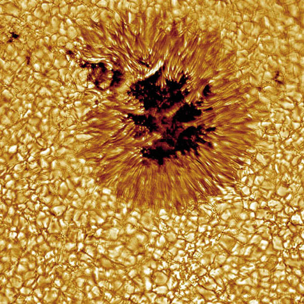
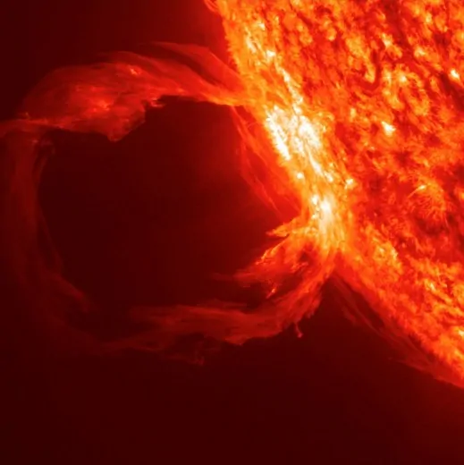
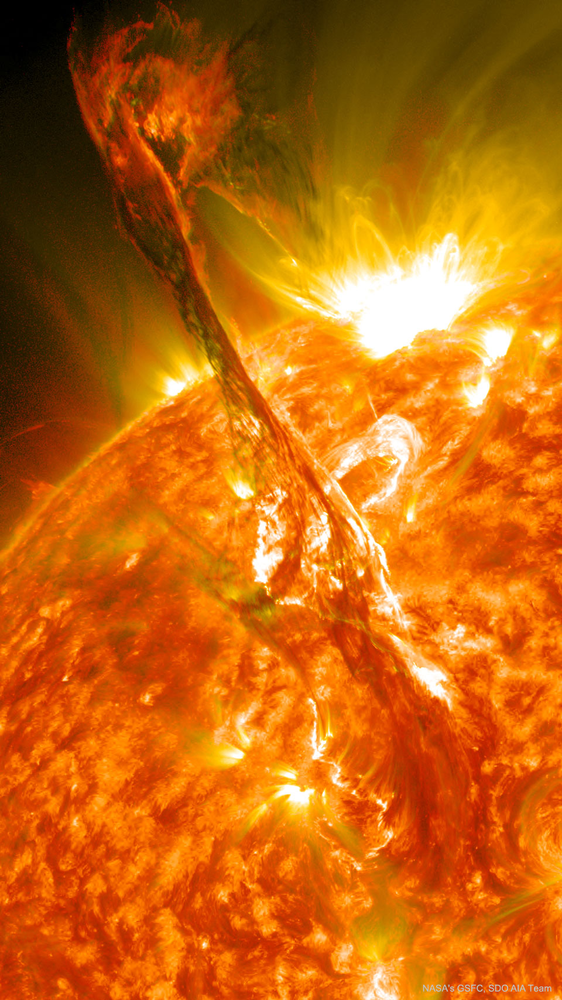
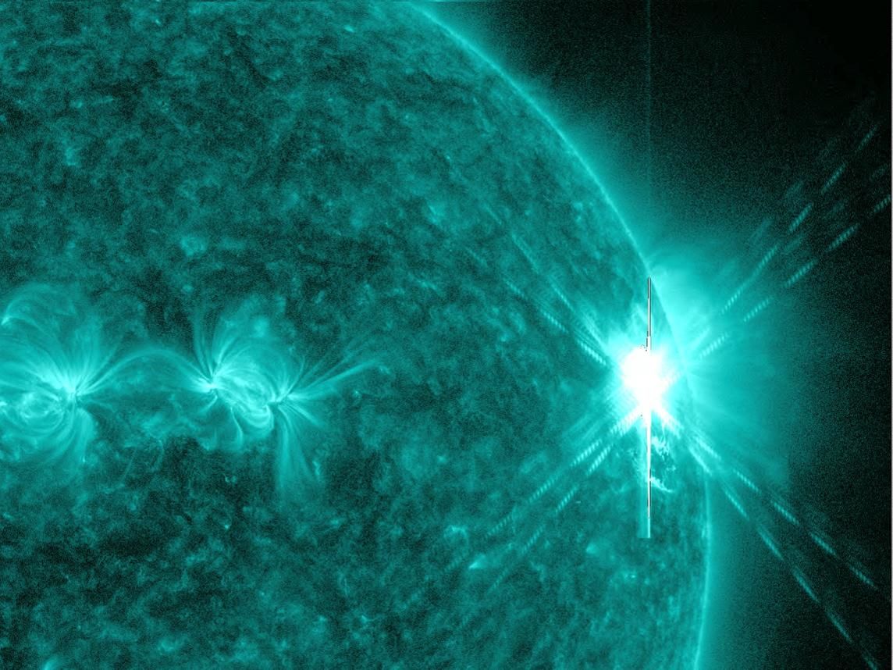

# Attività solare e ciclo

## Il Sole non è sempre uguale

L’attività del Sole cambia nel tempo.

Ci sono periodi con:
- poche macchie,
- meno fenomeni violenti,
- corona più semplice.

E periodi con:
- molte macchie,
- più brillamenti,
- più espulsioni di materia,
- corona più complessa.

## Le macchie solari

Le macchie solari sono regioni più scure della fotosfera. Furono scoperte da Galileo Galilei nel 1610.  
Una macchia compare inizialmente sul disco solare sotto forma di un minuscolo poro, appena percettibile. Nello spazio di pochi giorni i pori si sviluppano, proliferano, si allargano, si fondono insieme, dando luogo a gruppi di macchie, i quali in un periodo di circa un mese si dissolvono per far posto ad altri gruppi.  
Il fenomeno della comparsa di macchie sulla fotosfera solare ha carattere di periodicità e prende il nome di **ciclo delle macchie**.

Le macchie solari rappresentano dettagli ben identificabili sulla fotosfera, seguendo i quali nel tempo si ha l'evidenza della rotazione del Sole intorno ad un asse polare.

Il Sole non ruota come un corpo solido, ma il periodo di rotazione aumenta andando verso i poli (rotazione differenziale). **Esso è di circa 32 giorni in vicinanza dei poli** e di circa **27 giorni in vicinanza dell'equatore solare**.

Nei gruppi di macchie si distinguono una macchia di testa e una macchia di coda, nel senso della rotazione solare. Una tipica macchia solare è costituita da un'area grossolanamente circolare oscura, detta ombra, circondata da una zona grigiastra, detta penombra, con una caratteristica struttura radiale.

Le macchie più grandi possono avere un diametro di alcune decine di migliaia di chilometri. Una grande macchia solare può quindi contenere comodamente al suo interno la Terra.

**Le osservazioni consentono di affermare che le macchie sono sedi di vere e proprie aree cicloniche, simili (ma su scala infinitamente più grande) a trombe d'aria**, che succhiano il materiale dagli strati immediatamente inferiori della fotosfera e lo proiettano in alto con moto vorticoso, raffreddandolo. Un dato importante che riguarda le macchie è quello del forte campo magnetico associato ad esse, fino a qualche migliaio di gauss. I campi magnetici delle macchie di testa e delle macchie di coda hanno sempre polarità magnetica opposta.

Cortesia Coelum Astronomia.

### Perché sono scure
Non sono “buchi”.
Semplicemente sono **più fredde** delle zone circostanti e quindi appaiono più scure per contrasto.

### Cosa indicano davvero
Le macchie sono il segno visibile di **campi magnetici intensi**.

> [!important]
> Quando parliamo di attività solare, quasi sempre stiamo parlando anche di magnetismo.

## Il ciclo di circa 11 anni

Il numero di macchie solari cresce e diminuisce con una periodicità media di circa **11 anni**.

- **minimo solare** = poche macchie,
- **massimo solare** = molte macchie e più attività.

## In realtà c’è anche un ciclo magnetico di 22 anni (Ciclo di Hale)

Ogni 11 anni il Sole inverte la propria polarità magnetica globale.

Per tornare alla configurazione iniziale servono quindi circa **22 anni**.

Attualmente, ==il Sole si trova nella fase di **massimo del Ciclo Solare 25**==, un periodo di intensa attività magnetica iniziato nel 2020 e che ha raggiunto il suo picco tra la fine del 2024 e il 2025. 
Ecco i punti chiave dell'attività solare odierna (aggiornati ai dati del 2025-2026):
- **Massimo Solare:** L'attività solare è elevata, con un alto numero di macchie solari e brillamenti, in linea con le previsioni che indicavano un picco nel 2024-2025.
- **Intensa Attività Magnetica:** Si osservano frequenti brillamenti di classe M e X (le più potenti), che indicano campi magnetici complessi e attivi, in particolare nell'emisfero sud.
- **Tempeste Geomagnetiche:** L'elevata attività produce espulsioni di massa coronale (CME) che, dirette verso la Terra, causano tempeste geomagnetiche, talvolta in grado di generare aurore boreali a latitudini insolite.
- **Inversione dei Poli:** Secondo i dati recenti, i poli magnetici del Sole si stanno invertendo, un fenomeno tipico del massimo solare in cui il campo magnetico si inverte ogni 11 anni circa.
- **Ciclo più intenso del previsto:** Il Ciclo 25 si sta dimostrando più attivo di quanto ipotizzato inizialmente, portando a una maggiore frequenza di eventi intensi.

# Ciclo di Gleissberg
Il **ciclo di Gleissberg** è una **modulazione lenta dell’attività solare**: in pratica, l’ampiezza dei normali cicli solari di circa **11 anni** non resta sempre uguale, ma tende a crescere e diminuire su una scala di circa **70–100 anni**. È spesso chiamato anche **Wolf–Gleissberg cycle**. 

- il ciclo “normale” del Sole è quello delle **macchie solari** che sale e scende ogni ~11 anni;
    
- il ciclo di Gleissberg è una specie di **inviluppo** di lungo periodo che rende alcuni cicli undecennali mediamente più intensi e altri più deboli. ([ResearchGate](https://www.researchgate.net/publication/267429165_The_solar_Wolf-Gleissberg_cycle_and_its_influence_on_the_earth?utm_source=chatgpt.com "(PDF) The solar Wolf-Gleissberg cycle and its influence on ..."))

Non è però un “orologio” perfetto: diversi studi lo trattano come una **quasi-periodicità**, non come un periodo fisso esatto, e la sua evidenza dipende molto da come si analizzano le serie storiche di macchie solari e i proxy cosmogenici. ([NASA Technical Reports Server](https://ntrs.nasa.gov/api/citations/20040031767/downloads/20040031767.pdf?utm_source=chatgpt.com "FMS 2003- 19 1"))

Quindi, in una formula molto schematica, potresti pensarlo così:

$$
A(t) \sim A_0 + A_1 \cos\left(\frac{2\pi t}{P_G}\right),  
\qquad P_G \approx 80\text{–}100\ \text{anni}  
$$

dove ($A(t)$) rappresenta l’**ampiezza** del ciclo solare di 11 anni, modulata dal periodo lungo ($P_G$).

Non va confuso con:

- il **ciclo solare di 11 anni**;    
- il **ciclo di Hale di 22 anni**, legato all’inversione completa del campo magnetico solare. ([Springer Nature Link](https://link.springer.com/article/10.12942/lrsp-2010-1?utm_source=chatgpt.com "The Solar Cycle | Living Reviews in Solar Physics"))

### Protuberanze
Strutture di gas che seguono il campo magnetico e possono apparire come archi luminosi al bordo del Sole.

### Filamenti
Quando una protuberanza è vista sul disco solare, spesso appare scura e viene chiamata filamento.

### Brillamenti solari
Sono improvvisi rilasci di energia nelle regioni magneticamente attive.
Possono essere molto rapidi e intensi.

I brillamenti solari sono le più violente esplosioni del Sistema solare, e si vedono anche su molte altre stelle. Sono improvvisi aumenti di luminosità ben osservati nella bande dei raggi X, ma ci può essere emissione un po’ in tutte le bande, dal radio ai gamma. Nella banda X emette radiazione la corona solare, la parte più esterna dell’atmosfera del Sole, caratterizzata da tenue plasma a milioni di gradi. Durante i brillamenti, il plasma raggiunge temperature ben al di sopra dei 10 milioni di gradi e una luminosità che può superare quella dell’intera corona. Le prime osservazioni X di brillamenti risalgono agli anni ’60, da razzi, ma molte informazioni vengono dalle successive missioni su satellite, in particolare [Skylab](https://it.wikipedia.org/wiki/Skylab), [Solar Maximum Mission](https://it.wikipedia.org/wiki/Solar_Maximum_Mission), [Yohkoh](https://it.wikipedia.org/wiki/Yohkoh) e [Rhessi](https://it.wikipedia.org/wiki/RHESSI). I brillamenti hanno un andamento caratteristico della luminosità: un aumento repentino, seguito da una diminuzione molto più graduale. Non durano molto, da qualche minuto a qualche ora al massimo, e sono localizzati in piccole regioni sulla superficie del Sole. Essendo canali magnetici chiusi che trattengono il plasma solare, queste regioni sono per lo più a forma di arco. Intensi brillamenti possono coinvolgere via via intere arcate di canali magnetici. 
A volte la forza del brillamento è tale da rompere questi canali, e si hanno gigantesche eruzioni solari), con nubi di plasma che vengono proiettate nello spazio interplanetario. I brillamenti sono più frequenti, anche alcuni al giorno, in periodi di alta attività solare, in presenza degli intensi campi magnetici delle macchie. Difatti, la causa dei brillamenti viene fatta risalire a instabilità magnetiche, che accelerano particelle e liberano energia rapidamente, provocando l’aumento repentino della luminosità, seguito da un raffreddamento più graduale.

>Possono produrre spettacolari aurore boreali.

### Espulsioni di massa coronale (CME)
Sono grandi quantità di materia e campo magnetico che vengono lanciate nello spazio.

> Il Sole è una stella magnetica: quando il suo campo magnetico si aggroviglia e si riorganizza, vediamo macchie, brillamenti e talvolta enormi espulsioni di materia.

### Il Sole come elastici intrecciati
Immagina le linee di campo magnetico come elastici immersi nel gas solare:
- si torcono,
- si tirano,
- si intrecciano,
- a volte si riconfigurano liberando energia.

## Elementi che generano questi fenomeni

- il Sole ruota,
- non ruota tutto alla stessa velocità,
- questa rotazione differenziale aiuta a “stirare” il campo magnetico,
- il magnetismo guida gran parte dell’attività osservabile.

