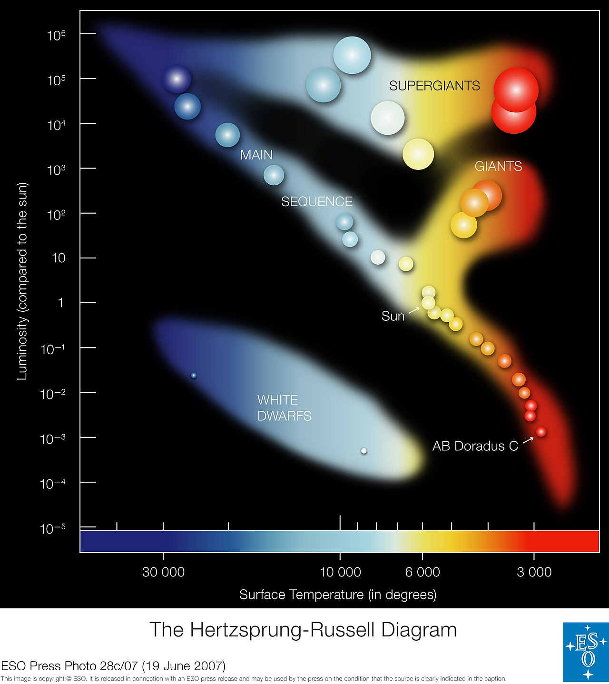

# Indice lezione Sole

1. [[4.2 - Il Sole in 5 minuti]]
2. [[4.3 - Struttura interna del Sole]]
3. [[4.4 - Atmosfera del Sole]]
4. [[4.5 - Attivita solare e ciclo]]
5. [[4.6 - Sole e Terra]]
6. [[4.7 - Osservare il Sole in sicurezza]]

## Obiettivo della lezione

Il Sole non è una una **stella attiva**, con:
- una struttura interna,
- un’atmosfera a strati,
- un campo magnetico,
- un’attività ciclica,
- effetti concreti sulla Terra.

Nel diagramma di Hertzsprung-Russell, le temperature delle stelle sono rappresentate in funzione della **loro luminosità**.

La posizione di una stella nel diagramma fornisce informazioni sulla sua **fase attuale e sulla sua massa**. 

Le stelle che bruciano idrogeno trasformandolo in elio si trovano sul ramo diagonale, la cosiddetta sequenza principale. 
Le nane rosse come AB Doradus C si trovano nell'angolo freddo e debole. AB Doradus C ha una temperatura di circa 3000 gradi e una luminosità pari allo 0,2% di quella del Sole. 
Quando una stella esaurisce tutto l'idrogeno, esce dalla sequenza principale e diventa una gigante rossa o una supergigante, a seconda della sua massa.

Le stelle con la massa del Sole che hanno esaurito tutto il loro combustibile si evolvono infine in una nana bianca (angolo in basso a sinistra).
