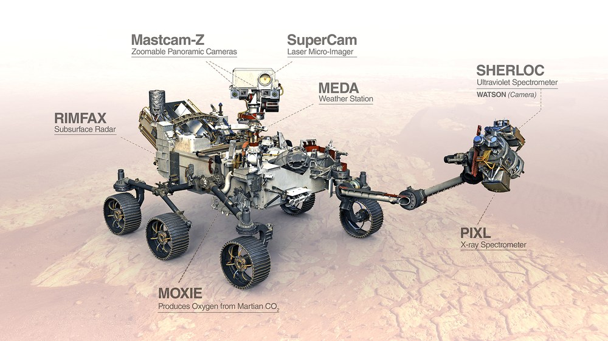
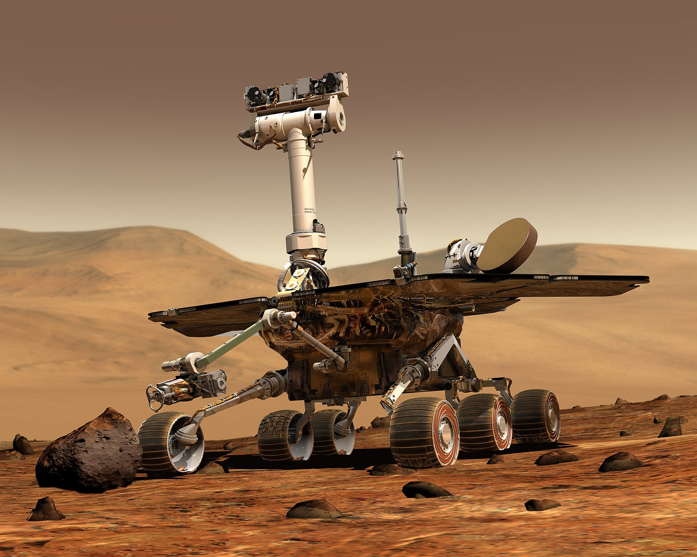
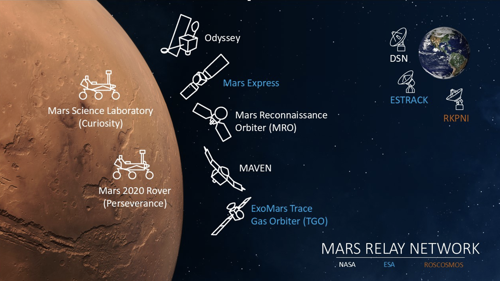
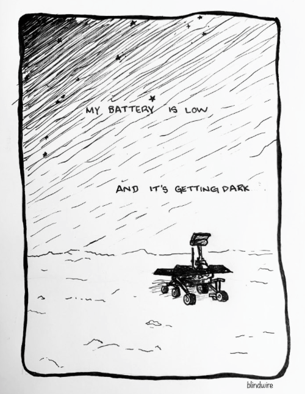
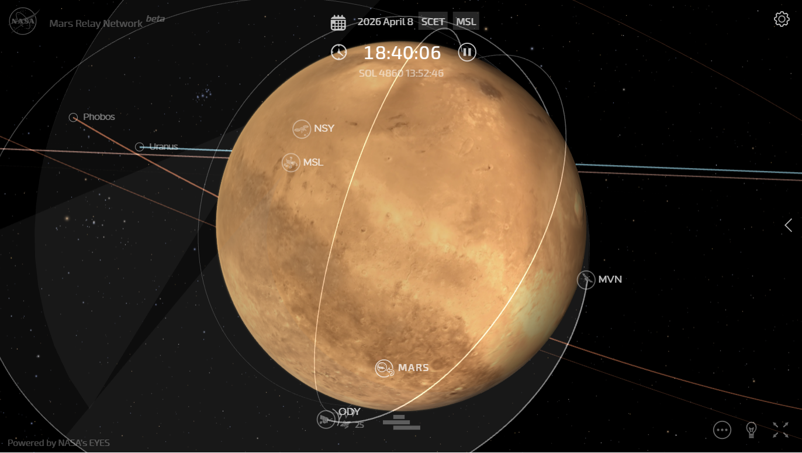

## 🗓️ Informazioni
- **Data creazione:** 2026-04-05 11:04
- **Ultima modifica:** 2026-04-05 11:04
- **Autore:** [[Tiriolo Luca]]

Le principali missioni attualmente operative su Marte rappresentano un sistema integrato di osservazione e analisi che combina attività di superficie e monitoraggio orbitale. 

# Perseverance

Tra queste, assumono un ruolo centrale i rover **Perseverance** e **Curiosity**, affiancati da sonde orbitali come il Mars Reconnaissance Orbiter, MAVEN e Mars Express. L’insieme di queste missioni, gestite principalmente da NASA e ESA, consente una comprensione sempre più approfondita dell’evoluzione geologica e atmosferica del pianeta.

Per quanto riguarda l’esplorazione in situ, il rover Perseverance, operativo nel cratere Jezero, ha recentemente superato i **1600 Sol**, confermando l’elevata durata operativa della missione. 

Il rover si trova attualmente in una fase di risalita verso il bordo del cratere, attraversando una regione geologicamente complessa nota come “Megabreccia”, caratterizzata da materiali frammentati che offrono accesso a strati profondi della crosta marziana. Le indagini condotte nell’area denominata Witch Hazel Hill hanno evidenziato la presenza di minerali argillosi, in particolare smectiti, e carbonati, indicatori chiave di ambienti acquatici stabili nel passato. Tali evidenze rafforzano l’ipotesi che Jezero fosse un antico bacino lacustre potenzialmente abitabile.

L’attività di campionamento, finalizzata alla futura missione di recupero dei campioni (Mars Sample Return), ha prodotto risultati significativi, pur incontrando difficoltà tecniche legate alla fragilità di alcune rocce. Il fallimento di un carotaggio al Sol 1649 ha evidenziato la complessità operativa di questo tipo di operazioni in condizioni ambientali estreme. 

Perseverance ha esplorato l'area di **Witch Hazel Hill**, dove sono stati individuati strati ricchi di 
* ***argille (smectiti)** e carbonati, segni di un antico ambiente acquatico. Nonostante alcuni successi nel carotaggio (come a "Bell Island"), la missione ha affrontato sfide tecniche, tra cui un **fallito prelievo di campione** al Sol 1649 a causa della fragilità della roccia. 
* ***Scoperte Atmosferiche:** Grazie ai suoi strumenti, è stata documentata la **prima aurora marziana nel visibile** (maggio 2024), apparsa come un debole bagliore verde. Inoltre, il microfono di SuperCam ha permesso di rilevare **scariche elettriche** prodotte dall'elettricità statica all'interno dei "dust devils" (diavoli di polvere). 
* **Meteoriti:** È stato scoperto un raro meteorite metallico ferro-nichel, denominato **"Phippskasla"**.

# Curiosity

Il rover **Curiosity**, operativo nel cratere Gale, continua a svolgere un ruolo fondamentale nello studio stratigrafico e mineralogico della superficie marziana. 

Tra le osservazioni più recenti si segnala l’individuazione di un **meteorite** metallico denominato “Cacao”, che contribuisce ad ampliare il catalogo di materiali esogeni presenti su Marte e a comprendere i processi di alterazione superficiale.

# Ingenuity

Ingenuity merita un paragrafo a parte, perché non è stato semplicemente un “accessorio” della missione Mars 2020, ma una dimostrazione tecnologica che ha cambiato il modo in cui si pensa l’esplorazione di Marte.

Si tratta di un piccolo elicottero autonomo, trasportato da Perseverance, progettato per compiere una breve campagna dimostrativa di pochi voli in un’atmosfera estremamente rarefatta. In effetti Ingenuity era stato concepito come un dimostratore tecnologico: il suo obiettivo iniziale non era svolgere scienza diretta, ma verificare se il volo controllato e motorizzato fosse possibile su Marte, dove l’atmosfera ha una densità molto inferiore a quella terrestre. NASA e JPL lo definiscono infatti come il primo velivolo a tentare, e poi a realizzare con successo, un volo controllato su un altro pianeta. ([NASA Jet Propulsion Laboratory (JPL)](https://www.jpl.nasa.gov/missions/ingenuity/?utm_source=chatgpt.com "Ingenuity"))

Dal punto di vista tecnico, Ingenuity era un velivolo estremamente leggero, con una massa di circa 1,8 chilogrammi, alimentato da pannelli solari e batterie agli ioni di litio. I suoi rotori controrotanti, di circa 1,2 metri di diametro complessivo, dovevano ruotare a velocità molto elevate proprio per compensare la rarefazione dell’aria marziana. La configurazione autonoma era indispensabile: a causa dei tempi di comunicazione tra Terra e Marte, il pilotaggio in tempo reale non era possibile, quindi il velivolo doveva gestire da solo stabilità, navigazione e atterraggio. ([NASA Jet Propulsion Laboratory (JPL)](https://www.jpl.nasa.gov/news/press_kits/ingenuity/landing/mission/?utm_source=chatgpt.com "Ingenuity Landing Press Kit | Mission Overview"))

Il valore storico di Ingenuity deriva soprattutto dal risultato raggiunto il 19 aprile 2021, quando effettuò il primo volo motorizzato e controllato su un altro pianeta. Quello che inizialmente era previsto come una breve serie di cinque voli dimostrativi si è trasformato in una missione molto più ampia e longeva. Secondo NASA, Ingenuity ha completato **72 voli** complessivi, superando di gran lunga il profilo operativo originario e dimostrando non solo la fattibilità del volo, ma anche la sua utilità come supporto tattico all’esplorazione di superficie. ([NASA Science](https://science.nasa.gov/mission/mars-2020-perseverance/ingenuity-mars-helicopter/mars-helicopter-updates/?utm_source=chatgpt.com "Mars Helicopter Updates"))

Con il proseguire della missione, Ingenuity è passato da semplice dimostratore a piattaforma operativa di ricognizione. Ha esplorato il terreno davanti a Perseverance, ha fotografato aree di difficile accesso e ha contribuito a individuare percorsi potenzialmente più sicuri o più interessanti dal punto di vista geologico. In questo senso, il suo successo ha mostrato che futuri velivoli marziani potrebbero affiancare rover ed equipaggi umani come strumenti di scouting, mappatura e supporto decisionale. La stessa NASA collega esplicitamente il successo di Ingenuity a concetti successivi di elicotteri marziani più avanzati. ([NASA Science](https://science.nasa.gov/mission/mars-2020-perseverance/ingenuity-mars-helicopter/?utm_source=chatgpt.com "Ingenuity Mars Helicopter"))

La missione si è conclusa ufficialmente nel gennaio 2024. NASA ha comunicato che, dopo il volo del 18 gennaio 2024, le immagini ricevute mostravano danni a una o più pale del rotore in fase di atterraggio; il velivolo è rimasto in comunicazione ed è rimasto verticale sulla superficie, ma non era più in grado di volare. La chiusura della missione non è quindi stata dovuta a una perdita totale del veicolo, bensì alla fine della sua capacità operativa principale, cioè il volo. ([NASA](https://www.nasa.gov/news-release/after-three-years-on-mars-nasas-ingenuity-helicopter-mission-ends/?utm_source=chatgpt.com "After Three Years on Mars, NASA's Ingenuity Helicopter ..."))

Nel quadro generale delle missioni su Marte, Ingenuity ha avuto un’importanza che va oltre le sue dimensioni e oltre il suo carattere sperimentale. Ha dimostrato che l’esplorazione aerea di Marte è praticabile, ha validato tecnologie di autonomia in ambiente extraterrestre e ha aperto una nuova architettura operativa per le missioni future. In termini strategici, il suo lascito è simile a quello dei primi rover: non tanto per la quantità di dati raccolti, quanto per aver inaugurato una nuova classe di veicoli e una nuova modalità di presenza sul pianeta. ([NASA Jet Propulsion Laboratory (JPL)](https://www.jpl.nasa.gov/missions/ingenuity/?utm_source=chatgpt.com "Ingenuity"))
# Missioni Orbitali (MRO, MAVEN, Mars Express)

Sul fronte orbitale, le missioni MRO, MAVEN e Mars Express continuano a fornire dati essenziali per l’interpretazione globale del pianeta.

In particolare, le osservazioni radar dello strumento SHARAD a bordo del Mars Reconnaissance Orbiter hanno portato a una revisione critica dell’ipotesi relativa **alla presenza di acqua liquida sotto la calotta polare sud**. I segnali radar precedentemente interpretati come laghi subglaciali potrebbero essere spiegati da materiali alternativi, come a Missioni Orbitali (MRO, MAVEN, Mars Express)**, ridimensionando quindi le evidenze di acqua liquida attuale.

L’immagine mostra in realtà un sistema più ampio, il cosiddetto **Mars Relay Network**, che include non solo gli orbiter che abbiamo già citato, ma anche altre missioni fondamentali e l’infrastruttura di comunicazione tra Marte e la Terra. 

Oltre a Mars Reconnaissance Orbiter, MAVEN e Mars Express, una delle missioni orbitali più longeve e operative è **Mars Odyssey**.

Lanciata nel 2001, Mars Odyssey è il più antico satellite ancora attivo attorno a Marte. Il suo ruolo oggi è soprattutto infrastrutturale: funge da nodo chiave per le comunicazioni tra i rover sulla superficie e la Terra. Oltre a questo, continua a fornire dati scientifici, in particolare sulla distribuzione di ghiaccio nel sottosuolo e sulla radiazione, aspetti cruciali in vista di future missioni umane.

Un’altra missione fondamentale, spesso meno citata ma molto importante, è il **ExoMars Trace Gas Orbiter (TGO)**, parte del programma ExoMars sviluppato da ESA in collaborazione con Roscosmos.

Il Trace Gas Orbiter ha due obiettivi principali. Il primo è lo studio dei gas in tracce nell’atmosfera marziana, in particolare il metano, che è di grande interesse scientifico perché potrebbe essere associato a processi geologici attivi o, in ipotesi più speculative, biologici. Il secondo è operativo: come Odyssey e MRO, il TGO svolge una funzione essenziale di relay per le comunicazioni con i veicoli di superficie, aumentando la capacità e l’affidabilità della rete complessiva.

L’immagine include anche elementi che non sono missioni marziane in senso stretto, ma infrastrutture terrestri indispensabili per il funzionamento dell’intero sistema.

Tra queste, la più importante è il **Deep Space Network (DSN)**, la rete globale di antenne della NASA distribuite in California, Spagna e Australia. Il DSN garantisce comunicazioni continue con Marte, compensando la rotazione terrestre. È attraverso questa rete che vengono inviati comandi e ricevuti dati da tutte le missioni NASA.

Accanto al DSN compare **ESTRACK**, l’equivalente europeo gestito dall’ESA, che supporta le missioni europee e collabora con la rete NASA in un sistema integrato. Infine, è indicata anche la rete russa **Roscosmos** (Russia), che partecipa alle operazioni di comunicazione soprattutto nell’ambito delle missioni ExoMars.

Nel loro insieme, questi elementi costituiscono una vera e propria architettura distribuita. Gli orbiter attorno a Marte non si limitano a raccogliere dati scientifici, ma svolgono una funzione cruciale di ponte radio: ricevono informazioni dai rover (come Perseverance e Curiosity) e le ritrasmettono verso la Terra. Le reti terrestri, a loro volta, assicurano la continuità delle comunicazioni e la gestione operativa delle missioni.

Questo sistema integrato è uno degli aspetti meno visibili ma più strategici dell’esplorazione marziana: senza una rete di relay orbitale e infrastrutture di comunicazione profonde, l’attività scientifica sulla superficie sarebbe estremamente limitata.

# Spirit e Opportunity 

Spirit era stato progettato per una missione primaria di circa **90 Sol**. In realtà rimase operativo per oltre **sei anni**, superando ampiamente le aspettative iniziali e confermando la notevole robustezza del progetto dei Mars Exploration Rover. Nel corso della missione, Spirit trasformò radicalmente la conoscenza della regione di Gusev, che all’inizio appariva meno promettente del previsto. Le prime analisi suggerivano infatti la presenza di rocce basaltiche, indicative soprattutto di un passato vulcanico. Tuttavia, con il proseguire dell’esplorazione, il rover raggiunse aree geologicamente più complesse che rivelarono una storia assai più ricca.

Il contributo scientifico più importante di Spirit consiste proprio nell’aver individuato evidenze convincenti di **interazione tra rocce e acqua**, in particolare nelle **Columbia Hills**, una zona elevata raggiunta dopo mesi di traversata. Qui il rover trovò minerali alterati, depositi ricchi di zolfo e materiali che indicavano processi idrotermali o ambienti in cui l’acqua aveva avuto un ruolo significativo. Queste osservazioni furono cruciali perché mostrarono che almeno alcune porzioni del cratere Gusev non erano state modellate solo da vulcanismo e impatti, ma anche da processi acquosi, ampliando il quadro della diversità ambientale dell’antico Marte.

Opportunity è una delle missioni più importanti e simboliche dell’esplorazione marziana. Il rover, formalmente denominato **Mars Exploration Rover-B**, faceva parte del programma Mars Exploration Rover della NASA ed era il gemello di Spirit. Fu lanciato nel 2003 e atterrò su Marte nel gennaio 2004, nella regione di **Meridiani Planum**, un’area scelta perché le osservazioni orbitali indicavano la possibile presenza di minerali formatisi in ambiente acquoso.

La missione era stata progettata per durare circa **90 Sol**, cioè novanta giorni marziani. In realtà Opportunity rimase operativo per quasi **quindici anni**, trasformandosi da missione relativamente breve in una delle esplorazioni robotiche più longeve e produttive mai realizzate. Questo dato da solo spiega perché il rover occupi un posto centrale nella storia scientifica e tecnologica di Marte.

Dal punto di vista scientifico, il contributo più importante di Opportunity riguarda la conferma che in passato Marte abbia ospitato **acqua liquida** in superficie. Già nei primi mesi dopo l’atterraggio, il rover individuò rocce sedimentarie e concrezioni ricche di ematite, soprannominate informalmente “blueberries”, che costituivano una forte evidenza di interazione prolungata tra rocce e acqua. Fu una scoperta decisiva, perché non si trattava solo di ipotizzare che Marte fosse stato umido, ma di dimostrare che in alcune aree del pianeta erano esistiti ambienti alterati chimicamente dall’acqua.

Nel corso della missione, Opportunity esplorò numerosi crateri, tra cui **Eagle**, **Endurance**, **Victoria** ed infine **Endeavour**, molto più vasto e geologicamente complesso. Questo lungo itinerario permise di studiare terreni di età diverse e di ricostruire in modo più articolato la storia ambientale della regione. In particolare, l’esplorazione del cratere Endeavour portò all’identificazione di minerali argillosi, molto significativi perché associati ad ambienti acquosi meno acidi e potenzialmente più favorevoli all’abitabilità rispetto a quelli individuati nelle prime fasi della missione.

Opportunity ebbe anche un valore ingegneristico straordinario. Percorse oltre **45 chilometri** sulla superficie marziana, stabilendo per anni il record di distanza coperta da un veicolo extraterrestre su un altro pianeta. Operò in condizioni ambientali molto dure, sopravvivendo a inverni marziani, tempeste di polvere e all’usura progressiva dei suoi sistemi. Il fatto che sia riuscito a funzionare per un tempo enormemente superiore a quello previsto è considerato uno dei maggiori successi dell’ingegneria robotica spaziale.

La missione terminò nel 2018 a causa di una **tempesta globale di polvere** che oscurò il cielo marziano per settimane. Poiché Opportunity dipendeva dall’energia solare, la drastica riduzione della luce impedì la ricarica delle batterie. Dopo numerosi tentativi di ristabilire il contatto, la NASA dichiarò conclusa la missione nel 2019. La fine di Opportunity ebbe un forte impatto anche simbolico, perché il rover era diventato una sorta di emblema della capacità umana di esplorare mondi lontani con mezzi relativamente piccoli ma straordinariamente resilienti.

Nel quadro generale delle missioni su Marte, Opportunity occupa una posizione fondamentale per tre ragioni. La prima è scientifica: ha fornito prove molto solide dell’esistenza passata di ambienti acquosi. La seconda è metodologica: ha mostrato quanto un rover mobile possa ricostruire la storia geologica di un’area su scala regionale. La terza è strategica: ha preparato il terreno alle missioni successive, come Curiosity e Perseverance, dimostrando che l’esplorazione di lunga durata della superficie marziana era non solo possibile, ma estremamente fruttuosa.

@blindwire_art on Twitter
# Risultati Scientifici Chiave

**Elettricità Statica:** La conferma della presenza di scariche elettriche nelle tempeste di polvere è fondamentale per comprendere la chimica del suolo marziano (come la formazione di perclorati) e per la sicurezza delle future missioni umane. 
**Evoluzione dell'Atmosfera:** Lo studio delle aurore e delle interazioni con il vento solare aiuta gli scienziati a comprendere meglio come Marte abbia perso la sua atmosfera nel tempo.

# Lo stato attuale

https://science.nasa.gov/mars/mars-relay-network/

