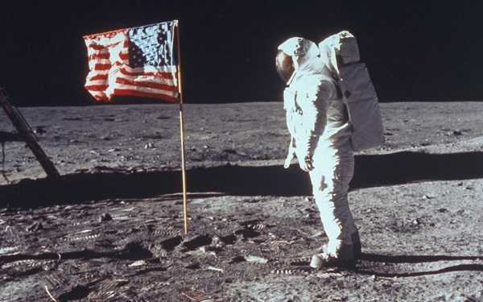

## 🗓️ Informazioni
- **Data creazione:** 2026-04-05 10:44
- **Ultima modifica:** 2026-04-05 10:44
- **Autore:** [[Tiriolo Luca]]

---
L'allunaggio è uno degli eventi più documentati della storia moderna. Le prove della sua veridicità non risiedono solo nelle testimonianze, ma in **dati fisici, osservazioni indipendenti e dinamiche geopolitiche** che rendono impossibile una messa in scena.

# Le Prove Scientifiche Più Concrete

- **I campioni di rocce lunari:** Le missioni Apollo hanno riportato sulla Terra **382 kg di materiale lunare**. Queste rocce sono uniche: sono "brecce da impatto" (ricompattate da scontri planetari), sono **completamente prive di acqua** e mostrano segni di **erosione spaziale** dovuta ai raggi cosmici, processi impossibili da replicare sulla Terra a causa dell'atmosfera. Alcune hanno **4,5 miliardi di anni**, superando in età le rocce terrestri più vecchie.
- **Retroriflettori Laser:** Durante le missioni Apollo 11, 14 e 15, sono stati installati degli specchi sulla superficie lunare. Ancora oggi, osservatori in tutto il mondo (inclusi quelli in **Francia, Cina e Russia**) inviano impulsi laser che vengono riflessi da questi strumenti per misurare la distanza Terra-Luna con estrema precisione.
- **Fotografie Satellitari Indipendenti:** Non solo la NASA, ma anche agenzie di altri paesi hanno fotografato i siti di allunaggio. Nel 2021, la missione indiana **Chandrayaan-2** ha catturato immagini del modulo _Eagle_ dell'Apollo 11 sulla superficie.
- **Il Fattore Umano e Geopolitico:** Il programma Apollo ha coinvolto circa **400.000 persone**. Mantenere un segreto di tale portata per decenni è logisticamente impossibile. Inoltre, l'**Unione Sovietica**, che disponeva di una fitta rete di spionaggio, non ha mai smentito l'allunaggio, riconoscendo la vittoria statunitense nella corsa allo spazio.

# Miti Comuni

- **Mancanza di stelle nelle foto:** È un problema di **esposizione**. Per fotografare la superficie lunare molto luminosa servivano scatti rapidi, che non permettevano al sensore di raccogliere la luce debole delle stelle. 

**Artemis II**

- **La bandiera che "sventola":** La bandiera era sostenuta da un'asta orizzontale telescopica. Appare "mossa" solo perché era sgualcita dopo essere stata ripiegata per il viaggio.
- **Fasce di Van Allen:** Sono regioni di radiazioni che circondano la Terra, ma gli astronauti le hanno attraversate in soli **15-20 minuti**, un tempo troppo breve per ricevere dosi letali.
- **Assenza di cratere sotto il modulo:** Il LEM è atterrato dolcemente, non si è schiantato come un meteorite. Inoltre, in assenza di atmosfera, i gas di scarico hanno soffiato via la polvere radialmente invece di creare un accumulo.

# Perché è così difficile tornare oggi?

Molti si chiedono perché, se ci siamo riusciti 50 anni fa, oggi ci siano così tanti ritardi con il **programma Artemis**.

1. **Standard di sicurezza:** All'epoca l'allunaggio era una missione militare/politica con un **rischio di morte stimato al 50%**. Oggi, nessuna agenzia approverebbe una missione con una probabilità di insuccesso superiore all'1%.
2. **Obiettivi diversi:** Le missioni Apollo erano "mordi e fuggi" per ragioni politiche. Artemis punta a una **presenza stabile e scientifica**, richiedendo tecnologie molto più complesse per la sopravvivenza a lungo termine.
3. **Budget:** Durante la Guerra Fredda, la NASA aveva fondi quasi illimitati per battere l'URSS; oggi opera con un budget che è solo una frazione di quello di allora.