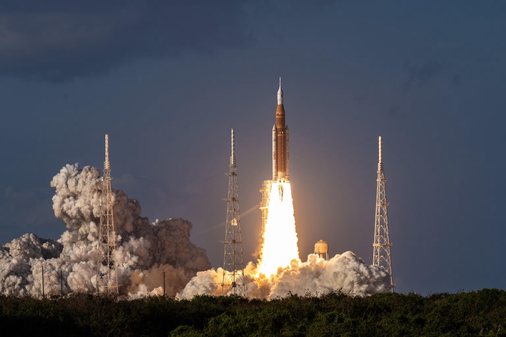

# Il Ritorno dell'Umanità verso la Luna

## 🗓️ Informazioni

- **Data creazione:** 2026-04-05 11:00
- **Missione:** Test con equipaggio del sistema SLS/Orion
- **Obiettivo principale:** Validare i sistemi di supporto vitale per le future missioni di allunaggio.

---

# Panoramica della Missione

Artemis II è la prima missione del programma Artemis a portare un equipaggio umano nello spazio profondo. A differenza delle missioni Apollo, non è un "mordi e fuggi" politico, ma potrebbe essere il primo passo verso un'**economia lunare sostenibile**.

- **Obiettivo:** Effettuare un _flyby_ (sorvolo) lunare a circa 7.400 km dalla superficie e tornare a Terra.
- **Durata:** Circa 10 giorni.
- **Equipaggio:** Quattro pionieri scelti per competenza ed esperienza:
    - **Reid Wiseman (Comandante):** Veterano ISS ed ex Navy Seal.
    - **Victor Glover (Pilota):** Primo astronauta afroamericano su una missione di lunga durata.
    - **Christina Koch (Specialista di missione):** Detentrice del record per il volo spaziale femminile più lungo.
    - **Jeremy Hansen (CSA):** Primo canadese a dirigersi verso la Luna.

# Tecnologia e Innovazione

La missione si basa su due pilastri ingegneristici:

1. **SLS (Space Launch System):** Attualmente il razzo operativo più potente al mondo, capace di generare 39 MN di spinta (superiore al leggendario Saturn V).
2. **Capsula Orion:** Progettata per ospitare 4 astronauti per 21 giorni. Include il **Modulo di Servizio Europeo (ESM)**, con una forte componente tecnologica italiana, che fornisce propulsione, acqua e ossigeno.

# Sicurezza e Sfide Tecniche

A differenza dell'era Apollo, dove il rischio era accettato per necessità politica, Artemis mette la **sicurezza al primo posto**.

- **Lo Scudo Termico:** Dopo Artemis I, sono state notate usure impreviste. Per Artemis II, la NASA ha deciso di modificare il profilo di rientro per esporre la capsula a uno stress minore invece di riprogettare interamente lo scudo, evitando ulteriori anni di ritardo.
- **Traiettoria di "Ritorno Libero":** La missione sfrutterà la gravità lunare per essere "risucchiata" naturalmente verso la Terra in caso di guasti ai motori, una misura di sicurezza fondamentale già usata in Apollo 13.
- **Radiazioni:** L'equipaggio attraverserà le fasce di Van Allen; la protezione è garantita dalla velocità di attraversamento e dalle schermature avanzate della capsula Orion.

# Perché i ritardi?

La missione ha subito diversi slittamenti (attualmente prevista non prima di **settembre 2025 o febbraio 2026**) per diverse ragioni:

- **Standard di sicurezza elevatissimi:** Oggi non si accetta più una probabilità di morte superiore all'1%, mentre l'Apollo 11 partì con una stima del 50% di successo.
- **Sviluppo dei sistemi:** Molte componenti (come le tute Axiom o il modulo di atterraggio Starship per Artemis III) sono gestite da privati e presentano ritardi fisiologici in progetti così complessi.
- **Budget:** La NASA opera oggi con una frazione dei fondi che aveva durante la Guerra Fredda, dovendo ottimizzare ogni singola risorsa.

Artemis II non allunerà. Il lander (Starship) non è ancora pronto e la missione serve proprio a testare che l'uomo possa sopravvivere a quelle distanze prima di tentare il contatto con il suolo in Artemis III.

### **Artemis III: Il ritorno sulla superficie**

Attualmente ipotizzata per il **2027**, questa sarà la missione dello storico sbarco.

- **Allunaggio:** A differenza delle missioni Apollo, si utilizzerà un sistema di atterraggio moderno, probabilmente una versione modificata della **Starship di SpaceX**, poiché la capsula Orion non è progettata per atterrare autonomamente. Attualmente Starship è nella fase primordiale, non c'è ancora nulla di realizzato
- **Scienza e Nuove Tute:** Gli astronauti indosseranno tute di nuova generazione sviluppate dall'azienda **Axiom** e si concentreranno sulla raccolta di dati scientifici in aree di interesse per futuri insediamenti.
- **Manca la volontà politica**: l'esplorazione lunare non è una priorità

### **Artemis IV e oltre: Verso una base stabile**

- **Artemis IV:** Potrebbe avvenire dopo **2028** (ma siamo già in ritardo), secondo alcuni fonti NASA (https://www.nasa.gov/news-release/nasa-shares-progress-toward-early-artemis-moon-missions-with-crew/?utm_source=chatgpt.com),  Esiste la possibilità che l'allunaggio umano venga spostato a questa missione se Artemis III dovesse servire come ulteriore test senza equipaggio per il lander.
- **Obiettivo Marte:** La Luna è vista come un "terreno di prova". L'intento a lungo termine è imparare a vivere e sopravvivere su un altro corpo celeste per preparare l'umanità alla futura **esplorazione di Marte**.

### **Collaborazioni Internazionali e Missioni Secondarie**

Il futuro non prevede solo astronauti della NASA. Il programma è una collaborazione globale che include l'**ESA (Europa)**, l'agenzia canadese e quella giapponese. Inoltre, missioni secondarie come il trasporto di **CubeSat** (piccoli satelliti) internazionali serviranno a studiare le radiazioni nello spazio profondo, l'impatto sull'elettronica e a testare comunicazioni GPS lunari.
