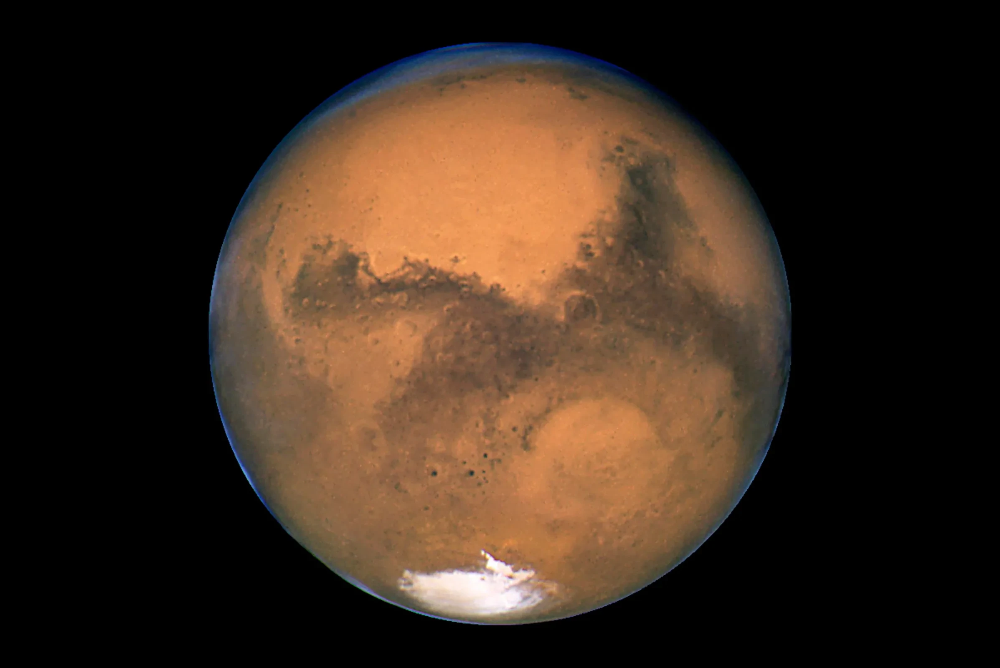
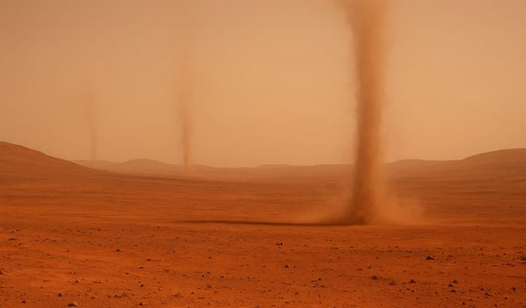
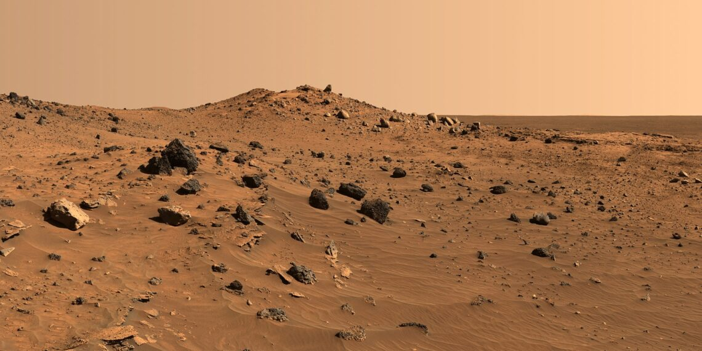
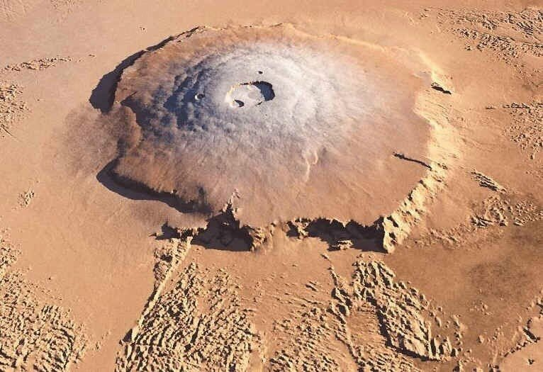
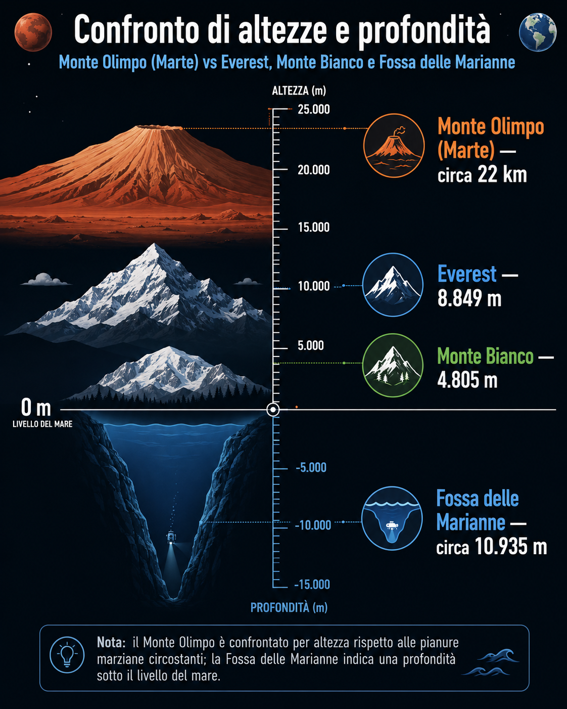
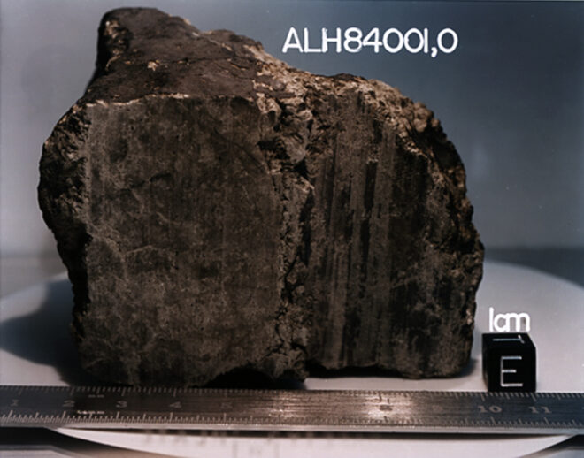
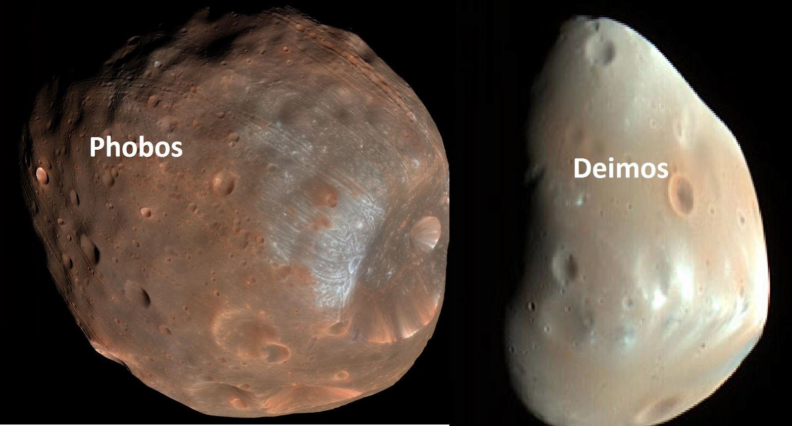

# Il Pianeta Rosso

## 🗓️ Informazioni
- **Data creazione:** 2026-05-01 10:44
- **Ultima modifica:** 2026-05-01 10:44
- **Autore:** [[Tiriolo Luca]]

# Marte

Marte è solo un **decimo della massa** della Terra ($6,41 \cdot 10^{23} \ kg$ di Marte contro $6,97 \cdot 10^{24} \ kg$ della Terra) ed ha una **densità** inferiore rispetto quella della Terra ($3,93 \cdot g/cm^3 \ kg$  di Marte contro $5,51 \cdot g/cm^3 \ kg$ della Terra), indicando una composizione interna con un nucleo contenente elementi più leggeri come il solfuro di ferro.
Chiamato “pianeta rosso” a causa del colore caratteristico della sua superficie, dovuto alla presenza di ossidi di ferro nelle polveri e nelle rocce superficiali.

 Sono innumerevoli i media che indicano Marte come il pianeta abitato dai Marziani.

Tutto è iniziato dall'astronomo Giovanni Schiaparelli che scriveva

>«Piuttosto che veri canali della forma a noi più familiare, dobbiamo immaginarci depressioni del suolo non molto profonde, estese in direzione rettilinea per migliaia di chilometri, sopra larghezza di 100, 200 chilometri od anche più. Io ho già fatto notare altra volta, che, mancando sopra Marte le piogge, questi **canali** probabilmente costituiscono il meccanismo principale, con cui l'acqua (e con essa la vita organica) può diffondersi sulla superficie asciutta del pianeta.»

(Giovanni Schiaparelli, _[La vita sul pianeta Marte](https://it.wikisource.org/wiki/La%20vita%20sul%20pianeta%20Marte "s:La vita sul pianeta Marte")_, estratto dal fascicolo N.° 11 - Anno IV della rivista _Natura ed Arte_, maggio 1895, cap. I)

La parola **Canali** fu tradotta, erroneamente, come *canals* e non *channels*: mentre la prima parola indica una costruzione artificiale, il secondo termine definisce una conformazione del terreno che può essere anche di origine naturale. E così è nato l'ambiguo ed è partita l'immaginazione degli scrittori/autori/registri di film di fantascienza.

Photograph of Mars by the Hubble Telescope

# Come appare al telescopio

Per un astrofilo amatoriale, Marte è un oggetto particolarmente interessante **perché mostra variazioni osservabili nel tempo: cambia luminosità, dimensione apparente e posizione nel cielo a seconda della sua distanza dalla Terra**. Nei periodi di opposizione, quando Terra e Marte si trovano dalla stessa parte rispetto al Sole, il pianeta appare più luminoso e più favorevole all’osservazione telescopica.
Le fasi di Marte sono il dettaglio più facile da osservare, tuttavia, per notare il crescere o il diminuire della zona illuminata, ci vogliono diverse osservazioni compiute a distanza di qualche giorno o settimana.
La Calotta Polare Sud appare come un puntino bianco sul bordo del pianeta.

Esiste anche la possibilità di vedere le **macchie di [[Albedo]]** , dato che la struttura superficiale di Marte presenta luminosità differenti.

Nei **periodi sfavorevoli il disco marziano appare piccolo e povero di dettagl**i; **durante le opposizioni, invece, Marte diventa molto più luminoso e il suo diametro apparente aumenta, rendendo possibile distinguere alcune strutture superficiali**. Con un telescopio amatoriale, buone condizioni atmosferiche e pazienza, si possono osservare il disco del pianeta, il colore rossastro, le calotte polari e talvolta alcune regioni più scure. Va però ricordato che Marte è un oggetto difficile: anche quando è vicino, i dettagli sono delicati e spesso compaiono solo per brevi istanti, quando la turbolenza dell’atmosfera terrestre si attenua (MEGLIO FARE UN VIDEO).
# Atmosfera

La bassa densità atmosferica ha conseguenze importanti: **Marte non riesce a trattenere efficacemente il calore e presenta forti escursioni termiche**. Inoltre, l’acqua liquida stabile in superficie è oggi molto difficile da mantenere, perché la pressione atmosferica è troppo bassa.

L’atmosfera marziana è molto sottile ed è composta per circa il 95% da anidride carbonica e per circa il 2,7% da azoto molecolare. Questo dato può sembrare sorprendente, perché sulla Terra l’anidride carbonica è un gas serra importante, ma **su Marte l’atmosfera è talmente rarefatta che l’effetto serra attuale è debole**. **In passato, però, l’atmosfera marziana potrebbe essere stata più densa**. Se così fosse, avrebbe potuto trattenere meglio il calore e permettere condizioni più favorevoli alla presenza di acqua liquida. Con il tempo, una parte dell’anidride carbonica potrebbe essere stata intrappolata nelle rocce carbonatiche, una parte potrebbe essere finita nelle calotte e una parte potrebbe essere stata persa nello spazio. Il risultato è il Marte attuale: f**reddo, secco e con un’atmosfera troppo sottile per sostenere acqua liquida stabile in superficie**.

Le condizioni attuali, però, sono molto diverse. **Le temperature superficiali possono variare approssimativamente tra -140 °C e 20 °C**. A queste temperature si aggiunge una pressione atmosferica estremamente bassa: circa **0,006 atmosfere**. **Con una pressione così ridotta, l’acqua liquida stabile in superficie è praticamente impossibile**. **L’acqua presente oggi si trova soprattutto sotto forma di ghiaccio, nelle calotte polari o probabilmente intrappolata nel sottosuolo e nel permafrost**. Per questo Marte è un pianeta che racconta una forte trasformazione climatica: da un passato forse più umido a un presente freddo, arido e dominato dal ghiaccio e dalla polvere.

Nonostante sia tenue, **l’atmosfera marziana è sufficiente a generare grandi tempeste di polvere**. Queste tempeste possono diventare molto estese e, in alcuni casi, coprire quasi l’intero pianeta. Per un osservatore amatoriale questo è un aspetto pratico importante: una tempesta di polvere può ridurre il contrasto dei dettagli superficiali e rendere Marte apparentemente più uniforme. **Nel 1976, durante le missioni Viking, furono osservate grandi tempeste di polvere; quando molta polvere rimane sospesa nell’atmosfera, essa modifica l’assorbimento della luce e può influenzare temporaneamente la temperatura media del pianeta**. Quando poi la polvere si deposita, il clima torna gradualmente alla situazione precedente.
# Superficie

Il colore rosso-arancio di Marte è dovuto soprattutto alla presenza di ferro ossidato nei materiali superficiali. In modo semplice, si può dire che parte della superficie marziana contiene composti simili alla ruggine.

Questo colore è **ben visibile anche a occhio nudo**. Marte, infatti, appare spesso come un punto luminoso dal tono rossastro, facilmente distinguibile dalle stelle più vicine. Tuttavia, al telescopio il colore può apparire meno intenso e più variabile, anche a causa della turbolenza atmosferica terrestre e delle condizioni osservative.

Uno degli aspetti più affascinanti di Marte è la presenza di gigantesche strutture geologiche. Tra queste spicca Valles Marineris, un sistema di canyon lungo circa 3000 km, visibile nelle immagini orbitali come una frattura enorme nei pressi dell’equatore marziano. Alcune sue sezioni possono raggiungere una **profondità di circa 8 km**. Per confronto, si tratta di una struttura molto più estesa e imponente del Grand Canyon terrestre. **Valles Marineris** indica che la crosta marziana è stata sottoposta in passato a forti tensioni, fratturazioni e processi geologici su scala planetaria.

Un’altra struttura fondamentale è il **Monte Olimpo**, uno dei vulcani più grandi del Sistema Solare. **È un vulcano a scudo che si innalza per circa 24 km** sopra la superficie circostante. Alla base misura circa 500 km di diametro e presenta una **caldera sommitale**, cioè una grande depressione vulcanica, larga circa 70 km. Attorno al vulcano è presente una scarpata alta circa 6 km. **Questi numeri fanno capire quanto Marte sia stato geologicamente attivo in passato**. Olympus Mons è così grande anche perché Marte non sembra avere una tettonica a placche attiva come quella terrestre: sulla Terra, il movimento delle placche sposta progressivamente la crosta sopra i punti caldi, creando catene di vulcani; su Marte, invece, **il punto di risalita del magma avrebbe potuto alimentare per tempi lunghissimi la stessa zona, permettendo al vulcano di crescere enormemente**.

Le **calotte polari marziane** sono un altro elemento osservabile e scientificamente importante. Sono composte in gran parte da ghiaccio di anidride carbonica, cioè **“ghiaccio secco”**, ma contengono anche ghiaccio d’acqua. **Marte ha un’inclinazione dell’asse di rotazione di circa 25°, molto simile a quella terrestre, che è di circa 23,5°. Questo significa che anche Marte ha stagioni.** Tuttavia, il **suo periodo orbitale è di circa 1,88 anni terrestri, quindi le stagioni marziane durano quasi il doppio delle nostre**. Durante l’inverno marziano le calotte si estendono, mentre durante l’estate parte del ghiaccio secco sublima, passando direttamente dallo stato solido a quello gassoso, e la calotta si riduce. La piccola calotta residua estiva è composta soprattutto da ghiaccio d’acqua.

# Meteorite Marziano

Un episodio molto discusso riguarda il meteorite marziano **ALH84001**, trovato in Antartide nel 1984. Questo meteorite avrebbe avuto origine dalla superficie di Marte circa 4,5 miliardi di anni fa, sarebbe stato espulso dal pianeta circa 16 milioni di anni fa a causa di un impatto e avrebbe raggiunto la Terra circa 13.000 anni fa. **Al suo interno sono state individuate strutture molto piccole, inferiori a 1/100 della dimensione di un capello umano, che alcuni scienziati interpretarono come possibili tracce fossili di antiche forme di vita microbica**. Tuttavia, la maggior parte dei ricercatori oggi ritiene che le prove non siano sufficienti: quelle strutture potrebbero essersi formate tramite processi inorganici oppure il meteorite potrebbe essere stato contaminato dopo l’arrivo sulla Terra. Il caso ALH84001 resta comunque importante perché mostra quanto sia difficile distinguere tra segnali geologici, chimici e biologici quando si cerca la vita fuori dalla Terra.

Link di approfondimento: https://www.media.inaf.it/2022/01/13/molecole-meteorite-alh-84001/

# I Satelliti

Marte possiede anche due piccoli satelliti naturali: **Phobos** e **Deimos**. Furono scoperti da **Asaph Hall nel 1877.** Sono molto diversi dalla Luna terrestre: **piccoli, irregolari, scuri e ricchi di crateri**. Phobos ha una dimensione massima di poco superiore a 28 km, mentre Deimos è ancora più piccolo, circa 16 km. I loro periodi orbitali sono rispettivamente di circa 7 ore e 39 minuti per Phobos e circa 30 ore e 17 minuti per Deimos. Questi satelliti assomigliano molto ad asteroidi, e infatti una delle ipotesi più note è che siano stati catturati dalla gravità di Marte. **Per un astrofilo amatoriale sono estremamente difficili da osservare, non tanto perché siano concettualmente invisibili, ma perché sono piccoli e molto vicini alla luce intensa del pianeta.**