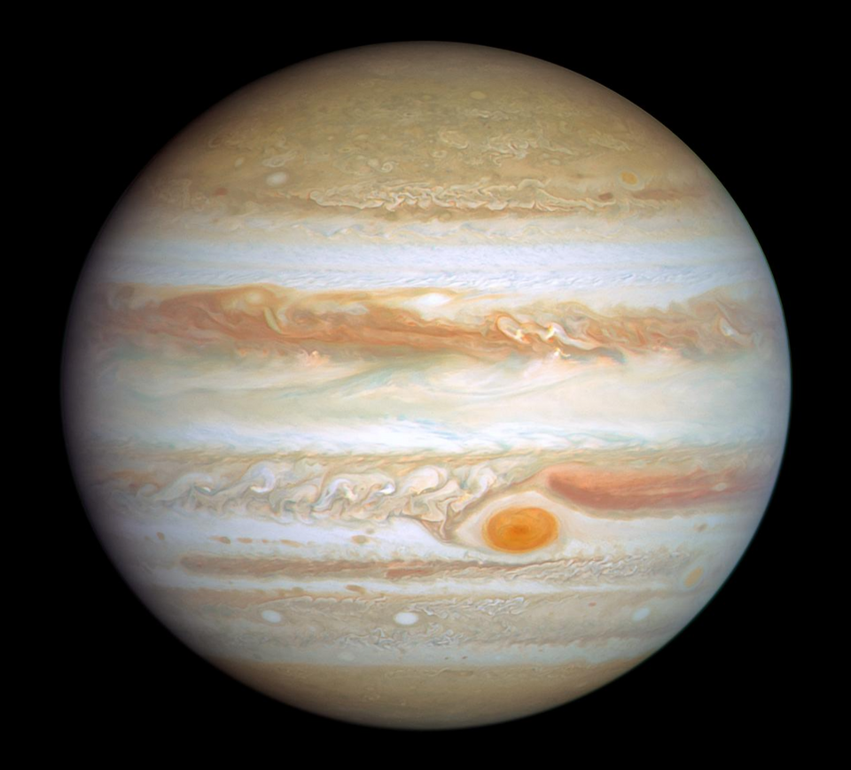
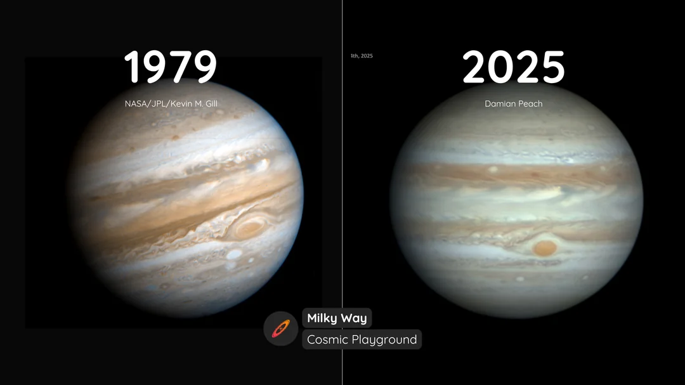
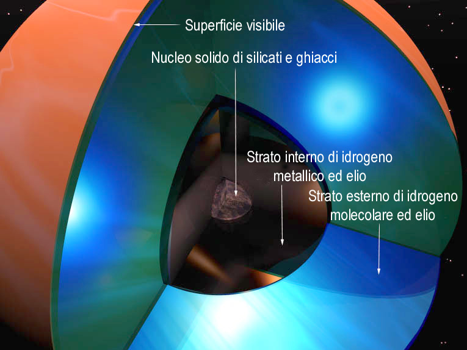
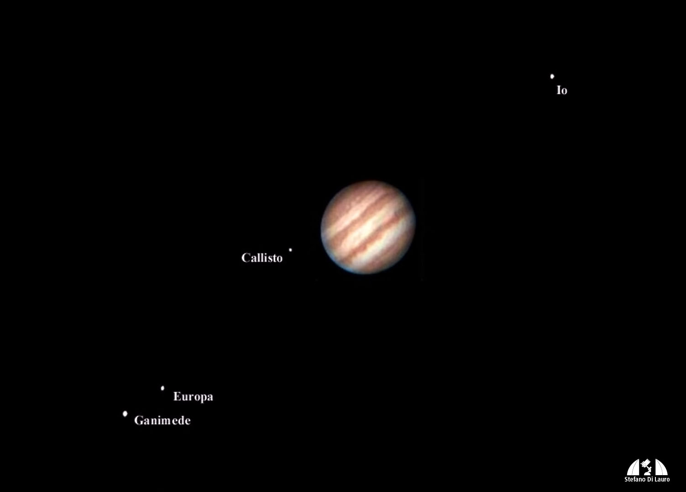
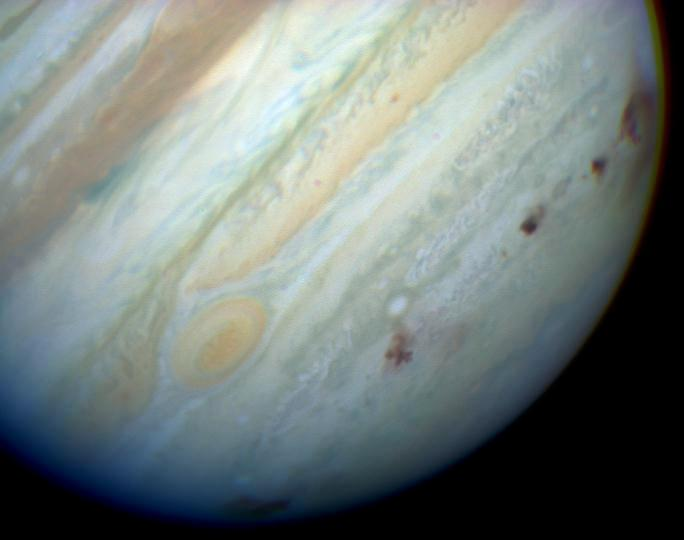

# Giove

## 🗓️ Informazioni
- **Data creazione:** 2026-05-01 09:07
- **Ultima modifica:** 2026-05-01 09:07
- **Autore:** [[Tiriolo Luca]]

---

# Giove

**Giove è il quinto pianeta dal Sole e il più grande pianeta del Sistema Solare**. La sua importanza non è soltanto legata alle dimensioni: Giove è un vero laboratorio naturale per comprendere la fisica dei pianeti giganti, la dinamica delle atmosfere, la formazione dei satelliti e perfino l’evoluzione complessiva del Sistema Solare. È così massiccio che la sua massa supera di oltre due volte la massa complessiva di tutti gli altri pianeti messi insieme; nel confronto con la Terra, la massa di Giove è circa **317,83 volte** quella terrestre.

Quando lo osserviamo al telescopio, Giove appare come un disco luminoso, attraversato da bande chiare e scure parallele all’equatore. Queste bande non sono strutture solide, ma sistemi atmosferici: **Giove non possiede una superficie rocciosa come la Terra o Marte**. È un gigante gassoso composto principalmente da idrogeno ed elio, con nubi visibili formate anche da ammoniaca e vapore acqueo. Guardare Giove significa quindi osservare la parte alta della sua atmosfera, non una superficie vera e propria. 

Le sue dimensioni sono impressionanti. Per rendere l’idea, dentro il volume di Giove potrebbero entrare più di **1.300 Terre**. Tuttavia, negli ultimi anni le misure della sua forma sono state raffinate. I dati della sonda Juno della NASA e del telescopio spaziale Hubble hanno portato a una stima del raggio medio pari a 69.886 km, circa 8 km in meno rispetto alle stime precedenti. **Il raggio equatoriale risulta di circa 71.488 km, mentre quello polare è di circa 66.886 km. Questa differenza mostra che Giove non è una sfera perfetta: è schiacciato ai poli e rigonfio all’equatore.** 

La causa principale di questa forma è la rapidissima rotazione del pianeta. Un giorno su Giove dura meno di 10 ore, rendendolo il pianeta a rotazione più veloce del Sistema Solare. Questa rotazione così rapida produce un forte rigonfiamento equatoriale e contribuisce alla complessa circolazione atmosferica visibile nelle sue bande. Per un astrofilo, questo è un dato molto importante. 

# Atmosfera
L’atmosfera gioviana è dominata da venti potentissimi. All’equatore possono raggiungere velocità di circa 335 miglia orarie, cioè oltre 500 km/h. Questi venti scorrono in fasce alternate, generando le bande chiare e scure che osserviamo al telescopio. Le zone più chiare sono chiamate generalmente “zone”, mentre quelle più scure sono chiamate “bande”. La loro visibilità dipende dalla qualità del cielo, dallo strumento utilizzato, dall’ingrandimento e dalla stabilità atmosferica terrestre. 

La struttura più famosa dell’atmosfera di **Giove è la Grande Macchia Rossa**. Si tratta di un enorme sistema anticiclonico, simile per certi aspetti a una tempesta, ma incomparabilmente più grande e duraturo rispetto ai fenomeni atmosferici terrestri. È stata osservata per secoli e ha dimensioni superiori alla larghezza della Terra, anche se negli ultimi decenni si sta riducendo. **Per gli astrofili è uno degli obiettivi più affascinanti: non sempre è visibile, perché dipende dalla rotazione del pianeta, ma quando transita sul disco gioviano può essere osservata con telescopi amatoriali di buona qualità.** 

**Nel lungo periodo si sta restringendo, ma non in modo lineare e costante.**  
È una tempesta gigantesca ancora attiva, ma la sua forma e dimensione variano nel tempo.

Una possibile spiegazione proposta nel 2024 è che la Macchia Rossa venga “alimentata” dall’interazione con tempeste più piccole; se queste interazioni diminuiscono, la Grande Macchia potrebbe perdere energia e ridursi

Sotto gli strati nuvolosi, la pressione e la temperatura aumentano enormemente. L’idrogeno, che negli strati superiori si comporta come un gas, nelle profondità del pianeta viene compresso fino a raggiungere uno stato liquido e poi uno stato detto “idrogeno metallico”. In questa condizione l’idrogeno può condurre elettricità, contribuendo alla generazione del fortissimo campo magnetico di Giove. Il campo magnetico gioviano è stimato tra 16 e 54 volte più intenso di quello terrestre. 

# Struttura Interna

La struttura interna di Giove è ancora oggetto di studio. I modelli più semplici immaginavano un nucleo compatto circondato da enormi strati di idrogeno ed elio, ma i dati moderni suggeriscono una realtà più complessa. Le misure della missione Juno indicano che il nucleo potrebbe essere esteso e parzialmente “diluito”, cioè non nettamente separato dagli strati superiori. Le temperature profonde possono essere estreme: nella regione interna si stimano valori fino a circa **50273 K, sufficienti a fondere materiali molto resistenti come il titanio**. 

Per capire Giove bisogna considerarlo non come una palla di gas uniforme, ma come u**n pianeta stratificato e dinamico**. L’atmosfera visibile è solo la parte superiore di un sistema molto più profondo. Le nuove misure della forma del pianeta sono importanti proprio perché aiutano a migliorare i modelli interni: **un raggio leggermente più piccolo e una forma misurata con grande precisione permettono di stimare meglio la distribuzione della massa, la quantità di elementi pesanti e la struttura degli strati profondi**. Le misure più recenti hanno definito la forma di Giove con un’incertezza di appena 0,4 km, un livello di precisione notevole per un corpo così grande e distante. 

# I Satelliti

Giove è anche un pianeta fondamentale per la storia dell’astronomia. Nel gennaio 1610 Galileo Galilei osservò quattro piccoli punti luminosi vicino al pianeta. Inizialmente potevano sembrare stelle, ma notte dopo notte Galileo si accorse che cambiavano posizione attorno a Giove. Erano i quattro grandi satelliti oggi chiamati satelliti galileiani: **Io, Europa, Ganimede e Callisto**. Questa scoperta fu decisiva perché mostrò che non tutti i corpi celesti orbitano attorno alla Terra, rafforzando la visione copernicana del Sistema Solare. 

Galileo pubblicò la scoperta nel **Sidereus Nuncius**, cioè il _Messaggero Sidereo_, nel 1610. In quest’opera descrisse le sue osservazioni della Luna, delle stelle e soprattutto dei quattro satelliti di Giove. Per rendere omaggio alla potente famiglia fiorentina dei **Medici**, e anche per ottenere protezione e prestigio, Galileo chiamò questi corpi **“stelle medicee”** o **“pianeti medicei”**. Il nome era dedicato a **Cosimo II de’ Medici**, Granduca di Toscana, e ai suoi fratelli: l’idea era associare i quattro satelliti ai quattro giovani membri della famiglia medicea.

La scelta del nome non era casuale. Nel Seicento la scienza era anche legata al mecenatismo: ottenere l’appoggio di una famiglia potente poteva significare avere protezione, incarichi, fondi e libertà di ricerca. Infatti Galileo, grazie anche al successo della scoperta, ottenne il ruolo di **matematico e filosofo del Granduca di Toscana**, trasferendosi a Firenze. Il nome “medicei” quindi non è solo astronomico, ma racconta anche il rapporto tra scienza, potere e patronato nell’Europa del tempo.

I nomi che usiamo oggi, **Io, Europa, Ganimede e Callisto**, non furono scelti da Galileo. Furono proposti dall’astronomo tedesco **Simon Marius**, che osservò anch’egli i satelliti più o meno nello stesso periodo e sostenne di averli visti prima di Galileo. La questione della priorità fu controversa, ma Galileo fu il primo a pubblicare la scoperta in modo sistematico. I nomi mitologici proposti da Marius, legati ad amanti di Zeus/Giove, finirono però per imporsi nell’uso moderno.

Dal punto di vista scientifico, i satelliti medicei ebbero anche un’altra grande importanza: diventarono una sorta di “orologio celeste”. Poiché i loro moti attorno a Giove sono regolari e prevedibili, le loro eclissi e occultazioni furono usate nei secoli successivi per migliorare le tavole astronomiche e per tentare la determinazione della longitudine. Inoltre, proprio osservando i tempi delle eclissi dei satelliti di Giove, l’astronomo **Ole Rømer** nel XVII secolo arrivò a una delle prime stime della velocità della luce.

I satelliti galileiani sono mondi molto diversi tra loro. 
- **Io è il corpo vulcanicamente più attivo del Sistema Solare**, riscaldato dalle fortissime forze mareali prodotte da Giove e dagli altri satelliti. 
- **Europa è particolarmente interessante perché sotto la sua crosta ghiacciata** potrebbe esistere un **vasto oceano globale**, motivo per cui è considerata uno dei luoghi più promettenti nella ricerca di **ambienti potenzialmente abitabili**. 
- **Ganimede** è il satellite più grande del Sistema Solare (è persino più grande del pianeta Mercurio) ed è l’unico satellite conosciuto ad avere un proprio **campo magnetico**. 
- **Callisto, invece, mostra una superficie molto antica e craterizzata**, utile per studiare la storia degli impatti nel Sistema Solare esterno. 

**Dal punto di vista osservativo, i satelliti galileiani sono una delle esperienze più belle per un astrofilo**. Anche con un piccolo telescopio, e spesso già con un buon binocolo stabilizzato, è possibile vedere questi quattro punti luminosi allineati vicino a Giove. **Nel corso delle ore e delle notti cambiano posizione.** A volte uno di essi passa davanti al disco del pianeta, proiettando un’ombra scura sulle nubi gioviane; altre volte scompare dietro Giove o entra nella sua ombra. Questi fenomeni rendono Giove un pianeta vivo all’oculare, non una semplice immagine statica.

 Essendo molto luminoso, può sembrare facile, ma i dettagli atmosferici sono fini e dipendono moltissimo dal seeing, cioè dalla stabilità dell’atmosfera terrestre. In una notte turbolenta il pianeta appare tremolante e povero di particolari; in una notte stabile, invece, le bande si separano meglio, emergono noduli, festoni, ovali chiari e scuri, e la visione diventa molto più ricca. Conviene osservare a lungo, perché i momenti migliori spesso durano pochi secondi.

# Missioni
Giove possiede **anche un sistema di anelli**, molto più debole e sottile rispetto a quello di Saturno. La loro scoperta arrivò grazie alle missioni **Voyager nel 1979**. Sono anelli scuri e polverosi, difficili da osservare direttamente con strumenti amatoriali, ma importanti perché mostrano che i sistemi ad anelli non sono esclusivi di Saturno. 

Le missioni spaziali hanno trasformato la conoscenza di Giove. **Le Pioneer 10 e 11 furono le prime sonde a sorvolarlo, rispettivamente nel 1973 e nel 1974. Le Voyager 1 e 2 passarono vicino a Giove nel 1979**, ottenendo immagini fondamentali e rivelando dettagli dell’atmosfera, dei satelliti e degli anelli. La missione Galileo, arrivata nel sistema gioviano nel 1995, studiò il pianeta e i suoi satelliti per anni e inviò anche una sonda nell’atmosfera di Giove. Più recentemente, **Juno è entrata in orbita nel 2016**, utilizzando una traiettoria polare molto ellittica per studiare atmosfera, gravità, campo magnetico e struttura interna del pianeta. 

**Un episodio spettacolare nella storia dell’osservazione di Giove fu l’impatto della cometa Shoemaker-Levy 9 nel 1994. La cometa, frammentata in più parti dalla gravità gioviana, colpì il pianeta tra il 16 e il 22 luglio 1994. Alcuni frammenti produssero enormi cicatrici scure nell’atmosfera, visibili anche con telescopi terrestri. Le immagini dell’evento mostrarono pennacchi e macchie d’impatto più grandi della Terra, dimostrando concretamente il ruolo di Giove come grande intercettore gravitazionale del Sistema Solare.**

Questo ruolo gravitazionale è uno degli aspetti più interessanti del pianeta. **Giove, con la sua massa enorme, influenza orbite di asteroidi,** comete e piccoli corpi. Non bisogna immaginarlo semplicemente come uno “scudo” perfetto per la Terra, perché la sua gravità può sia deviare oggetti lontano dal Sistema Solare interno sia modificarne le orbite in modo complesso. Tuttavia, è indubbio che Giove abbia avuto e continui ad avere un ruolo importante nell’architettura dinamica del Sistema Solare.

