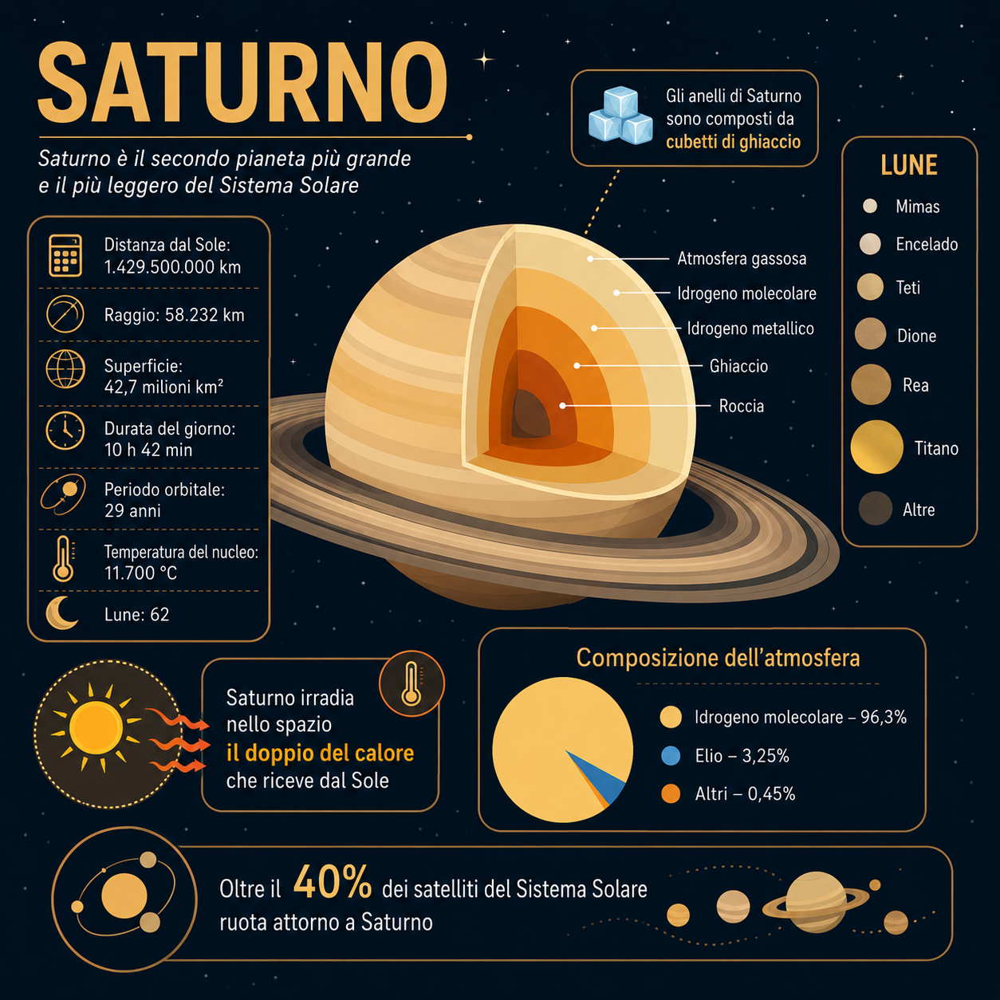
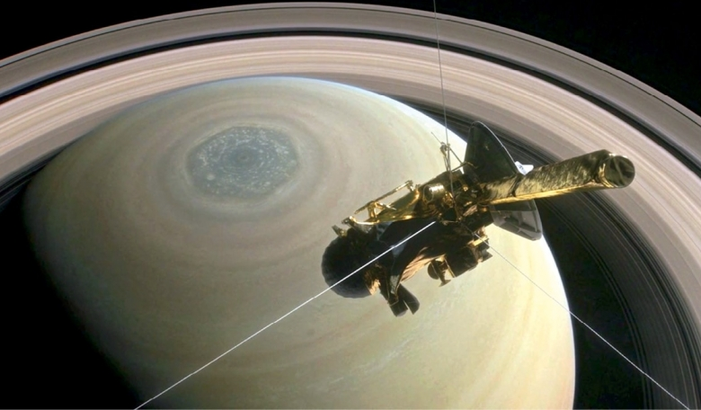
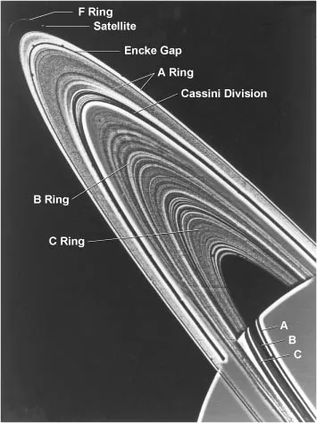
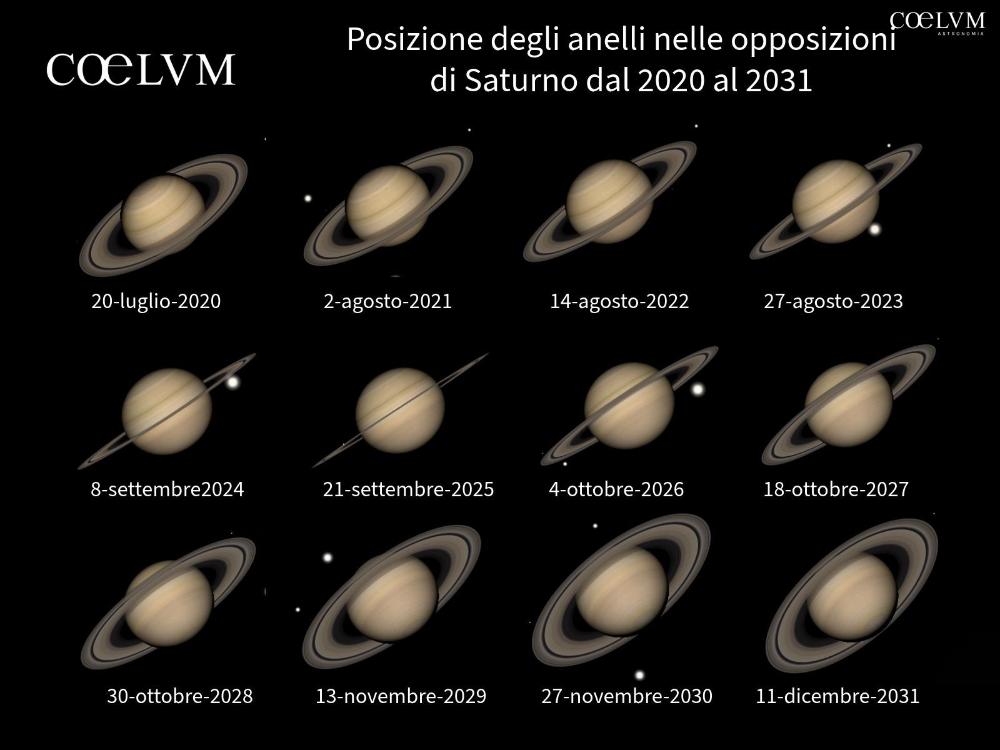
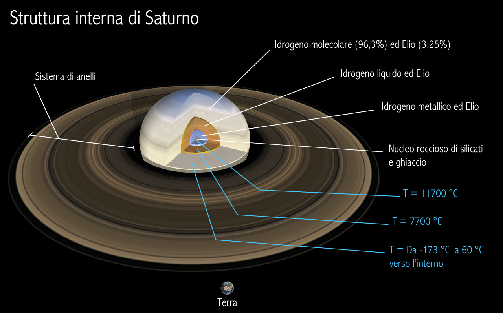
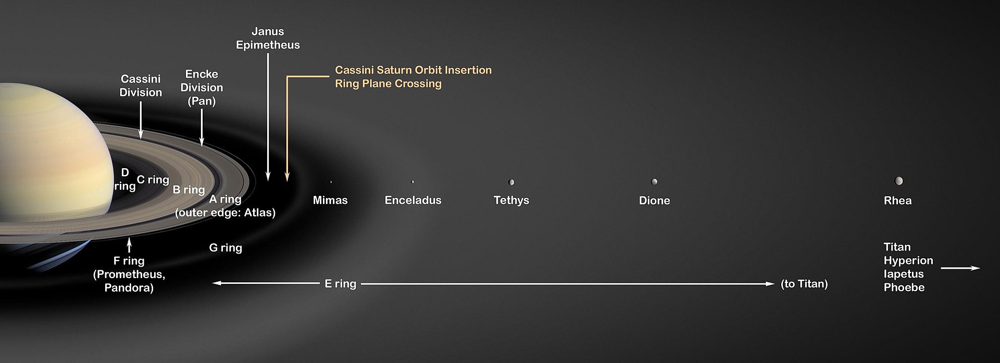

---
tags:
  - pianeta
  - saturno
---

# Saturno

## 🗓️ Informazioni

- **Data creazione:** 2026-05-09 10:00
    
- **Ultima modifica:** 2026-05-09 10:00
    
- **Autore:** [[Tiriolo Luca]]
    

---

# Saturno

**Saturno è il sesto pianeta dal Sole e il secondo pianeta più grande del Sistema Solare**, dopo Giove. È un gigante gassoso composto principalmente da idrogeno ed elio, ma la sua immagine è resa unica dal sistema di anelli più spettacolare e complesso conosciuto. Anche altri pianeti giganti possiedono anelli, ma nessuno mostra una struttura così ampia, luminosa e facilmente osservabile come quella di Saturno. ([NASA Science](https://science.nasa.gov/saturn/facts/ "Saturn: Facts - NASA Science"))

Saturno è conosciuto fin dall’antichità, perché è visibile a occhio nudo come un punto luminoso nel cielo. Tuttavia, la sua vera natura iniziò a emergere solo con l’uso del telescopio. Galileo Galilei osservò Saturno nel 1610, ma il suo strumento non era abbastanza potente da distinguere chiaramente gli anelli: gli apparvero come strane “appendici” laterali. Solo più tardi Christiaan Huygens interpretò correttamente la struttura come un anello separato dal pianeta.

Quando osserviamo Saturno al telescopio, non vediamo una superficie solida. Come Giove, anche Saturno **non possiede una superficie rocciosa definita**: la parte visibile corrisponde agli strati superiori della sua atmosfera. Procedendo verso l’interno, gas e fluidi diventano sempre più compressi, fino a condizioni estreme di pressione e temperatura. Una sonda non potrebbe “atterrare” su Saturno: verrebbe progressivamente schiacciata, riscaldata e distrutta dagli strati profondi del pianeta. ([NASA Science](https://science.nasa.gov/saturn/facts/ "Saturn: Facts - NASA Science"))

Saturno è enorme: ha un diametro equatoriale di circa **120.500 km**, quindi è circa **9 volte più largo della Terra**. Si trova mediamente a circa **1,4 miliardi di km dal Sole**, cioè circa **9,5 unità astronomiche**. A questa distanza, la luce del Sole impiega circa **80 minuti** per raggiungerlo. ([NASA Science](https://science.nasa.gov/saturn/facts/ "Saturn: Facts - NASA Science"))

Una caratteristica importante di Saturno è la sua bassa densità media. È il pianeta meno denso del Sistema Solare, con una densità inferiore a quella dell’acqua. Questo dato viene spesso semplificato dicendo che Saturno “galleggerebbe” in un enorme oceano, anche se si tratta ovviamente di un’immagine teorica e non realistica. Il concetto utile da ricordare è che Saturno, pur essendo gigantesco, è relativamente “leggero” rispetto al suo volume. ([NASA Science](https://science.nasa.gov/saturn/facts/ "Saturn: Facts - NASA Science"))

Un aspetto particolarmente interessante della struttura interna di Saturno riguarda l’emissione di energia. Il pianeta, infatti, irradia nello spazio più calore di quanto ne riceva dal Sole. Una delle spiegazioni principali è legata alla cosiddetta **pioggia di elio**. Nelle profondità di Saturno, dove pressione e temperatura sono enormi, **l’elio tende a separarsi dall’idrogeno circostante formando piccole gocce**. Queste gocce, più dense del materiale che le circonda, cadono lentamente verso gli strati più interni del pianeta. **Durante questa discesa liberano energia gravitazionale, trasformata in calore**. In questo modo, Saturno non si limita a riflettere o riemettere l’energia solare ricevuta, ma produce anche una parte significativa del proprio calore interno. Questo processo aiuta a spiegare perché Saturno risulti più caldo e luminoso, dal punto di vista termico, di quanto ci si aspetterebbe considerando soltanto la radiazione proveniente dal Sole.

Saturno ruota molto rapidamente. Un giorno saturniano dura circa **10,7 ore**, mentre un anno su Saturno dura circa **29,4 anni terrestri**. La rapida rotazione contribuisce allo schiacciamento del pianeta ai poli e al rigonfiamento equatoriale. Anche Saturno, come la Terra, ha un asse inclinato: la sua inclinazione è di circa **26,73°**, valore non molto diverso dai 23,5° terrestri. Questo significa che anche Saturno ha stagioni, sebbene molto più lunghe delle nostre. ([NASA Science](https://science.nasa.gov/saturn/facts/ "Saturn: Facts - NASA Science"))

# Atmosfera

L’atmosfera di Saturno è formata soprattutto da idrogeno ed elio, con tracce di altre sostanze come **metano, ammoniaca e vapore acqueo**. A differenza di Giove, che mostra bande molto contrastate, Saturno appare spesso più delicato e uniforme. Le sue bande atmosferiche esistono, ma sono meno evidenti e richiedono buone condizioni osservative per essere percepite chiaramente.

Saturno è attraversato da venti fortissimi. Nella regione equatoriale, i venti dell’alta atmosfera possono raggiungere circa **500 metri al secondo**, cioè circa **1.800 km/h**. Per confronto, i venti più potenti degli uragani terrestri sono molto inferiori. Questa circolazione atmosferica genera fasce, correnti a getto e tempeste. ([NASA Science](https://science.nasa.gov/saturn/facts/ "Saturn: Facts - NASA Science"))

Un fenomeno molto particolare è l’**esagono del polo nord**. Si tratta di una struttura atmosferica stabile, con forma approssimativamente esagonale, osservata per la prima volta dalle missioni Voyager e poi studiata in dettaglio dalla missione Cassini. **È uno degli esempi più affascinanti di dinamica atmosferica planetaria: una forma geometrica enorme, prodotta non da una superficie solida, ma da correnti e onde atmosferiche**.

Saturno, come gli altri pianeti giganti, rappresenta un laboratorio naturale per studiare atmosfere molto diverse da quella terrestre. Le atmosfere di Giove, Saturno, Urano e Nettuno sono profonde, dinamiche e influenzate anche dall’energia interna del pianeta. Nel caso di Saturno, l’energia proveniente dall’interno contribuisce ai processi atmosferici insieme alla radiazione solare ricevuta dall’esterno. ([ScienceDirect](https://www.sciencedirect.com/topics/earth-and-planetary-sciences/saturn-planet "Saturn (Planet) - an overview | ScienceDirect Topics"))

**Per l’astrofilo, l’atmosfera di Saturno è più difficile da leggere rispetto a quella di Giove. N**on bisogna aspettarsi sempre bande evidenti o dettagli netti. In buone condizioni di seeing, però, è possibile osservare leggere differenze di colore sul disco, fasce atmosferiche, l’ombra degli anelli proiettata sul pianeta e l’ombra del pianeta sugli anelli.

# Gli Anelli

Gli anelli sono la caratteristica più famosa di Saturno. Sono composti da miliardi di particelle di ghiaccio e roccia, ricoperte da materiali più scuri e polveri. Le dimensioni di queste particelle variano moltissimo: alcune sono minuscole come granelli di polvere, altre possono essere grandi come massi o persino più grandi. ([NASA Science](https://science.nasa.gov/saturn/facts/ "Saturn: Facts - NASA Science"))

Il sistema di anelli si estende fino a circa **282.000 km** dal pianeta, ma è incredibilmente sottile: nelle regioni principali, lo spessore verticale tipico è dell’ordine di appena **10 metri**. Questo contrasto è impressionante: un sistema larghissimo, ma estremamente sottile rispetto alla sua estensione. ([NASA Science](https://science.nasa.gov/saturn/facts/ "Saturn: Facts - NASA Science"))

Gli anelli principali sono indicati con lettere: A, B, C, D, E, F e G. Le lettere non seguono l’ordine della distanza dal pianeta, ma l’ordine storico di scoperta. Una delle strutture più famose è la **Divisione di Cassini**, una regione più scura che separa l’anello A dall’anello B. In buone condizioni osservative, con un telescopio amatoriale adeguato, questa divisione può essere visibile.

Gli anelli non sono fermi né rigidi. Ogni regione orbita attorno a Saturno con una velocità diversa. Inoltre, il sistema è influenzato dalla gravità del pianeta e dei satelliti. Alcune piccole lune, dette **lune pastore**, **contribuiscono a modellare bordi, lacune e strutture degli anelli.**

Le ricerche più recenti mostrano che il **rapporto tra anelli e piccole lune interne è molto stretto. Tra i satelliti di Saturno esiste infatti una popolazione di piccole “ring moons”, cioè lune legate dinamicamente agli anelli. Queste lune contribuiscono a limitare la diffusione del materiale degli anelli e, allo stesso tempo, potrebbero essersi formate almeno in parte dall’aggregazione di materiale proveniente dagli anelli stessi.** ([Springer Nature Link](https://link.springer.com/article/10.1007/s11214-024-01103-z "The Origin and Composition of Saturn’s Ring Moons | Space Science Reviews | Springer Nature Link"))

Questo significa che gli anelli non vanno pensati come una semplice decorazione del pianeta. **Sono un sistema fisico attivo, in evoluzione, collegato alle lune e alla storia dell’intero sistema saturniano**. Alcune lune come Pan e Daphnis si trovano all’interno di lacune degli anelli e contribuiscono a mantenerle; altre orbitano vicino ai bordi degli anelli e ne influenzano la struttura. ([Springer Nature Link](https://link.springer.com/article/10.1007/s11214-024-01103-z "The Origin and Composition of Saturn’s Ring Moons | Space Science Reviews | Springer Nature Link"))

Dal punto di vista osservativo, gli anelli cambiano aspetto nel corso degli anni perché cambia la loro inclinazione rispetto alla Terra. Quando sono molto aperti, Saturno appare spettacolare e tridimensionale. Quando invece sono quasi di taglio, diventano sottilissimi e molto più difficili da vedere. Questo rende Saturno un pianeta da seguire nel tempo: non appare sempre uguale.

# Struttura Interna

La struttura interna di Saturno è complessa e non completamente conosciuta. In modo semplificato, si può immaginare un nucleo ricco di materiali pesanti, come rocce, ghiacci, ferro e nichel, circondato da strati di idrogeno ed elio sempre più compressi. Più in profondità, l’idrogeno può raggiungere uno stato detto **idrogeno metallico**, capace di condurre elettricità. ([NASA Science](https://science.nasa.gov/saturn/facts/ "Saturn: Facts - NASA Science"))

Per molto tempo i modelli dei pianeti giganti hanno immaginato nuclei relativamente compatti e separati dagli strati superiori. Studi più recenti, però, suggeriscono una struttura più sfumata. Le osservazioni della missione Cassini e l’analisi delle onde negli anelli hanno fornito indizi sulla presenza di un nucleo **diffuso**, cioè non separato in modo netto dall’involucro esterno. In questo scenario, gli elementi pesanti potrebbero essere distribuiti gradualmente verso l’esterno invece di essere concentrati solo in un nucleo compatto. ([arXiv](https://arxiv.org/abs/2104.13385?utm_source=chatgpt.com "A diffuse core in Saturn revealed by ring seismology"))

**Questo è importante perché la struttura interna di Saturno racconta la sua storia di formazione. Se il nucleo è davvero diffuso, significa che i materiali pesanti e i gas non sono rimasti separati in modo semplice, ma hanno subito processi di mescolamento, stratificazione e lenta evoluzione interna.** Saturno non è quindi una palla uniforme di gas, ma un pianeta stratificato, dinamico e ancora in parte misterioso.

Saturno emette più energia di quanta ne riceva dal Sole. Una spiegazione possibile è la cosiddetta “pioggia di elio”: negli strati interni, l’elio potrebbe separarsi dall’idrogeno e cadere verso regioni più profonde, liberando energia gravitazionale. Questo processo contribuirebbe al calore interno del pianeta e alla sua evoluzione termica.

# Campo Magnetico

**Saturno possiede un campo magnetico esteso**, generato dai movimenti di materiale conduttivo al suo interno, probabilmente collegati all’idrogeno metallico. **La magnetosfera saturniana è enorme e interagisce con il vento solare, con gli anelli e con i satelliti.**

Un aspetto molto interessante emerso da studi recenti è che il campo magnetico di Saturno non è perfettamente simmetrico. **Una ricerca pubblicata nel 2026, basata su anni di dati della missione Cassini, ha indicato che una regione importante della magnetosfera, chiamata cuspide magnetica, risulta spostata da un lato**. Secondo gli studiosi, questa distorsione sarebbe legata alla rapida rotazione del pianeta e alla presenza di un ambiente ricco di plasma, alimentato in parte dal materiale proveniente da Encelado. ([ScienceDaily](https://www.sciencedaily.com/releases/2026/04/260403002014.htm "Saturn’s magnetic field is twisted and scientists just figured out why | ScienceDaily"))

Questa scoperta è importante perché mostra quanto Saturno sia un sistema integrato: il pianeta, il campo magnetico, gli anelli e i satelliti non funzionano come elementi separati. Encelado, pur essendo una luna relativamente piccola, può contribuire all’ambiente magnetosferico del pianeta attraverso i suoi getti di materiale.

# I Satelliti

Saturno possiede un sistema di satelliti estremamente ricco. Secondo i dati NASA, al 2023 erano noti **146 satelliti** in orbita attorno a Saturno, con altri oggetti in attesa di conferma o denominazione ufficiale. ([NASA Science](https://science.nasa.gov/saturn/facts/ "Saturn: Facts - NASA Science"))

Il satellite più famoso è **Titano**, la luna più grande di Saturno e la seconda luna più grande del Sistema Solare dopo Ganimede. Titano ha un diametro di circa **5.150 km**, quindi è più grande del **pianeta Mercurio.** È anche uno dei corpi più interessanti del Sistema Solare perché possiede una densa atmosfera, ricca di azoto, e un ciclo superficiale basato su metano ed etano. ([ScienceDirect](https://www.sciencedirect.com/topics/earth-and-planetary-sciences/saturn-planet "Saturn (Planet) - an overview | ScienceDirect Topics"))

**Su Titano esistono laghi, mari, fiumi e piogge, ma non d’acqua: i liquidi presenti in superficie sono principalmente idrocarburi, come metano ed etano.** Questo rende Titano un mondo straordinario, con processi geologici e atmosferici che ricordano in parte quelli terrestri, ma basati su sostanze e temperature completamente diverse.

Un altro satellite fondamentale è **Encelado**. **È molto più piccolo di Titano, ma ha attirato enorme attenzione scientifica perché dalla sua regione polare sud fuoriescono getti di vapore acqueo, particelle di ghiaccio e composti organici. Cassini ha osservato questi getti e ha mostrato che Encelado è geologicamente attivo**. La presenza di materiale proveniente dall’interno suggerisce l’esistenza di un oceano sotto la crosta ghiacciata. ([ScienceDirect](https://www.sciencedirect.com/topics/earth-and-planetary-sciences/saturn-planet "Saturn (Planet) - an overview | ScienceDirect Topics"))

Titano ed Encelado sono importanti anche per la ricerca di ambienti potenzialmente abitabili. Saturno, come pianeta, non è adatto alla vita come la conosciamo: le sue condizioni di pressione, temperatura e composizione sono troppo estreme. Tuttavia, alcune sue lune potrebbero ospitare ambienti interni più interessanti, in particolare oceani sotto la superficie ghiacciata. ([NASA Science](https://science.nasa.gov/saturn/facts/ "Saturn: Facts - NASA Science"))

Altri satelliti importanti sono **Rea, Giapeto, Dione, Teti, Mimas, Pan, Daphnis, Prometheus, Pandora, Epimeteo e Giano**. Alcuni sono grandi lune ghiacciate, altri sono piccoli corpi collegati agli anelli. Giapeto è famoso per la forte differenza di luminosità tra un emisfero e l’altro; Mimas è noto per il grande cratere Herschel; Pan e Daphnis sono importanti per la loro interazione diretta con le strutture degli anelli.

Dal punto di vista osservativo, **Titano** è il satellite più facile da individuare con un telescopio amatoriale. Appare come un piccolo punto luminoso vicino a Saturno. Con strumenti più grandi e cieli bui è possibile osservare anche altre lune, anche se sono molto meno evidenti rispetto ai satelliti galileiani di Giove.

# Osservazione Amatoriale

Saturno è uno degli oggetti più emozionanti da osservare con un telescopio. Anche a bassi ingrandimenti, la visione del disco circondato dagli anelli produce un effetto molto forte, soprattutto per chi lo osserva per la prima volta. È uno di quei casi in cui l’immagine all’oculare corrisponde davvero all’idea “classica” di un pianeta.

Essendo meno luminoso di Giove, Saturno richiede un po’ più di attenzione. È preferibile osservarlo quando si trova alto sull’orizzonte, perché la turbolenza atmosferica terrestre peggiora molto la qualità dell’immagine quando il pianeta è basso. Il seeing è fondamentale: in una notte instabile Saturno può apparire tremolante e povero di dettagli; in una notte stabile, invece, gli anelli diventano più netti e il disco mostra sfumature più delicate.

Gli elementi più interessanti da cercare sono:

- la separazione tra il disco del pianeta e gli anelli;
    
- la **Divisione di Cassini**;
    
- l’ombra degli anelli proiettata sul pianeta;
    
- l’ombra del pianeta proiettata sugli anelli;
    
- Titano e, con strumenti adeguati, altri satelliti;
    
- leggere bande atmosferiche sul disco;
    
- eventuali differenze di luminosità tra le regioni degli anelli.
    

Un aspetto importante è l’inclinazione degli anelli. Quando sono aperti, Saturno appare più spettacolare; quando sono quasi di taglio, gli anelli diventano più difficili da vedere, ma l’osservazione resta interessante perché permette di percepire il cambiamento geometrico del sistema nel corso degli anni.

# Missioni

Le missioni spaziali hanno trasformato completamente la conoscenza di Saturno. Le prime immagini ravvicinate arrivarono grazie a **Pioneer 11**, seguita dalle sonde **Voyager 1** e **Voyager 2**. Queste missioni mostrarono dettagli del pianeta, degli anelli e dei satelliti che non potevano essere osservati da Terra con la stessa precisione.

La missione più importante è stata però **Cassini-Huygens**, una collaborazione tra NASA, ESA e Agenzia Spaziale Italiana. Cassini entrò in orbita attorno a Saturno nel 2004 e studiò il sistema saturniano fino al 2017. La missione osservò il pianeta dall’interno dell’ambiente magnetosferico fino agli strati alti dell’atmosfera, seguì il cambiamento delle stagioni e fornì osservazioni ravvicinate di anelli e satelliti. ([PMC](https://pmc.ncbi.nlm.nih.gov/articles/PMC8753610/?utm_source=chatgpt.com "Cassini Exploration of the Planet Saturn - PMC - NIH"))

La sonda **Huygens** si separò da Cassini e scese nell’atmosfera di Titano nel gennaio 2005, raggiungendo la superficie. Fu un evento storico: il primo atterraggio su un corpo del Sistema Solare esterno. Grazie a Huygens e Cassini, Titano passò dall’essere una luna avvolta da foschia a un mondo complesso, con atmosfera, paesaggi e processi superficiali.

Cassini studiò anche **Encelado, rivelando i getti provenienti dalla regione polare sud e contribuendo a farne uno dei principali candidati nella ricerca di ambienti potenzialmente abitabil**i. Inoltre, i dati di Cassini sono ancora oggi utilizzati per nuove ricerche: studi recenti sul campo magnetico di Saturno e sulle lune degli anelli derivano proprio dall’analisi dei dati raccolti durante quella missione. ([ScienceDaily](https://www.sciencedaily.com/releases/2026/04/260403002014.htm "Saturn’s magnetic field is twisted and scientists just figured out why | ScienceDaily"))

La missione terminò il **15 settembre 2017**, quando Cassini fu fatta precipitare intenzionalmente nell’atmosfera di Saturno. Questa scelta servì a evitare il rischio di contaminare lune come Encelado o Titano, considerate molto importanti per la ricerca astrobiologica.
