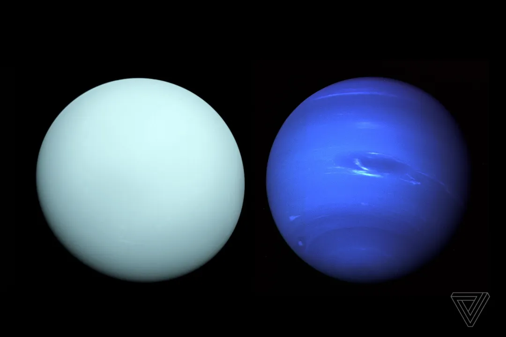
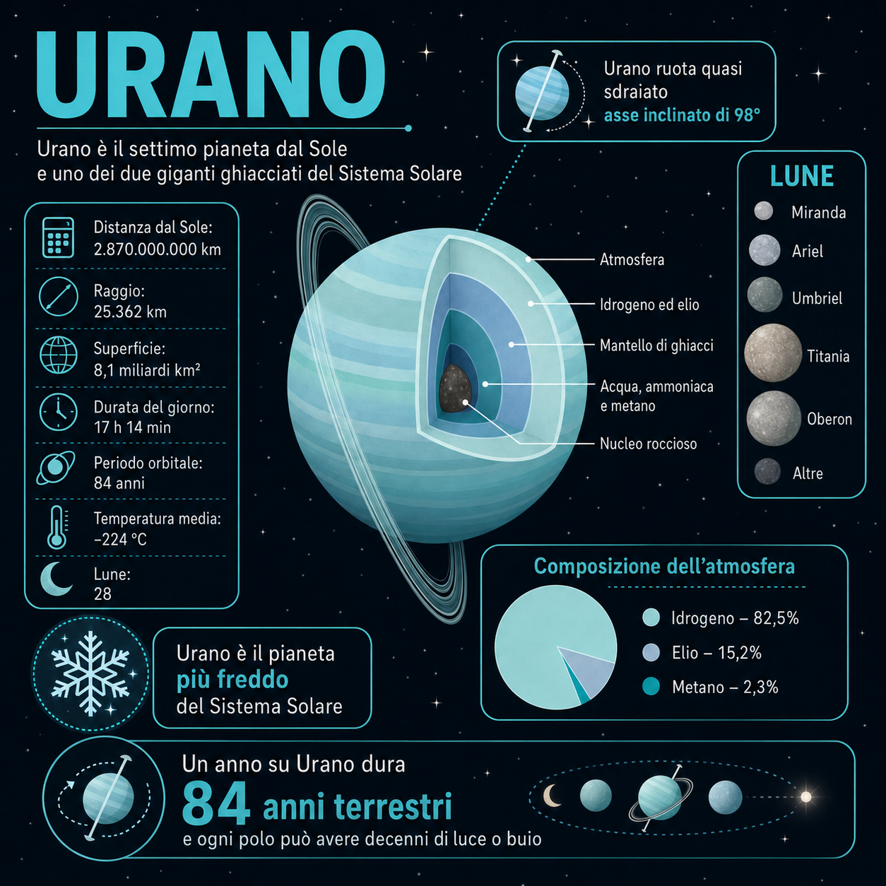
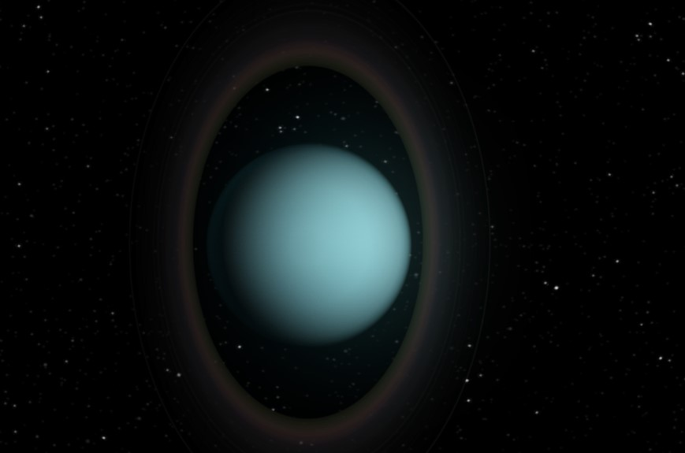
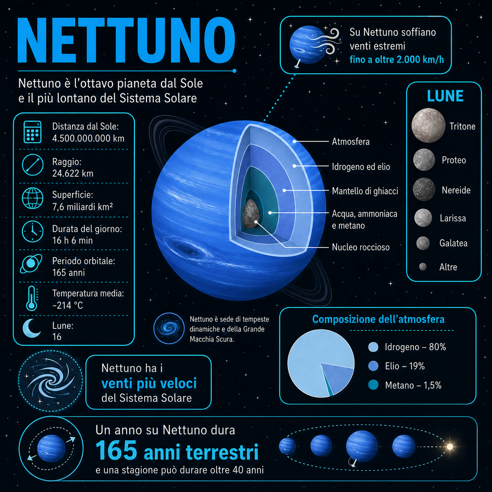
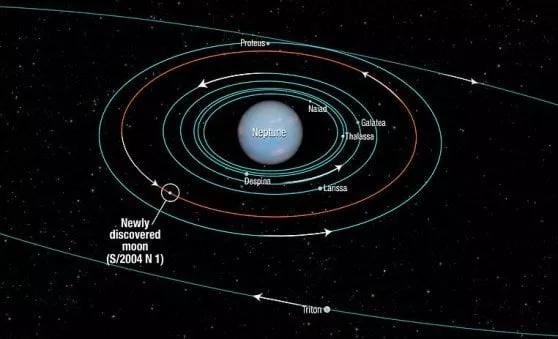
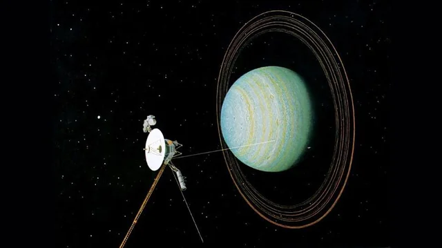

# Urano e Nettuno

## 🗓️ Informazioni
- **Data creazione:** 2026-05-09 10:00
- **Ultima modifica:** 2026-05-09 10:00
- **Autore:** [[Tiriolo Luca]]

---

# Urano e Nettuno

Urano e Nettuno sono gli ultimi due pianeti principali del Sistema Solare e appartengono alla categoria dei **giganti ghiacciati**. Questa definizione non significa che siano semplicemente “palle di ghiaccio”: indica piuttosto che, rispetto a Giove e Saturno, contengono una frazione molto maggiore di materiali pesanti e volatili, come acqua, ammoniaca e metano, presenti in condizioni estreme di pressione e temperatura. In molte fonti astronomiche questi materiali vengono chiamati “ghiacci”, anche se all’interno dei pianeti possono trovarsi in stati fisici molto diversi dal ghiaccio comune. [^1] [^2]

Questi due pianeti sono fondamentali per comprendere la formazione del Sistema Solare esterno. Sono meno conosciuti di Giove e Saturno perché sono stati visitati una sola volta da una sonda, **Voyager 2**, e solo tramite sorvoli rapidi. Proprio per questo rimangono tra gli oggetti più misteriosi del Sistema Solare: conosciamo alcune proprietà generali, ma la loro struttura interna, la composizione profonda e la storia evolutiva sono ancora oggetto di ricerca. [^2]

Urano e Nettuno sono importanti anche per lo **studio degli esopianeti.** Molti pianeti extrasolari scoperti hanno masse e dimensioni intermedie, simili o paragonabili a quelle dei giganti ghiacciati. Capire Urano e Nettuno significa quindi avere un riferimento reale, vicino e osservabile per interpretare una grande popolazione di mondi presenti nella nostra galassia. [^2]

---

# La scoperta di Urano e Nettuno

La scoperta di Urano e Nettuno rappresenta uno dei passaggi più importanti nella storia dell’astronomia moderna, perché **mostra il passaggio da un’astronomia basata soprattutto sull’osservazione diretta a un’astronomia capace di usare la matematica per prevedere l’esistenza di nuovi mondi**. **Urano** fu scoperto nel 1781 da **William Herschel**, anche se in realtà era già stato osservato in precedenza da altri astronomi, che però lo avevano catalogato come una semplice stella. Il motivo è che **Urano**, pur essendo visibile a occhio nudo in condizioni eccezionali, è molto debole e si muove lentamente nel cielo. Herschel, osservandolo con il telescopio, notò che non si comportava come una stella puntiforme: **appariva come un piccolo disco e cambiava posizione rispetto alle stelle di fondo**. Inizialmente pensò potesse trattarsi di una cometa, ma le osservazioni successive mostrarono che l’oggetto seguiva un’orbita quasi circolare attorno al Sole. Era quindi un nuovo pianeta, il primo scoperto con l’ausilio del telescopio. La scoperta di Urano ampliò enormemente i confini conosciuti del Sistema Solare, che fino ad allora terminava idealmente con Saturno.  [^3]

La scoperta di **Nettuno** fu ancora più rivoluzionaria, perché non avvenne semplicemente “guardando nel cielo”, ma attraverso il **ragionamento matematico.** Dopo la scoperta di Urano, gli astronomi iniziarono a calcolarne l’orbita con grande precisione, ma notarono alcune anomalie: la posizione osservata del pianeta non coincideva perfettamente con quella prevista dalle leggi della meccanica celeste. Una possibile spiegazione era la presenza di un altro pianeta, più lontano, capace di perturbare gravitazionalmente l’orbita di Urano. Sulla base di questi scarti, matematici e astronomi come **Urbain Le Verrier** in Francia e **John Couch Adams** in Inghilterra calcolarono indipendentemente la possibile posizione del pianeta sconosciuto. Nel 1846, l’astronomo **Johann Gottfried Galle**, dall’Osservatorio di Berlino, puntò il telescopio **nella regione indicata dai calcoli di Le Verrie**r e trovò Nettuno molto vicino alla posizione prevista. Questo evento fu una conferma spettacolare della potenza della gravitazione newtoniana: Nettuno fu scoperto perché la sua gravità lasciava una “firma” invisibile nel moto di Urano. **Per questo la sua scoperta è considerata uno dei più grandi successi della meccanica celeste**.

# Urano

**Urano è il settimo pianeta dal Sole**. È un pianeta di **colore azzurro-verde**, dovuto soprattutto alla presenza di metano nella sua atmosfera: **il metano assorbe parte della luce rossa e lascia prevalere le componenti blu-verdi riflesse verso l’osservatore**. Si tratta di un gigante ghiacciato composto in larga parte da acqua, ammoniaca e metano in fase supercritica, con un’atmosfera complessa e stratificata. [^3]

La caratteristica più famosa di **Urano è la sua inclinazione assiale estrema**. Il pianeta ruota quasi “sdraiato” sul piano della sua orbita, con un’inclinazione di circa **98°**. Questo significa che, durante il lungo anno uraniano, i poli possono rimanere esposti alla luce solare o immersi nell’oscurità per periodi lunghissimi, dell’ordine di decenni. Una delle ipotesi più discusse è che questa inclinazione sia stata prodotta da un grande impatto avvenuto nelle prime fasi della storia del pianeta. [^3] [^5]

# Atmosfera di Urano

L’atmosfera di Urano è composta soprattutto da **idrogeno ed elio**, con una quantità minore di metano. Il metano è però molto importante dal punto di vista visivo, perché determina la colorazione azzurro-verde del pianeta. Rispetto a Giove e Saturno, Urano appare molto più uniforme, con bande e contrasti atmosferici meno evidenti. [^3]

Urano è spesso definito un pianeta “tranquillo” dal punto di vista osservativo, ma questa impressione dipende anche dai limiti degli strumenti e dalla grande distanza. Le osservazioni moderne mostrano variazioni stagionali, nubi e fenomeni atmosferici, anche se meno spettacolari rispetto a Nettuno.

Un punto importante è il **debole calore interno** di Urano. **A differenza di Nettuno, Urano sembra emettere pochissima energia in eccesso rispetto a quella che riceve dal Sole**. Questo è uno dei grandi enigmi del pianeta. Due mondi simili per massa, dimensioni e composizione generale mostrano infatti comportamenti termici molto diversi: Nettuno irradia calore interno in modo significativo, mentre Urano appare molto meno attivo. [^2] [^4]

Per un astrofilo, Urano è difficilmente osservabile e riconoscibile. Occorre molta pratica e tecnica

# Struttura interna di Urano

La struttura interna di Urano è ancora incerta. Il modello classico prevede tre grandi regioni: un nucleo roccioso, un mantello ricco di materiali volatili come acqua, ammoniaca e metano, e un involucro esterno di idrogeno ed elio. Tuttavia, gli studi moderni sottolineano che questa divisione semplice potrebbe essere troppo schematica. [^2]

Nella review **Uranus and Neptune: Origin, Evolution and Internal Structure**, Helled, Nettelmann e Guillot evidenziano che **la struttura interna di Urano e Nettuno è ancora poco vincolata dai dati.** I modelli possono ammettere interni con strati distinti, ma anche profili più graduali, nei quali la composizione cambia progressivamente con la profondità. **Questo significa che non è obbligatorio immaginare Urano come una serie di gusci perfettamente separati.** [^2]

Un aspetto interessante è che i modelli non richiedono necessariamente grandi quantità di acqua per spiegare le proprietà osservate. Alcune soluzioni compatibili con i dati possono essere **più ricche di materiale roccioso o refrattario**. Per questo motivo, gli stessi autori mettono in discussione l’idea troppo semplice secondo cui Urano e Nettuno sarebbero “ghiacciati” nel senso comune del termine. [^2]

**La debole emissione di calore di Urano potrebbe essere collegata a una struttura interna più stratificata, che ostacola il trasporto di calore dalle profondità verso l’esterno. In uno scenario di questo tipo, l’energia interna resterebbe in parte intrappolata o verrebbe trasportata meno efficacemente**. Questa ipotesi si collega anche alla possibile storia di impatti giganti: un grande impatto obliquo potrebbe aver inclinato Urano e modificato il modo in cui il suo interno si è organizzato. [^2] [^5]

# Anelli e satelliti di Urano

**Urano possiede un sistema di anelli scuri, stretti e molto meno luminosi rispetto a quelli di Saturno**. Gli anelli furono scoperti nel 1977 durante l’occultazione di una stella: prima e dopo il passaggio di Urano davanti alla stella, la luce stellare diminuì più volte, rivelando la presenza di materiale anulare attorno al pianeta.

Gli anelli di Urano sono difficili da osservare con strumenti amatoriali. Sono composti da materiale scuro e poco riflettente, probabilmente particelle alterate dalla radiazione e dall’ambiente spaziale. La loro esistenza è comunque importante perché mostra che i sistemi ad anelli sono comuni tra i pianeti giganti, anche se Saturno resta il caso più spettacolare.

I principali satelliti di Urano sono **Miranda, Ariel, Umbriel, Titania e Oberon**. Titania è la luna più grande, mentre **Miranda è famosa per la sua superficie estremamente irregolare, con fratture, scarpate e regioni geologiche molto diverse tra loro. I nomi delle lune di Urano derivano in gran parte da personaggi delle opere di Shakespeare e Alexander Pope.**

---

# Nettuno

**Nettuno è l’ottavo pianeta dal Sole e il pianeta principale più esterno del Sistema Solar**e. Non è visibile a occhio nudo e ha una storia particolare: fu il primo pianeta individuato grazie a calcoli matematici prima ancora di essere osservato direttamente. Le anomalie nell’orbita di Urano portarono infatti a ipotizzare la presenza di un altro pianeta più esterno. [^4]

Nettuno è simile a Urano per dimensioni e composizione generale, ma appare molto più dinamico. Nonostante riceva pochissima luce dal Sole, possiede venti estremamente rapidi, nubi brillanti e sistemi tempestosi. Questo comportamento è collegato al fatto che Nettuno emette una quantità significativa di calore interno. [^4]

**Il colore blu di Nettuno è dovuto anche qui al metano atmosferico, ma il pianeta appare spesso di un blu più intenso rispetto a Urano. La differenza cromatica potrebbe dipendere anche da foschie, aerosol e altri composti presenti negli strati atmosferici superiori.**

# Atmosfera di Nettuno

L’atmosfera di Nettuno è composta soprattutto da idrogeno ed elio, con metano in quantità minore. Il metano assorbe la luce rossa e contribuisce al colore blu del pianeta. Tuttavia, Nettuno non è soltanto una versione più lontana di Urano: la sua atmosfera appare più attiva e più contrastata. [^4]

**La Voyager 2 osservò nel 1989 la famosa Grande Macchia Scura**, una struttura tempestosa nell’atmosfera nettuniana. A differenza della Grande Macchia Rossa di Giove, le macchie scure di Nettuno non sembrano strutture secolari stabili: possono formarsi, evolvere e scomparire nel tempo.

**Nettuno possiede alcuni dei venti più veloci del Sistema Solare**. **La cosa sorprendente è che il pianeta riceve pochissima energia dal Sole, ma la sua atmosfera resta molto dinamica. Questo indica che il calore interno svolge un ruolo importante nella meteorologia nettuniana.  Nettuno riceve molta meno luce solare di Urano, ma la sua energia interna è sufficiente ad alimentare venti estremamente rapidi.** [^4]

**Per un astrofilo, Nettuno è una sfida osservativa.** Non è visibile a occhio nudo e al telescopio appare come un piccolo disco bluastro. I dettagli atmosferici sono normalmente fuori dalla portata dell’osservazione visuale amatoriale, ma individuarlo correttamente tra le stelle è già un risultato significativo.

# Struttura interna di Nettuno

La struttura interna di Nettuno è simile, in termini generali, a quella di Urano: un involucro esterno ricco di idrogeno ed elio, un’ampia regione interna di materiali pesanti e volatili, e probabilmente un nucleo più ricco di rocce e metalli. Anche in questo caso, però, la divisione in strati netti è una semplificazione. [^2]

**Nettuno sembra trasportare il calore interno verso l’esterno in modo più efficiente rispetto a Urano. Questa differenza potrebbe dipendere dalla sua storia evolutiva. Alcuni modelli suggeriscono che Nettuno possa aver subito impatti capaci di mescolare più profondamente il suo interno, rendendolo meno stratificato e più convettivo.** [^2] [^5]

**Secondo la review di Helled, Nettelmann e Guillot, una delle grandi domande aperte è proprio capire perché Urano e Nettuno, pur essendo simili, presentino differenze così marcate nel calore interno, nella struttura, nel campo magnetico e nell’evoluzione atmosferica**. [^2]

# Tritone, anelli e satelliti di Nettuno

Nettuno possiede un sistema di anelli molto debole e scuro. Questi anelli sono difficili da osservare e molto meno spettacolari rispetto a quelli di Saturno, ma confermano che anche il pianeta più esterno possiede un ambiente complesso fatto di polveri, piccoli corpi e satelliti.

Il satellite più importante di Nettuno è **Tritone**. Tritone è particolare perché orbita in senso retrogrado, **cioè nella direzione opposta rispetto alla rotazione del pianeta. Questa caratteristica suggerisce che non si sia formato insieme a Nettuno, ma sia stato probabilmente catturato gravitazionalmente, forse come antico oggetto della fascia di Kuiper.**

Tritone è un mondo molto interessante: ha una superficie ghiacciata, una tenue atmosfera e segni di attività geologica. La Voyager 2 osservò possibili geyser o pennacchi scuri, interpretati come emissioni di materiale dalla superficie. La cattura di Tritone potrebbe aver modificato profondamente il sistema originario di satelliti di Nettuno.

---

# Origine e formazione di Urano e Nettuno

**La formazione di Urano e Nettuno è uno dei problemi più difficili della planetologia**. I due pianeti hanno masse intermedie, circa **14,5 masse terrestri** per Urano e circa **17,1 masse terrestri** per Nettuno, ma non hanno acquisito enormi involucri di idrogeno ed elio come Giove e Saturno. Questo suggerisce che abbiano seguito una storia diversa rispetto ai giganti gassosi. [^5]

L’articolo **Accretion of Uranus and Neptune: Confronting different giant impact scenarios**, pubblicato su *Icarus*, confronta diversi scenari di impatti giganti per spiegare la formazione dei due pianeti. Gli autori sottolineano che le origini di Urano e Nettuno non sono ancora completamente comprese **e che le loro inclinazioni assiali indicano probabilmente una storia segnata da grandi impatti.** [^5]

Lo studio considera scenari con impattatori grandi e scenari con impattatori più piccoli. **Gli impatti con corpi di massa simile possono spiegare alcune proprietà, ma tendono a produrre pianeti con rotazioni troppo rapide. Gli impatti con grande rapporto di massa, cioè tra un proto-pianeta molto più massiccio e un impattatore più piccolo, possono invece produrre periodi di rotazione più compatibili con quelli osservati, ma risultano dinamicamente meno frequenti in alcune simulazioni**. [^5]

La conclusione importante è che non esiste ancora uno scenario semplice e definitivo. Sia gli impatti grandi sia quelli più piccoli restano possibili, ma le probabilità complessive di ottenere contemporaneamente masse, rapporti di massa, rotazioni e inclinazioni simili a quelle osservate sono basse. Questo mostra quanto sia delicata la ricostruzione della fase finale di formazione di Urano e Nettuno. [^5]

# Composizione profonda e linea del ghiaccio del CO

Uno degli studi più interessanti tra quelli recenti è **Insights on the Formation Conditions of Uranus and Neptune from Their Deep Elemental Compositions**, pubblicato su *The Planetary Science Journal*. L’articolo parte da un’idea importante: la composizione profonda di Urano e Nettuno può conservare indizi sulle condizioni del disco protoplanetario in cui si sono formati. [^6]

Secondo questo studio, l’abbondanza elevata di carbonio nelle atmosfere profonde dei due pianeti suggerisce che Urano e Nettuno possano essersi formati in prossimità della **linea del ghiaccio del monossido di carbonio**, cioè una regione del disco protosolare in cui il CO poteva condensare e contribuire alla composizione dei solidi accresciuti dai pianeti. [^6]

Gli autori considerano due scenari principali:
- accrescimento di solidi formati da **condensati puri**;
- accrescimento di una miscela di **condensati e clatrati**, cioè strutture ghiacciate capaci di intrappolare molecole volatili.

Nel primo caso, il modello prevede una forte deplezione dell’argon e un arricchimento di elementi come azoto, ossigeno, kripton, fosforo, zolfo e xeno. Nel secondo caso, invece, anche l’argon risulterebbe significativamente arricchito. Queste differenze sono importanti perché future sonde atmosferiche potrebbero misurare i rapporti tra gas nobili e distinguere tra i diversi scenari di formazione. [^6]

Questa ricerca è importante perché collega la chimica profonda dei pianeti alla loro origine. Non basta sapere che Urano e Nettuno sono “ricchi di ghiacci”: bisogna capire quali composti hanno accresciuto, in quale regione del disco si trovavano e come quei materiali si sono trasformati nel tempo.

# Sono davvero “giganti ghiacciati”?

**La definizione di “giganti ghiacciati” è utile, ma può essere fuorviante se presa troppo alla lettera. La review di Helled, Nettelmann e Guillot sottolinea che Urano e Nettuno potrebbero non essere necessariamente dominati dall’acqua. Alcuni modelli compatibili con i dati permettono interni più ricchi di materiali rocciosi o refrattari.** [^2]

Questo punto è importante perché modifica l’immagine classica dei due pianeti. Invece di pensarli come mondi composti soprattutto da acqua, ammoniaca e metano, oggi si considera possibile una gamma più ampia di composizioni interne. Le osservazioni disponibili non sono ancora sufficienti per distinguere in modo definitivo tra tutte le soluzioni.

L’incertezza riguarda anche il collegamento tra atmosfera e interno profondo. Le abbondanze misurate o stimate negli strati atmosferici superiori non rappresentano necessariamente l’intero pianeta. Per capire davvero la composizione di Urano e Nettuno servirebbero sonde atmosferiche capaci di misurare direttamente gas nobili, isotopi e composti volatili in profondità. [^2] [^6]

# Campi magnetici

Urano e Nettuno possiedono campi magnetici molto particolari. A differenza della Terra, di Giove e di Saturno, i loro campi magnetici non sono ben allineati con l’asse di rotazione e risultano fortemente decentrati. **Questo suggerisce che il meccanismo di generazione del campo magnetico non avvenga in un nucleo centrale semplice, ma probabilmente in regioni fluide e conduttive poste a profondità intermedie.**
La natura di questi strati conduttivi è ancora discussa. Potrebbero essere coinvolte forme esotiche di acqua, ammoniaca o altri materiali ionici e superionici, presenti alle pressioni estreme degli interni planetari. Anche questo tema è collegato alla domanda più generale sulla struttura interna: se gli interni sono stratificati, graduali o parzialmente mescolati, cambia anche il modo in cui può essere generato il campo magnetico. [^2]

# Osservazione amatoriale

Urano e Nettuno non sono pianeti spettacolari come Giove o Saturno, ma sono molto affascinanti per chi ama osservare il Sistema Solare completo. La loro osservazione è più sottile: richiede pazienza, mappe aggiornate e una buona capacità di orientarsi tra le stelle.

Urano può essere visto come un piccolo disco azzurro-verde. In condizioni eccellenti può essere individuato anche a occhio nudo, ma normalmente è molto più semplice osservarlo con binocolo o telescopio. Con telescopi amatoriali di buon diametro appare come un dischetto non puntiforme. [^3]

Nettuno è più difficile. È troppo debole per essere visto a occhio nudo e al telescopio appare come un piccolo disco bluastro. La sfida principale è identificarlo correttamente. Una volta trovato, però, offre una sensazione particolare: si sta osservando il pianeta principale più lontano dal Sole. [^4]

Osservare Urano e Nettuno significa percepire direttamente la scala del Sistema Solare. La loro luce è debole, il disco è piccolo, i dettagli sono quasi invisibili, ma proprio questo li rende interessanti: sono mondi lontanissimi, freddi e ancora poco conosciuti.

# Missioni

L’unica missione ad aver visitato Urano e Nettuno è stata **Voyager 2**. La sonda sorvolò Urano nel gennaio 1986 e Nettuno nell’agosto 1989, fornendo immagini e dati fondamentali su atmosfere, anelli, satelliti e campi magnetici.

Da allora, lo studio dei due pianeti si è basato soprattutto su telescopi terrestri e spaziali. Tuttavia, molte domande richiedono una missione dedicata. La review di Helled, Nettelmann e Guillot evidenzia che Urano e Nettuno sono priorità importanti della scienza planetaria, anche perché sono fondamentali per interpretare i numerosi esopianeti di dimensioni simili scoperti nella galassia. [^2]

**Una futura missione ideale dovrebbe includere un orbiter e una sonda atmosferica. L’orbiter permetterebbe di studiare nel tempo atmosfera, anelli, satelliti, campo gravitazionale e campo magnetico. La sonda atmosferica potrebbe invece misurare direttamente la composizione, fornendo dati decisivi per distinguere tra i diversi modelli di formazione e struttura interna.** [^2] [^6]

# Fonti e riferimenti

[^1]: Wikipedia, **Ice giant** e classificazione generale dei giganti ghiacciati.  
Fonte usata come riferimento divulgativo di base: https://en.wikipedia.org/wiki/Ice_giant

[^2]: Ravit Helled, Nadine Nettelmann, Tristan Guillot, **Uranus and Neptune: Origin, Evolution and Internal Structure**, *Space Science Reviews*, 2020.  
Fonte condivisa: https://www.researchgate.net/publication/340169463_Uranus_and_Neptune_Origin_Evolution_and_Internal_Structure  
DOI indicato nella fonte: https://doi.org/10.1007/s11214-020-00660-3

[^3]: Wikipedia, **Uranus**.  
Fonte condivisa come riferimento generale: https://en.wikipedia.org/wiki/Uranus

[^4]: Wikipedia, **Neptune**.  
Fonte condivisa come riferimento generale: https://en.wikipedia.org/wiki/Neptune

[^5]: Leandro Esteves, André Izidoro, Othon C. Winter, **Accretion of Uranus and Neptune: Confronting different giant impact scenarios**, *Icarus*, Volume 429, 15 March 2025, 116428.  
Fonte condivisa: https://www.sciencedirect.com/science/article/abs/pii/S0019103524004883  
DOI: https://doi.org/10.1016/j.icarus.2024.116428

[^6]: Olivier Mousis et al., **Insights on the Formation Conditions of Uranus and Neptune from Their Deep Elemental Compositions**, *The Planetary Science Journal*, 2024.  
Fonte condivisa: https://iopscience.iop.org/article/10.3847/PSJ/ad58d8  
DOI: https://doi.org/10.3847/PSJ/ad58d8  
Versione alternativa consultabile: https://arxiv.org/abs/2406.11530
