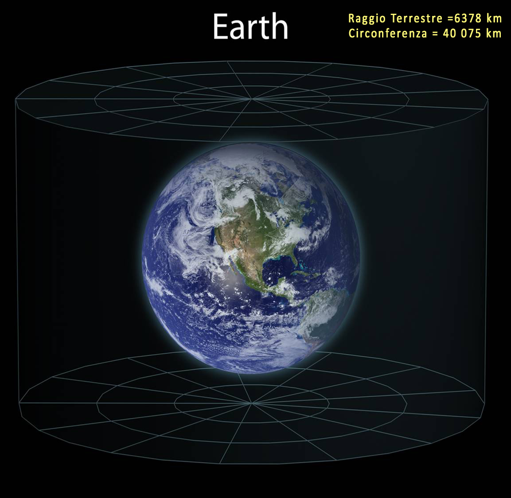
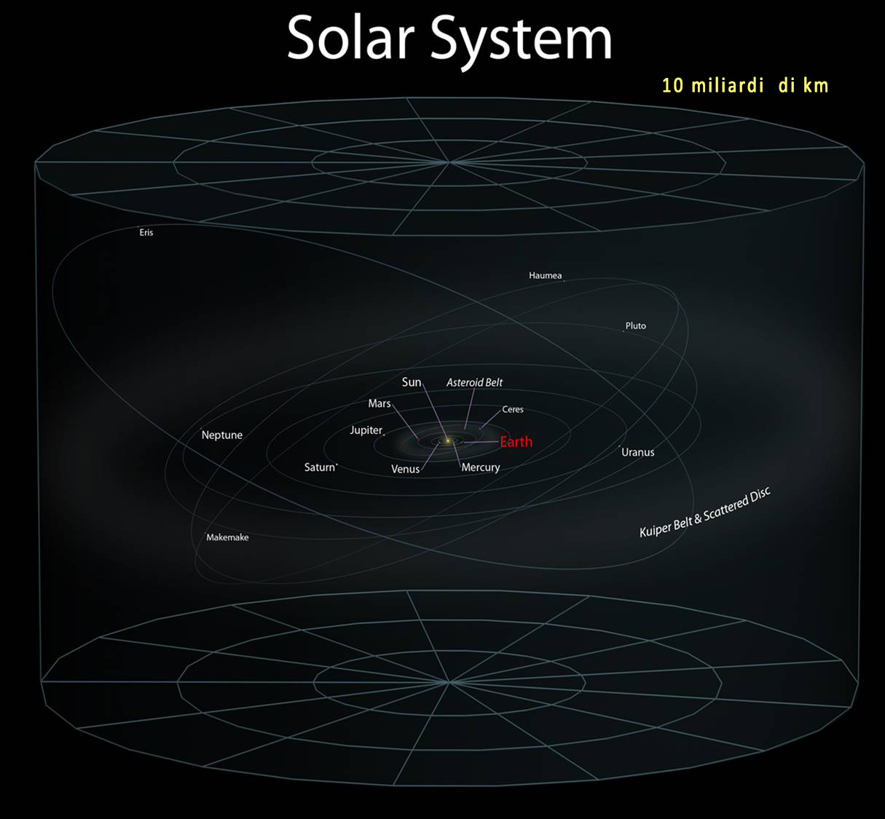
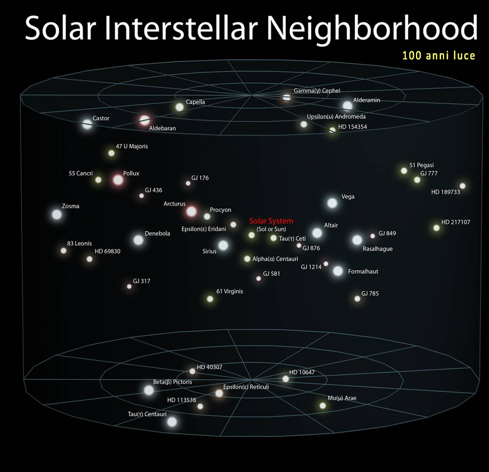
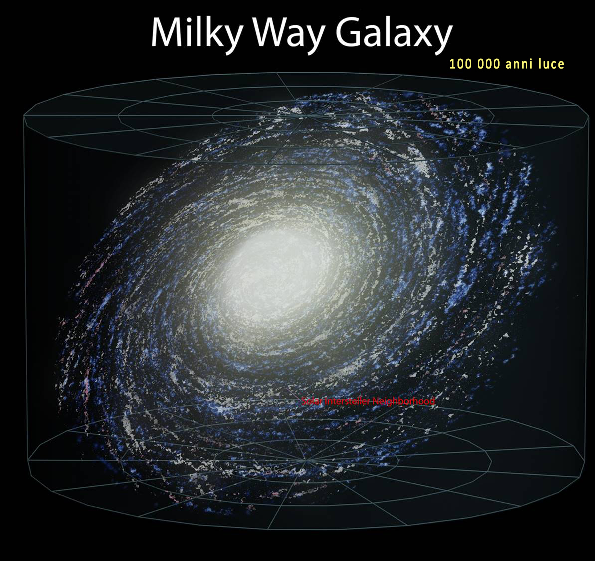
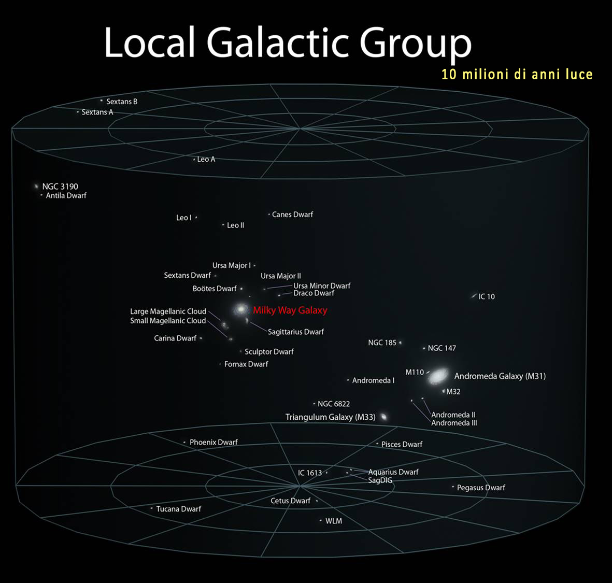
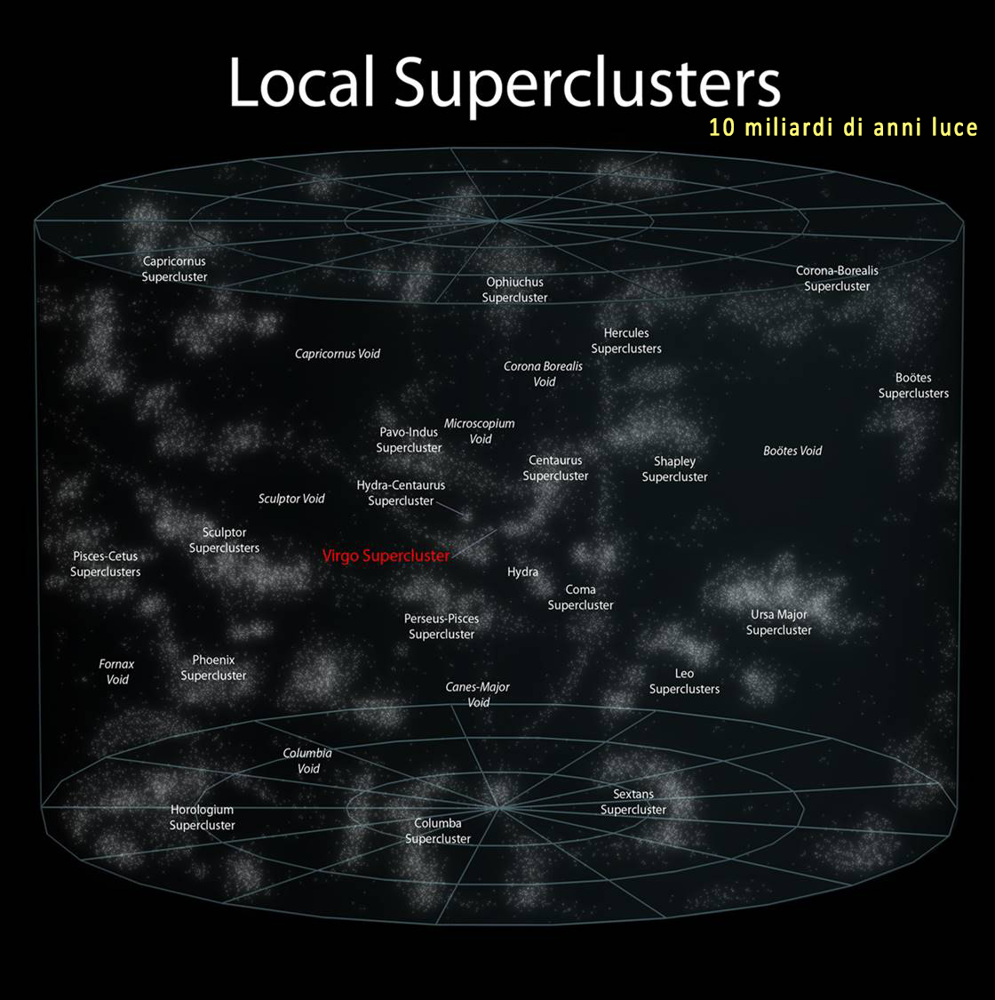
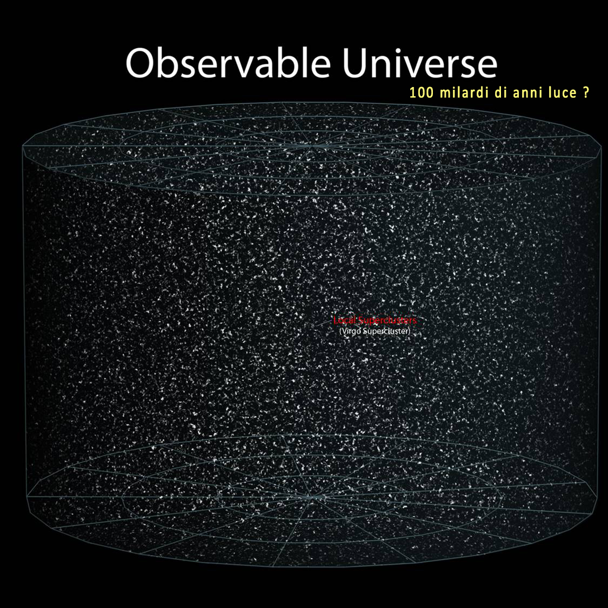

## Struttura generale

1. Le galassie non sono tutte uguali: forma, colore, gas e stelle raccontano storie diverse.
2. La sequenza di Hubble è utilissima, ma non va letta come un percorso evolutivo lineare.
3. Le spirali sono sistemi dinamici: ruotano, formano stelle e contengono gas e polvere.
4. Le curve di rotazione sono un indizio forte che la massa visibile non basta.
5. Il centro di molte galassie ospita oggetti estremi, come buchi neri supermassicci.

