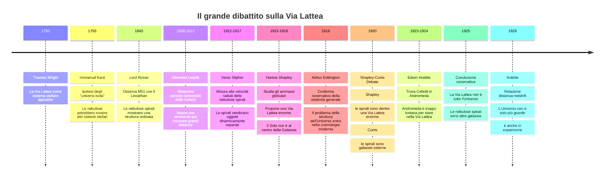
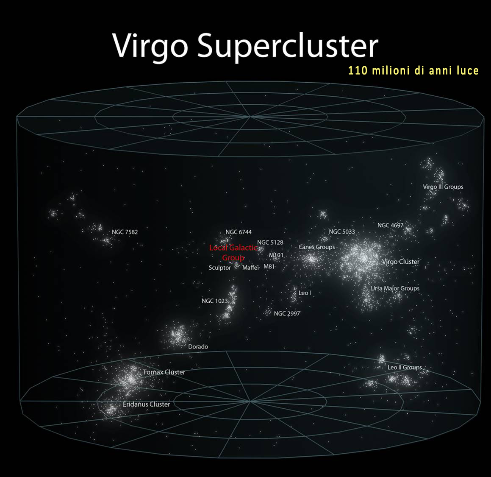

## Le nebulose e i cataloghi

 **Messier**, **Herschel** e poi dal **New General Catalog**. Molti oggetti che oggi conosciamo come galassie erano inizialmente classificati semplicemente come nebulose.

> [!note] Concetto storico
> “Quando guardiamo M31, la galassia di Andromeda, oggi sappiamo che è un'altra galassia. Ma per molto tempo era solo una macchia: non era evidente se fosse dentro o fuori dalla nostra Via Lattea.”

## Il Grande Dibattito Shapley-Curtis

All'inizio del Novecento il tema della natura delle nebulose spirali era centrale. Nel cosiddetto **Grande Dibattito**:

- una posizione sosteneva che le nebulose spirali fossero dentro la Via Lattea;
- l'altra sosteneva che fossero sistemi esterni e indipendenti.

La svolta arrivò con le osservazioni di stelle variabili Cefeidi in alcune nebulose, in particolare nella regione di Andromeda. Le Cefeidi permettono di stimare le distanze perché hanno una relazione tra periodo di variazione e luminosità intrinseca.

Il grande dibattito sulla Via Lattea fu il momento in cui l’astronomia dovette decidere se la nostra Galassia fosse **l’intero Universo** oppure soltanto **una galassia tra molte altre**. L’idea non nasce nel 1920: già nel Settecento **Thomas Wright** e **Immanuel Kant** avevano immaginato la Via Lattea come un sistema stellare appiattito e finito, e Kant aveva parlato di possibili “universi-isola”, cioè sistemi stellari esterni simili al nostro. Nell’Ottocento, con i cataloghi di **Charles Messier**, **William Herschel** e poi **John Herschel**, il cielo si riempì di oggetti nebulosi: alcune erano vere nubi di gas, altre ammassi stellari, altre ancora misteriose **nebulose spirali**. Il problema era che nessuno sapeva quanto fossero lontane. Se erano vicine, allora appartenevano alla Via Lattea; se erano lontanissime, erano galassie autonome. A complicare il quadro arrivò **Lord Rosse**, che nel 1845 osservò la struttura a spirale di M51 con il grande telescopio “Leviathan”: da quel momento le nebulose spirali non sembravano più semplici macchie indistinte, ma sistemi organizzati, forse paragonabili alla nostra Galassia. All’inizio del Novecento si formarono due visioni opposte. **Jacobus Kapteyn** costruì un modello relativamente piccolo della Via Lattea, con il Sole vicino al centro; **Harlow Shapley**, studiando gli ammassi globulari e usando le variabili Cefeidi, arrivò invece a una Via Lattea molto più grande, con il Sole decentrato. Shapley aveva ragione sul fatto che il Sole non occupa il centro galattico, ma portò questa idea fino a considerare la Via Lattea talmente vasta da poter contenere anche le nebulose spirali. Di fronte a lui c’era **Heber Curtis**, sostenitore dell’ipotesi degli universi-isola: per Curtis, oggetti come Andromeda erano sistemi stellari separati, esterni alla Via Lattea. Il confronto culminò il **26 aprile 1920**, al National Museum di Washington, nel celebre dibattito Shapley-Curtis sulla “scala dell’Universo”. Shapley difese una Via Lattea enorme, quasi coincidente con l’intero cosmo osservabile; Curtis difese una Via Lattea più piccola e un Universo popolato da molte galassie. Entrambi usarono argomenti seri ma incompleti: Shapley si appoggiava anche alle presunte rotazioni interne osservate da **Adriaan van Maanen** nelle spirali, che se fossero state extragalattiche avrebbero implicato velocità impossibili; Curtis citava invece le grandi velocità radiali misurate da **Vesto Slipher**, la distribuzione delle novae in Andromeda e la somiglianza morfologica tra le spirali e la nostra Galassia. In questo clima si inserisce anche **Arthur Eddington**: non fu il protagonista diretto del dibattito del 1920, ma fu una figura essenziale nel passaggio culturale successivo, perché contribuì a portare la discussione dalla struttura della Via Lattea alla cosmologia relativistica e all’idea di un Universo fisico in evoluzione. Dopo il lavoro di **Henrietta Leavitt** sulle Cefeidi, fu **Edwin Hubble** a chiudere la questione: identificando Cefeidi in Andromeda e misurandone la distanza, mostrò che Andromeda era troppo lontana per appartenere alla Via Lattea. La conclusione fu rivoluzionaria: la Via Lattea non era l’Universo, ma una galassia; le nebulose spirali erano altre galassie; e il cosmo diventava improvvisamente molto più grande, popolato da sistemi stellari separati da distanze enormi. ([apod.nasa.gov](https://apod.nasa.gov/diamond_jubilee/debate20.html?utm_source=chatgpt.com "The Shapley - Curtis Debate in 1920"))

