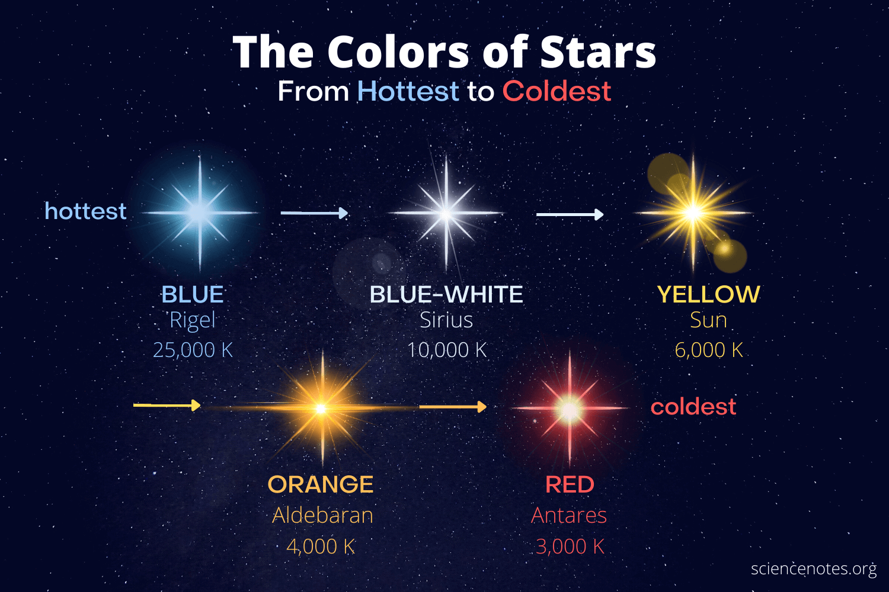

C:\Users\lucat\Pictures\Foto\2025_08_22_MW_Tirivolo

# 2 Struttura della galassia
Dal punto di vista dinamico, la Via Lattea è un sistema in cui la gravità complessiva determina orbite, moti collettivi, stabilità del disco, distribuzione delle stelle e velocità di rotazione.

In forma sintetica:

$$
\text{Galassia} = \text{stelle} + \text{gas} + \text{polveri} + \text{materia oscura} + \text{gravità}
$$

Nella classificazione di Hubble, la **Via Lattea** è classificata come una ==**galassia a spirale barrata**==, indicata con la sigla **SBb** o **SBbc**

- **S (Spirale):** Possiede una struttura a disco rotante con dei bracci luminosi in cui si concentrano polveri, gas e giovani stelle.
- **B (Barrata):** Dal nucleo centrale parte una struttura allungata, simile a una "barra", da cui si diramano i bracci a spirale.
- **b/bc:** Indica la dimensione del nucleo centrale (bulge) e il grado di avvolgimento dei bracci, che nella nostra galassia sono moderatamente aperti
### 2.1 La Via Lattea come galassia “normale” e come caso speciale

La Via Lattea è una galassia a spirale tra molte altre, ma per noi è speciale perché possiamo studiarne i dettagli locali.

### 2.1.1 Normale

È normale perché:

- possiede un disco;
- ha bracci spirali;
- contiene gas e polveri;
- ruota;
- mostra popolazioni stellari di età diverse;
- presenta un centro compatto;
- è immersa in un alone di materia oscura.

### 2.1.2 Speciale

È speciale perché:

- possiamo misurare moti stellari individuali;
- possiamo osservare chimica, età e velocità di moltissime stelle;
- possiamo studiare il mezzo interstellare con grande dettaglio;
- possiamo usare la Galassia come riferimento per interpretare le galassie esterne.

La Via Lattea è quindi sia un oggetto astronomico sia uno strumento concettuale.
### 2.2 Perché è difficile capire la forma della Via Lattea

Quando osserviamo una galassia esterna, vediamo la sua struttura complessiva: disco, nucleo, bracci, barra, alone. Con la Via Lattea accade il contrario: siamo immersi nel suo disco.
È come cercare di disegnare la pianta di una città restando in una strada piena di palazzi, nebbia e luci.
I principali ostacoli osservativi sono:
### 2.1 Prospettiva interna

Il Sole si trova nel disco galattico. Guardando lungo il piano della Galassia, la nostra linea di vista attraversa una grande quantità di stelle, gas e polveri.

Questo produce una sovrapposizione apparente di oggetti che in realtà si trovano a distanze molto diverse.

### 2.2 Estinzione interstellare

Le polveri assorbono e diffondono la luce, soprattutto alle lunghezze d'onda visibili. Per questo il centro galattico è fortemente oscurato in luce ottica.

L'estinzione modifica la luminosità osservata:

$$
F_{osservato} < F_{intrinseco}
$$

In magnitudini, una sorgente appare più debole di quanto sia realmente:

$$
m_{osservata} = m_{intrinseca} + A_\lambda
$$

Dove $A_\lambda$ è l'estinzione alla lunghezza d'onda $\lambda$.

### 2.3 Necessità di osservare a più lunghezze d'onda

Per ricostruire la Via Lattea non basta la luce visibile. Servono:

- **radio**, per tracciare idrogeno neutro e gas molecolare;
- **infrarosso**, per penetrare le polveri e osservare stelle fredde e regioni centrali;
- **ottico**, per stelle vicine, ammassi e nebulose non troppo oscurate;
- **raggi X e gamma**, per fenomeni energetici, resti di supernova, sorgenti compatte e ambiente centrale.

---

---

## 3 Disco sottile e disco spesso

La Via Lattea contiene almeno due sottocomponenti discoidali:

| Componente | Caratteristiche principali |
|---|---|
| Disco sottile | gas, polveri, stelle giovani, bracci spirali, formazione stellare attiva |
| Disco spesso | stelle più vecchie, maggiore dispersione verticale, minore contenuto di gas |

Il disco sottile è più legato alla formazione stellare recente. Il disco spesso conserva invece informazioni più antiche sulla storia dinamica della Galassia.

---

## 4. Bracci spirali: non sono “oggetti rigidi”

I bracci spirali non devono essere immaginati come strutture materiali fisse, simili alle pale di una girandola. Sono regioni in cui aumentano la densità di gas, polveri, stelle giovani e regioni H II.

I bracci sono evidenziati da:

- stelle massicce blu;
- nebulose a emissione;
- regioni di idrogeno ionizzato;
- nubi molecolari;
- ammassi aperti giovani.

Le stelle blu massicce sono traccianti efficaci dei bracci perché vivono poco. Se le osserviamo in un braccio, significa che si sono formate lì o molto vicino a lì.

### 4.1 Perché i bracci sono blu

Le stelle più massive hanno temperature superficiali elevate e quindi colore blu-bianco. Poiché consumano rapidamente il combustibile nucleare, la loro presenza indica formazione stellare recente.

Per questo i bracci spirali tendono ad apparire più blu rispetto al nucleo, che è dominato da popolazioni stellari più vecchie e rosse.

---

## 5. nucleo e barra centrale

La regione centrale della Via Lattea è composta da un **nucleo** e da una **barra**.

Il nucleo è una concentrazione di stelle nella zona centrale. La barra è una struttura allungata che attraversa il centro galattico e influenza la dinamica del gas e delle stelle.

### 5.1 Profilo del nucleo

Le componenti sferoidali delle galassie, come nuclei ed ellittiche, sono spesso descritte da un profilo di tipo de Vaucouleurs:

$$
\mu(r) = \mu_e + 8.3268 \left[ \left(\frac{r}{r_e}\right)^{1/4} - 1 \right]
$$

Dove:

- $\mu(r)$ è la luminosità superficiale alla distanza $r$;
- $\mu_e$ è la luminosità superficiale al raggio efficace;
- $r_e$ è il raggio efficace, cioè il raggio che contiene metà della luce totale della componente.

Questa legge non descrive il disco, ma è utile per capire la differenza tra una componente esponenziale appiattita e una componente centrale più concentrata.

### 5.2 Effetto dinamico della barra

La barra può agire come un canale dinamico:

- ridistribuisce momento angolare;
- può convogliare gas verso le regioni interne;
- influenza la forma delle orbite stellari;
- può favorire episodi di formazione stellare centrale.

In una spirale barrata, la struttura complessiva non è perfettamente assialsimmetrica. Questo complica la modellizzazione dinamica rispetto a un disco ideale.

---

## 6. Popolazioni stellari: età, colore e metallicità

Una chiave per capire la Via Lattea è distinguere le popolazioni stellari.

### 6.1 Stelle giovani

Le stelle giovani si trovano soprattutto:

- nel disco sottile;
- nei bracci spirali;
- nelle regioni di formazione stellare;
- negli ammassi aperti.

Sono spesso più blu e più ricche di metalli rispetto alle popolazioni antiche.

### 6.2 Stelle vecchie

Le stelle vecchie dominano:

- nucleo;
- alone stellare;
- ammassi globulari;
- parte del disco spesso.

Sono generalmente più rosse e, soprattutto nell'alone, più povere di metalli.

### 6.3 Metallicità

In astronomia, per “metalli” si intendono tutti gli elementi più pesanti dell'elio. La metallicità misura quindi l'arricchimento chimico di una popolazione stellare.

Una notazione comune è:

$$
[Fe/H] = \log_{10}\left(\frac{Fe}{H}\right)_\star - \log_{10}\left(\frac{Fe}{H}\right)_\odot
$$

Se $[Fe/H] = 0$, la stella ha abbondanza di ferro simile a quella solare.  
Se $[Fe/H] < 0$, la stella è più povera di ferro rispetto al Sole.  
Se $[Fe/H] > 0$, è più ricca.

### 6.4 Gradiente di metallicità

Nei dischi delle galassie a spirale si osservano spesso gradienti chimici: le regioni interne sono mediamente più ricche di metalli rispetto alle regioni esterne.

Questo accade perché le zone interne hanno avuto una storia di formazione stellare più intensa e quindi un arricchimento chimico più rapido.

---

## 7. Gas e polveri: il mezzo interstellare

La Via Lattea non è composta solo da stelle. Una parte essenziale della sua evoluzione è il **mezzo interstellare**, formato da gas e polveri.

### 7.1 Gas atomico

L'idrogeno neutro, indicato come H I, è tracciabile nella riga radio a 21 cm. Questa emissione è fondamentale per studiare:

- la distribuzione del gas nel disco;
- la rotazione galattica;
- la struttura dei bracci;
- regioni difficili da osservare in ottico.

### 7.2 Gas molecolare

Il gas molecolare, soprattutto H₂, è associato alle nubi fredde e dense in cui si formano nuove stelle. Poiché H₂ è difficile da osservare direttamente, si usano spesso traccianti come il monossido di carbonio CO.

### 7.3 Polveri

Le polveri:

- assorbono luce visibile;
- riemettono nell'infrarosso;
- rendono opache alcune regioni del piano galattico;
- partecipano ai processi di raffreddamento e formazione stellare.

Senza gas e polveri, una galassia a spirale non potrebbe mantenere formazione stellare attiva per tempi lunghi.

### 7.4 Fotografia in H-alfa e Via Lattea

[[Fotografia in H-alfa osservare il gas ionizzato]]
La Via Lattea non è fatta solo di stelle. Nel suo disco contiene anche gas, polveri e nubi interstellari. Una parte di questo gas è idrogeno ionizzato, soprattutto vicino a stelle giovani, calde e massicce. Quando queste stelle emettono radiazione ultravioletta, ionizzano l’idrogeno circostante; quando l’idrogeno si ricombina o torna a stati energetici più bassi, emette luce anche nella riga **H-alfa**, nel rosso profondo dello spettro.

Per questo la fotografia H-alfa è molto importante nello studio osservativo della Via Lattea: permette di evidenziare le **regioni H II**, cioè grandi zone di gas ionizzato associate alla formazione stellare recente. Queste regioni si trovano spesso lungo il **piano galattico** e sono collegate ai **bracci spirali**, perché i bracci sono zone dove gas e polveri si addensano e possono formare nuove stelle.

Quindi, mentre la luce visibile normale mostra soprattutto il tappeto di stelle della Via Lattea, l’H-alfa mostra dove la Galassia è ancora “attiva”, cioè dove il gas viene riscaldato, ionizzato e trasformato in nuove generazioni stellari. In una fotografia a largo campo della Via Lattea, l’H-alfa può far emergere nebulose come la Nord America, la Velo, la Rosetta, la Laguna, la Trifida, la California, Orione e molte altre strutture diffuse del mezzo interstellare.

Però bisogna chiarire un limite: l’H-alfa **non è il tracciante migliore per ricostruire tutta la struttura della Via Lattea**, perché la luce visibile e il rosso profondo vengono assorbiti dalle polveri interstellari. Per studiare il disco galattico nel suo insieme si usano anche altri traccianti, come la riga a **21 cm dell’idrogeno neutro**, l’infrarosso per attraversare meglio le polveri, e il CO per il gas molecolare. L’H-alfa, invece, è particolarmente utile per studiare il **gas ionizzato** e la **formazione stellare recente**.

> L’H-alfa non ci mostra la Via Lattea nella sua totalità, ma ci mostra una delle sue componenti più vive: le regioni di gas ionizzato in cui stelle giovani e massicce stanno modificando l’ambiente circostante. È quindi un tracciante osservativo della formazione stellare e dell’attività del mezzo interstellare nel disco galattico.

## 8. Il centro galattico

Il centro della Via Lattea si trova nella direzione della costellazione del Sagittario. In luce visibile è oscurato dalle polveri del piano galattico, ma può essere studiato in radio, infrarosso e raggi X.

La regione centrale contiene:

- alta densità stellare;
- gas caldo e freddo;
- campi magnetici;
- sorgenti radio compatte;
- il buco nero supermassiccio associato a Sagittarius A*.

