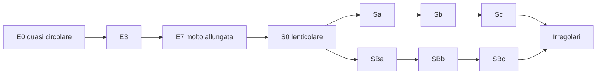
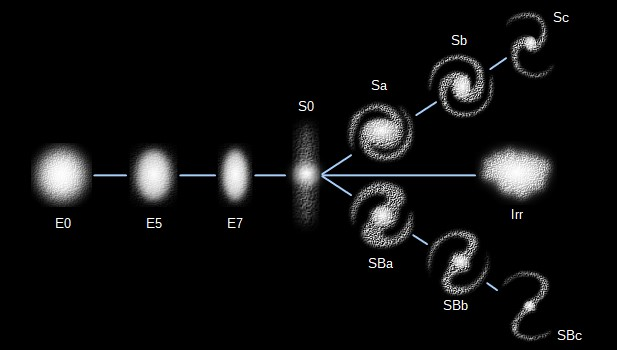
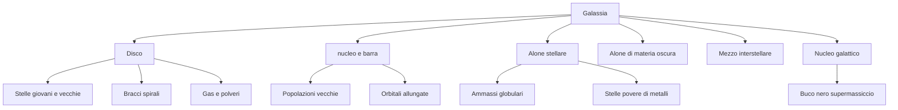
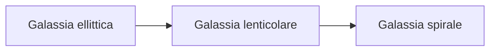
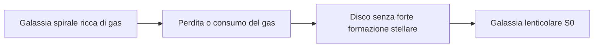
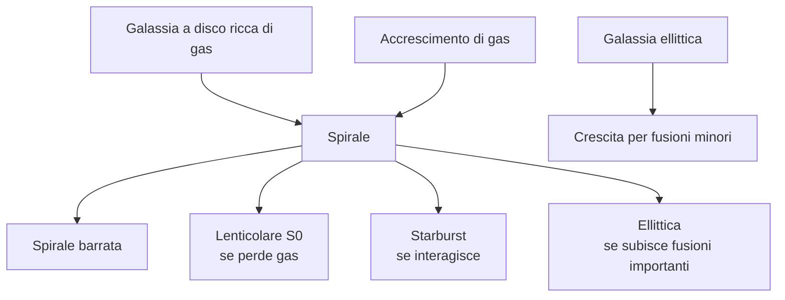

# La sequenza di Hubble

>[!note]  Nella classificazione di Hubble, la **Via Lattea** è classificata come una ==**galassia a spirale barrata**==. Secondo l'estensione del diagramma a diapason di Hubble, la nostra galassia appartiene specificamente al tipo **SBbc**

La **sequenza di Hubble** è uno schema di classificazione morfologica delle galassie. Morfologica significa che parte dall'aspetto osservato: forma, struttura, presenza di disco, bracci, barra, regolarità.

Qui sopra è presentata con il famoso schema a “diapason” o **tuning fork**, utile perché separa galassie ellittiche, lenticolari, spirali normali e spirali barrate.

## Le famiglie principali

| Tipo | Sigla | Aspetto generale | Idea semplice |
|---|---|---|---|
| Ellittiche | E0-E7 | lisce, senza bracci evidenti | “palle o ellissi di stelle” |
| Lenticolari | S0 | disco senza bracci spirali evidenti | “una spirale senza spirali” |
| Spirali normali | Sa, Sb, Sc | disco con bracci, senza barra centrale dominante | “girandole cosmiche” |
| Spirali barrate | SBa, SBb, SBc | disco con barra centrale da cui partono i bracci | “girandole con manubrio centrale” |
| Irregolari | Ir, Im | forma disordinata | “galassie senza geometria semplice” |

## 3. Collocazione morfologica: la Via Lattea nella sequenza di Hubble

La classificazione morfologica delle galassie distingue principalmente:

- galassie ellittiche;
- galassie lenticolari;
- galassie spirali normali;
- galassie spirali barrate;
- galassie irregolari.

La Via Lattea appartiene alla famiglia delle **galassie a spirale barrata**.

Una spirale barrata possiede:

1. un disco stellare;
2. un rigonfiamento centrale, detto **nucleo**;
3. una struttura allungata centrale, detta **barra**;
4. bracci spirali che emergono dalla regione interna;
5. gas e polveri concentrati soprattutto nel disco.

Nel linguaggio della sequenza di Hubble, una spirale barrata viene indicata con la sigla:

$$
SB
$$

La lettera successiva, come **a**, **b** o **c**, indica in modo qualitativo quanto i bracci siano avvolti e quanto il nucleo sia dominante:

- **SBa**: nucleo grande, bracci molto avvolti, meno gas relativo;
- **SBb**: caso intermedio;
- **SBc**: nucleo meno dominante, bracci più aperti, maggiore componente di gas e stelle giovani.

La Via Lattea è spesso descritta come una spirale barrata intermedia, non estrema: possiede un nucleo/barra centrale importante, ma anche un disco ricco di gas, polveri e formazione stellare.

## 4. Componenti strutturali principali

Una galassia può essere descritta come la sovrapposizione di più componenti dinamiche e fotometriche.

---

## Ellittiche: E0-E7

Le ellittiche sono classificate in base a quanto appaiono schiacciate.

- **E0**: quasi circolare;
- **E7**: molto allungata.

Attenzione: la forma apparente dipende anche dall'orientazione. Una galassia può sembrare più o meno schiacciata a seconda di come la osserviamo.

> [!tip] Analogia
> Una moneta vista di faccia sembra un cerchio; vista di taglio sembra una linea. Anche una galassia può apparire diversa a seconda dell'angolo di osservazione.

## Spirali: Sa, Sb, Sc

Nelle spirali la lettera indica, in modo semplificato:

- dimensione del bulge centrale;
- apertura dei bracci;
- ricchezza di gas, polvere e regioni di formazione stellare.

| Tipo | Bulge | Bracci | Gas e stelle giovani |
|---|---|---|---|
| Sa | grande | stretti e avvolti | meno evidenti |
| Sb | intermedio | moderatamente aperti | intermedi |
| Sc | piccolo | aperti e frammentati | più evidenti |

## Spirali barrate: SBa, SBb, SBc

Le spirali barrate hanno una **barra centrale**: una struttura allungata di stelle che attraversa il centro. Dai capi della barra partono i bracci spirali.

La barra non è un dettaglio estetico: può influenzare il moto del gas e favorire il trasporto di materiale verso il centro della galassia.

## Irregolari

Le galassie irregolari non mostrano una simmetria semplice. Nel documento vengono citate anche galassie come le Nubi di Magellano, esempi vicini e molto utili per capire sistemi ricchi di gas e formazione stellare.

## Errore comune: la sequenza non è una scala evolutiva

Hubble pensava inizialmente che il diagramma potesse avere un significato evolutivo, ma oggi non lo interpretiamo così in modo semplice.

> [!warning] Da sottolineare
> “Early type” e “late type” non significano necessariamente “giovani” e “vecchie” in senso evolutivo. Sono termini storici della classificazione.
La frase si riferisce al **diagramma di classificazione di Hubble**, spesso chiamato anche **diagramma a diapason**.

L’idea da chiarire è questa:

> Hubble ordinò le galassie secondo la loro forma: ellittiche, lenticolari, spirali normali e spirali barrate. All’inizio si poteva pensare che questa sequenza rappresentasse anche una specie di “vita” della galassia, ma oggi sappiamo che non funziona in modo così lineare.

---

6. Perché sembrava un diagramma evolutivo

Il diagramma ha una forma che suggerisce quasi una progressione:

Per questo, storicamente, si poteva immaginare qualcosa del genere:

> Le galassie nascono come ellittiche, poi diventano lenticolari, poi spirali.

Oppure, più in generale:

> una galassia potrebbe “spostarsi” lungo il diagramma durante la sua vita.

Il problema nasce anche dai nomi usati da Hubble: chiamò le ellittiche **early-type galaxies**, cioè “galassie di tipo precoce”, e le spirali **late-type galaxies**, cioè “galassie di tipo tardivo”.

Questi termini sono pericolosi, perché sembrano indicare un’età:

- “early” sembra voler dire “giovane”;
    
- “late” sembra voler dire “vecchia”.
    

Ma oggi sappiamo che **non bisogna interpretarli così**.

Una galassia ellittica non è necessariamente una galassia giovane, e una spirale non è necessariamente una galassia vecchia. Anzi, spesso è il contrario: molte ellittiche contengono popolazioni stellari molto antiche, mentre molte spirali continuano ancora oggi a formare stelle giovani.

---

## 5. Perché oggi non lo interpretiamo come una semplice evoluzione

Il motivo principale è che la forma di una galassia non dipende da un solo fattore, né da una sequenza obbligata. Dipende da molti elementi fisici:

- massa totale della galassia;
    
- quantità di gas disponibile;
    
- momento angolare, cioè quanta rotazione possiede il sistema;
    
- storia di fusioni con altre galassie;
    
- interazioni gravitazionali;
    
- ambiente in cui si trova;
    
- presenza di una barra;
    
- attività di formazione stellare;
    
- quantità di materia oscura;
    
- perdita o acquisizione di gas nel tempo.
    
## 6. Il caso delle ellittiche

Le galassie ellittiche hanno una forma liscia, senza bracci spirali evidenti. Di solito contengono poco gas freddo e poca polvere. Per questo formano poche stelle nuove.

Sono spesso dominate da stelle vecchie e rossastre.

Quindi, se uno interpretasse ingenuamente il diagramma di Hubble come sequenza temporale, potrebbe pensare:

> Le ellittiche vengono prima delle spirali.

Ma fisicamente sarebbe strano: per trasformare una galassia ellittica povera di gas in una spirale ricca di gas bisognerebbe ricostruire un disco ordinato, freddo e rotante. Non è impossibile in senso assoluto se entra nuovo gas, ma non è la normale evoluzione semplice di una galassia.

Oggi, anzi, molte ellittiche giganti vengono interpretate come il risultato di **fusioni galattiche**, soprattutto tra galassie massive. In questo caso il processo può andare più facilmente nella direzione opposta:

Quindi una spirale può contribuire alla formazione di una ellittica, non necessariamente il contrario.

---
## 7. Il ruolo delle galassie lenticolari

Le galassie **S0**, o lenticolari, sono particolarmente interessanti perché stanno nel punto di raccordo tra ellittiche e spirali.

Hanno un disco, quindi ricordano le spirali, ma hanno poco gas e bracci poco evidenti o assenti, quindi ricordano anche le ellittiche.

Per questo potrebbero sembrare una “fase intermedia”.

In alcuni casi una galassia spirale può effettivamente diventare lenticolare se perde il gas, per esempio in ambienti ricchi come gli ammassi di galassie. In un ammasso, il gas può essere strappato via dal mezzo intergalattico caldo o consumato senza essere rimpiazzato. La galassia conserva il disco, ma smette progressivamente di formare stelle.

In questo caso abbiamo una trasformazione reale:

Però questo non significa che **tutto** il diagramma di Hubble sia una sequenza evolutiva universale. Significa solo che alcuni percorsi evolutivi possono collegare certe classi.

## 8. Il caso delle spirali

Le galassie spirali, come la Via Lattea, possiedono:

- un disco stellare;
    
- gas e polveri;
    
- bracci spirali;
    
- formazione stellare attiva;
    
- spesso un bulge centrale;
    
- talvolta una barra.
    

Nel diagramma di Hubble, andando da **Sa** a **Sc**, cambiano alcune proprietà osservabili:

Anche qui la tentazione sarebbe dire:

> Una Sa diventa Sb, poi Sc.

Ma non è così semplice. Una galassia non passa necessariamente da Sa a Sb a Sc come se fossero tappe obbligate. Quelle categorie descrivono una combinazione di caratteristiche: dimensione del bulge, apertura dei bracci, contenuto di gas, attività stellare.

Una spirale può cambiare nel tempo, certo, ma non segue automaticamente la sequenza del diagramma.

---

La realtà è più simile a una rete di possibilità:

