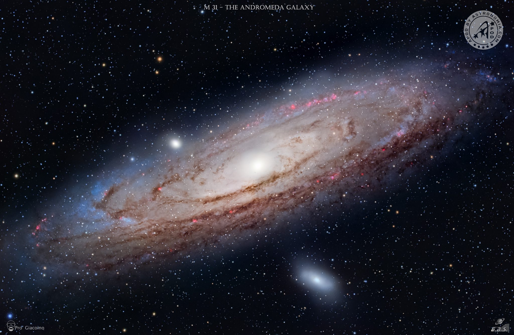
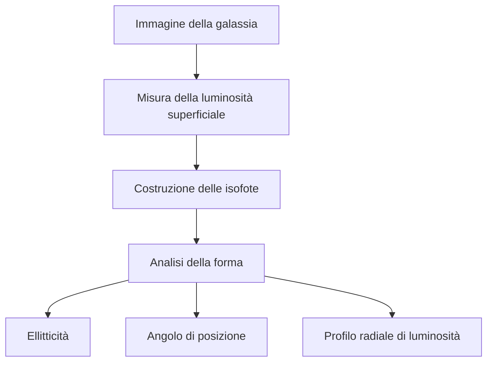
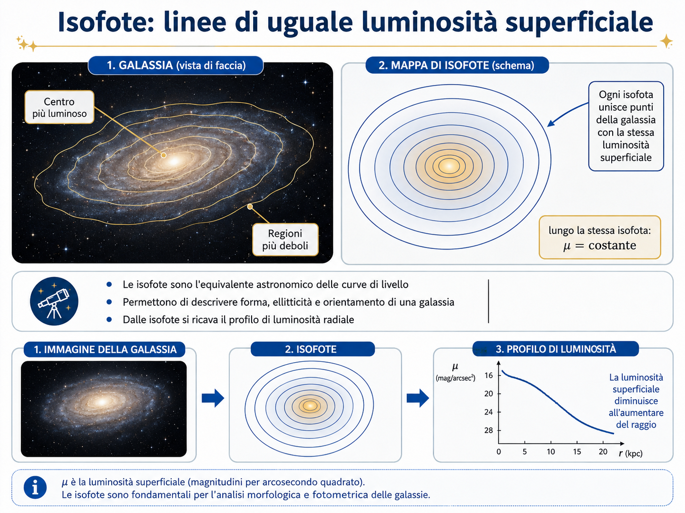
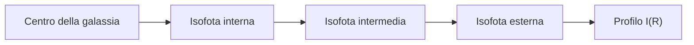

## Luce, dimensioni e profili delle galassie

Quando osserviamo una galassia, non vediamo un oggetto con un bordo netto come un pianeta o una stella. Una galassia è un sistema esteso: la sua luce diminuisce gradualmente dal centro verso l’esterno, fino a confondersi con il fondo cielo. Per questo, parlare di **dimensione di una galassia** è più complesso di quanto sembri. Non esiste quasi mai un “confine fisico” evidente; esistono invece criteri osservativi basati sulla quantità di luce misurata.

Una galassia viene quindi studiata attraverso la sua **distribuzione di luminosità**, cioè attraverso il modo in cui la luce è distribuita nello spazio. Questa distribuzione contiene molte informazioni: ci dice se la galassia ha un bulge centrale, un disco, bracci spirali, una barra, un alone esterno, oppure se ha una struttura più regolare e priva di sottostrutture evidenti, come accade spesso nelle galassie ellittiche.

---

## 1. Luminosità totale e luminosità superficiale

La prima distinzione importante è tra **luminosità totale** e **luminosità superficiale**.

La **luminosità totale** indica quanta luce emette complessivamente una galassia. Osservativamente, però, noi non misuriamo direttamente la luminosità intrinseca: misuriamo il **flusso**, cioè quanta radiazione arriva al telescopio per unità di tempo e superficie.

Il flusso dipende dalla distanza:

$$  
F = \frac{L}{4\pi d^2}  
$$

dove:

- (F) è il flusso osservato;
    
- (L) è la luminosità intrinseca;
    
- (d) è la distanza della galassia.
    

Questo significa che due galassie identiche, poste a distanze diverse, ci appaiono con luminosità apparente diversa. La più lontana appare più debole, anche se emette la stessa quantità di luce.

La **luminosità superficiale**, invece, descrive quanta luce osserviamo per unità di area apparente sul cielo. In astronomia viene spesso espressa in:

$$  
mag/arcsec^2  
$$

cioè magnitudini per secondo d’arco quadrato.

Questa grandezza è fondamentale perché una galassia può avere una luminosità totale elevata ma essere molto estesa e quindi apparire debole per unità di superficie. In quel caso si parla di galassia a **bassa luminosità superficiale**.

---

## 2. Perché la luminosità superficiale è così importante

La luminosità superficiale determina quanto facilmente una galassia è osservabile.

Una galassia compatta, con molta luce concentrata in poco spazio, emerge bene dal fondo cielo. Una galassia molto diffusa, anche se grande, può essere difficilissima da osservare perché la sua luce è distribuita su un’area enorme.

Questo è un punto molto importante in osservazione astronomica: non conta solo “quanta luce” emette un oggetto, ma anche **come questa luce è distribuita**.

Per esempio:

- una galassia ellittica compatta può avere un nucleo molto brillante;
    
- una spirale vista di fronte può mostrare bracci deboli e diffusi;
    
- una galassia nana può avere una luce così distribuita da confondersi quasi con il fondo cielo;
    
- un alone stellare esterno può essere reale ma difficilissimo da misurare.
    

Per questo lo studio delle galassie non si limita alla magnitudine totale, ma richiede l’analisi della luce punto per punto.

---

## 3. Le isofote: linee di uguale luminosità superficiale

Per descrivere la distribuzione della luce si usano spesso le **isofote**.

Una **isofota** è una linea che unisce tutti i punti di una galassia che hanno la stessa luminosità superficiale.

È un concetto simile alle curve di livello in una carta geografica:

- nelle carte topografiche, una curva di livello unisce punti alla stessa quota;
    
- nelle immagini astronomiche, una isofota unisce punti alla stessa luminosità superficiale.
    

Quindi, se immaginiamo la galassia come un “paesaggio luminoso”, le isofote sono le curve che descrivono la forma di quel paesaggio.

In una galassia regolare, le isofote appaiono spesso come ellissi concentriche. Questo è particolarmente vero per molte galassie ellittiche e per le zone più regolari dei bulge galattici.

---

## 4. Cosa ci dicono le isofote

### Luminosità superficiale

È una quantità **locale**, o comunque misurata per unità di area apparente:

$$I(R)$$

Dice quanta luce arriva da una certa zona della galassia per unità di superficie sul cielo.

In pratica:

> quanta luce vedo in quel pezzetto di galassia?

### Luminosità integrata

Questa invece è la luce totale contenuta entro un certo raggio:

$$L(<R)=\int_0^R 2\pi R' I(R')\,dR'$$

Questa sì è un integrale.

Vuol dire:

> sommo tutta la luce contenuta dentro il raggio RRR.

Quindi:

- **l’isofota** è una linea di uguale luminosità superficiale;
- **il profilo $I(R)$ descrive come cambia la luminosità superficiale col raggio;
- **la luminosità integrata $L(<R)$** è la somma della luce entro un certo raggio.

Le isofote non servono solo a “disegnare il contorno” della galassia. Servono a ricavare informazioni fisiche e strutturali.

Da una famiglia di isofote si possono misurare:

### Ellitticità

L’ellitticità indica quanto una isofota è schiacciata.

Si definisce spesso come:

$$  
\epsilon = 1 - \frac{b}{a}  
$$

dove:

- (a) è il semiasse maggiore dell’ellisse;
    
- (b) è il semiasse minore.
    

Se (a) e (b) sono quasi uguali, l’isofota è quasi circolare. Se (b) è molto più piccolo di (a), l’isofota è molto schiacciata.

Nelle galassie ellittiche, l’ellitticità è alla base della classificazione morfologica da **E0** a **E7**.

Una galassia E0 appare quasi rotonda; una E7 appare molto allungata.

Attenzione però: l’ellitticità osservata non sempre corrisponde alla vera forma tridimensionale. Una galassia può sembrare più o meno schiacciata anche a causa dell’inclinazione rispetto alla nostra linea di vista.

---

### Angolo di posizione

Le isofote permettono anche di misurare l’**angolo di posizione**, cioè l’orientamento apparente dell’asse maggiore della galassia sul cielo.

Se l’angolo di posizione cambia andando dal centro verso l’esterno, questo può indicare che la galassia non è strutturalmente semplice. Potrebbero esserci:

- una barra centrale;
    
- un disco inclinato;
    
- una deformazione gravitazionale;
    
- una componente esterna diversa da quella interna;
    
- effetti di interazione con altre galassie.
    

---

### Deviazioni dalla forma ellittica

In molte galassie reali le isofote non sono ellissi perfette.

Possono mostrare:

- bracci spirali;
    
- barre;
    
- anelli;
    
- code mareali;
    
- asimmetrie;
    
- regioni di formazione stellare;
    
- polveri che assorbono la luce;
    
- deformazioni dovute a interazioni gravitazionali.
    

Nelle galassie ellittiche si studiano anche piccole deviazioni dalla forma ellittica ideale. Alcune isofote possono apparire leggermente “a disco”, altre leggermente “squadrate”. Queste differenze sono importanti perché possono rivelare la storia dinamica della galassia.

---

## 5. Dal disegno delle isofote al profilo di luminosità

Una volta costruite le isofote, si può ricavare il **profilo radiale di luminosità**.

L’idea è questa: invece di guardare l’intera immagine bidimensionale, si misura la luminosità media lungo isofote successive e la si rappresenta in funzione della distanza dal centro.

Si ottiene così una funzione:

$$  
I(R)  
$$

dove:

- (I) è l’intensità luminosa superficiale;
    
- (R) è la distanza dal centro della galassia.
    

Il profilo (I(R)) descrive come la luce diminuisce dal centro verso l’esterno.

In termini pratici:

Il profilo di luminosità è uno degli strumenti fondamentali per confrontare galassie diverse.

---

## 6. Dimensioni delle galassie: perché non basta dire “diametro”

Poiché la luce di una galassia sfuma gradualmente, la sua dimensione dipende dal criterio usato per definirla.

Esistono diversi modi per definire una dimensione galattica.

### Dimensione isofotale

Una prima definizione è la **dimensione isofotale**.

Si sceglie una certa luminosità superficiale limite e si misura il diametro della galassia fino all’isofota corrispondente.

Per esempio, in astronomia ottica si usa spesso un diametro misurato fino a una certa soglia di luminosità superficiale nel blu. Il concetto è:

> la galassia viene considerata grande fino al punto in cui la sua luce resta sopra una soglia osservativa stabilita.

Il problema è che questa dimensione dipende dalla profondità dell’osservazione. Con un telescopio più sensibile o con esposizioni più lunghe, si possono vedere regioni più deboli ed esterne, quindi la galassia appare più grande.

---

### Raggio efficace

Un’altra grandezza molto usata è il **raggio efficace**, indicato con:

$$  
R_e  
$$

Il raggio efficace è il raggio entro cui è contenuta metà della luce totale della galassia.

Quindi:

$$  
L(<R_e) = \frac{1}{2} L_{tot}  
$$

Questa definizione è molto utile perché non richiede di individuare un bordo netto. Invece di chiedersi “dove finisce la galassia?”, si chiede:

> entro quale raggio è contenuta metà della sua luce?

Il raggio efficace è particolarmente importante nello studio delle galassie ellittiche, ma viene usato anche per confrontare galassie di tipi diversi.

---

## 7. Problemi osservativi: fondo cielo, polveri e inclinazione

Misurare il profilo di una galassia non è banale.

Il primo problema è il **fondo cielo**. Le regioni esterne delle galassie sono debolissime; un piccolo errore nella sottrazione del fondo può alterare molto il profilo esterno.

Il secondo problema è la **polvere interstellare**. Nelle spirali, la polvere può assorbire parte della luce, soprattutto nelle bande ottiche. Questo può far apparire alcune regioni meno luminose di quanto siano realmente.

Il terzo problema è l’**inclinazione**. Una galassia a disco vista di fronte appare quasi circolare; la stessa galassia vista di taglio appare molto allungata. Quindi la forma delle isofote dipende anche dall’orientamento rispetto a noi.

Infine, nelle regioni centrali, la misura del profilo può essere influenzata dalla risoluzione del telescopio e dalla turbolenza atmosferica, che allarga le immagini puntiformi. Questo effetto è descritto dalla **PSF**, Point Spread Function.
