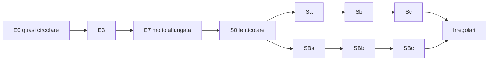
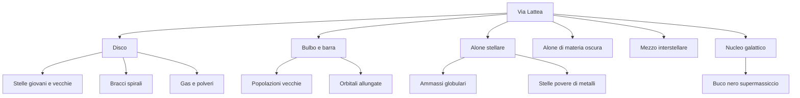

# La sequenza di Hubble

La **sequenza di Hubble** è uno schema di classificazione morfologica delle galassie. Morfologica significa che parte dall'aspetto osservato: forma, struttura, presenza di disco, bracci, barra, regolarità.

Qui sopra è presentata con il famoso schema a “diapason” o **tuning fork**, utile perché separa galassie ellittiche, lenticolari, spirali normali e spirali barrate.

## Le famiglie principali

| Tipo | Sigla | Aspetto generale | Idea semplice |
|---|---|---|---|
| Ellittiche | E0-E7 | lisce, senza bracci evidenti | “palle o ellissi di stelle” |
| Lenticolari | S0 | disco senza bracci spirali evidenti | “una spirale senza spirali” |
| Spirali normali | Sa, Sb, Sc | disco con bracci, senza barra centrale dominante | “girandole cosmiche” |
| Spirali barrate | SBa, SBb, SBc | disco con barra centrale da cui partono i bracci | “girandole con manubrio centrale” |
| Irregolari | Ir, Im | forma disordinata | “galassie senza geometria semplice” |

## 3. Collocazione morfologica: la Via Lattea nella sequenza di Hubble

La classificazione morfologica delle galassie distingue principalmente:

- galassie ellittiche;
- galassie lenticolari;
- galassie spirali normali;
- galassie spirali barrate;
- galassie irregolari.

La Via Lattea appartiene alla famiglia delle **galassie a spirale barrata**.

Una spirale barrata possiede:

1. un disco stellare;
2. un rigonfiamento centrale, detto **bulbo**;
3. una struttura allungata centrale, detta **barra**;
4. bracci spirali che emergono dalla regione interna;
5. gas e polveri concentrati soprattutto nel disco.

Nel linguaggio della sequenza di Hubble, una spirale barrata viene indicata con la sigla:

$$
SB
$$

La lettera successiva, come **a**, **b** o **c**, indica in modo qualitativo quanto i bracci siano avvolti e quanto il bulbo sia dominante:

- **SBa**: bulbo grande, bracci molto avvolti, meno gas relativo;
- **SBb**: caso intermedio;
- **SBc**: bulbo meno dominante, bracci più aperti, maggiore componente di gas e stelle giovani.

La Via Lattea è spesso descritta come una spirale barrata intermedia, non estrema: possiede un bulbo/barra centrale importante, ma anche un disco ricco di gas, polveri e formazione stellare.

## 4. Componenti strutturali principali

La Via Lattea può essere descritta come la sovrapposizione di più componenti dinamiche e fotometriche.

---

## 5. Il disco galattico

Il **disco** è la componente più evidente della Via Lattea. Contiene:

- gran parte delle stelle visibili;
- il gas interstellare;
- le polveri;
- regioni di formazione stellare;
- bracci spirali.

Il disco è una struttura appiattita e in rotazione differenziale. Le stelle e il gas non ruotano come un corpo rigido: la velocità angolare cambia con la distanza dal centro.

### 5.1 Profilo di luminosità del disco

Nei dischi galattici, la luminosità superficiale è spesso descritta da una legge esponenziale. In termini di intensità:

$$
I(r) = I_0 e^{-r/h}
$$

Dove:

- $I(r)$ è la luminosità superficiale alla distanza $r$ dal centro;
- $I_0$ è la luminosità superficiale centrale extrapolata;
- $h$ è la lunghezza di scala del disco.

In magnitudini per secondo d'arco quadrato, la relazione diventa:

$$
\mu(r) = \mu_0 + 1.086 \frac{r}{h}
$$

Questa formula è importante perché mostra che il disco non ha un “bordo netto”: la densità luminosa diminuisce progressivamente.

## Ellittiche: E0-E7

Le ellittiche sono classificate in base a quanto appaiono schiacciate.

- **E0**: quasi circolare;
- **E7**: molto allungata.

Attenzione: la forma apparente dipende anche dall'orientazione. Una galassia può sembrare più o meno schiacciata a seconda di come la osserviamo.

> [!tip] Analogia
> Una moneta vista di faccia sembra un cerchio; vista di taglio sembra una linea. Anche una galassia può apparire diversa a seconda dell'angolo di osservazione.

## Spirali: Sa, Sb, Sc

Nelle spirali la lettera indica, in modo semplificato:

- dimensione del bulge centrale;
- apertura dei bracci;
- ricchezza di gas, polvere e regioni di formazione stellare.

| Tipo | Bulge | Bracci | Gas e stelle giovani |
|---|---|---|---|
| Sa | grande | stretti e avvolti | meno evidenti |
| Sb | intermedio | moderatamente aperti | intermedi |
| Sc | piccolo | aperti e frammentati | più evidenti |

## Spirali barrate: SBa, SBb, SBc

Le spirali barrate hanno una **barra centrale**: una struttura allungata di stelle che attraversa il centro. Dai capi della barra partono i bracci spirali.

La barra non è un dettaglio estetico: può influenzare il moto del gas e favorire il trasporto di materiale verso il centro della galassia.

## Irregolari

Le galassie irregolari non mostrano una simmetria semplice. Nel documento vengono citate anche galassie come le Nubi di Magellano, esempi vicini e molto utili per capire sistemi ricchi di gas e formazione stellare.

## Errore comune: la sequenza non è una scala evolutiva

Hubble pensava inizialmente che il diagramma potesse avere un significato evolutivo, ma oggi non lo interpretiamo così in modo semplice.

> [!warning] Da sottolineare
> “Early type” e “late type” non significano necessariamente “giovani” e “vecchie” in senso evolutivo. Sono termini storici della classificazione.

## Domande per l'aula

1. Una galassia vista di taglio è più facile o più difficile da classificare?
2. Una galassia con bracci molto aperti vi sembra più simile a Sa o a Sc?
3. Una galassia senza bracci ma con disco evidente è per forza ellittica?

## Collegamento successivo

Dopo la classificazione generale, si entra nel dettaglio delle galassie a disco: [[7.5 Spirali lenticolari irregolari]].
