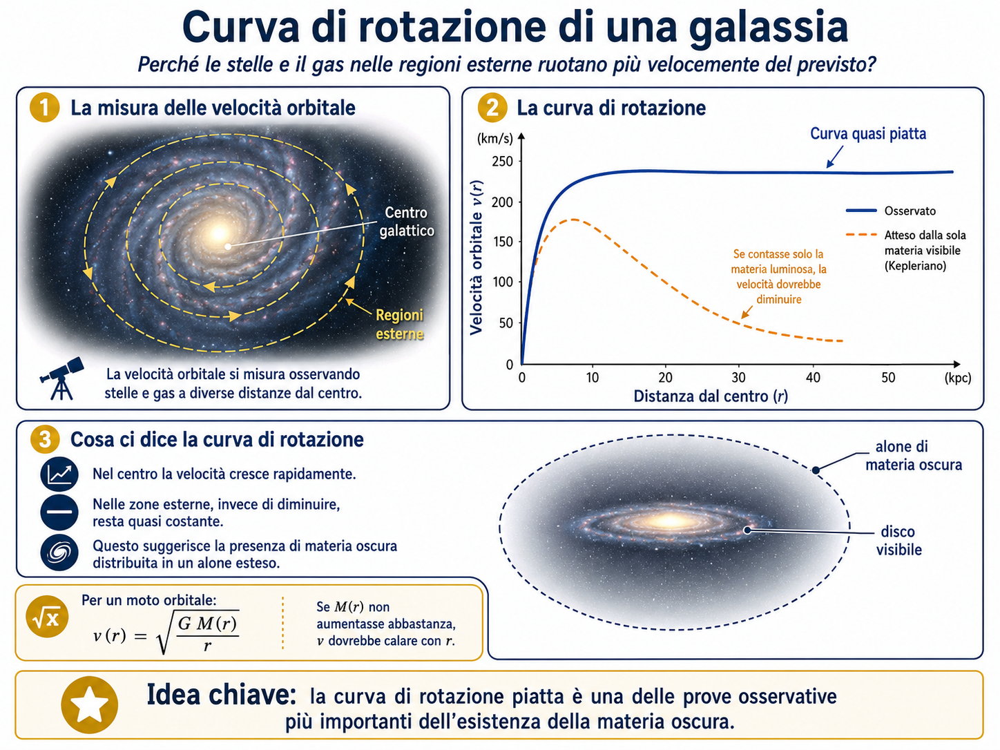

# Rotazione, Tully-Fisher e materia oscura



Le galassie spirali ruotano. Misurare come ruotano è uno dei modi più potenti per stimare la loro massa.

## Curve di rotazione

Una **curva di rotazione** mostra la velocità orbitale del gas o delle stelle in funzione della distanza dal centro galattico.

In un sistema dove la massa fosse concentrata quasi tutta al centro, ci aspetteremmo che la velocità diminuisca andando verso l'esterno, un po' come accade per i pianeti più lontani dal Sole.

In molte galassie spirali, invece, la curva di rotazione resta piatta anche a grandi distanze.

## Perché è importante

Se il gas nelle zone esterne ruota più velocemente del previsto, significa che sente una gravità più forte di quella prodotta dalla sola materia visibile.

Da qui nasce uno degli indizi più famosi della **materia oscura**:

> c'è più massa di quanta ne vediamo sotto forma di stelle, gas e polvere.

## La riga a 21 cm dell'idrogeno

Il gas di idrogeno neutro emette una radiazione radio con lunghezza d'onda di circa 21 cm. Questa riga è molto utile perché permette di studiare il gas anche nelle parti esterne dei dischi galattici.


## Correzione per inclinazione

Una galassia vista di faccia mostra poca velocità lungo la nostra linea di vista. Una galassia vista di taglio mostra meglio la rotazione.

Quindi le velocità osservate vanno corrette per l'**inclinazione**.

> [!tip] Da dire a voce
> “Se una giostra ruota vista dall'alto, vediamo bene il cerchio ma poco il movimento verso di noi. Vista di lato, il movimento verso e lontano da noi diventa evidente.”

## Relazione di Tully-Fisher

La **relazione di Tully-Fisher** è una relazione empirica che collega la **luminosità di una galassia a spirale** con la sua **velocità di rotazione**.

In forma concettuale:

$$ 
\text{più una galassia a spirale ruota velocemente, più è luminosa}  
$$

Oppure, in forma fisica semplificata:

$$
L \propto V^\alpha  
$$

dove:

- (L) è la luminosità della galassia;    
- (V) è una velocità caratteristica di rotazione, spesso la velocità massima o la velocità della parte piatta della curva di rotazione;    
- (\alpha) è un esponente che vale circa 3-4, a seconda della banda fotometrica usata.    

Nella forma più classica, scritta in magnitudini assolute, diventa:

$$
M = a \log V + b  
$$

dove:

- (M) è la magnitudine assoluta della galassia;    
- (V) è la velocità di rotazione;    
- (a) è la pendenza della relazione;    
- (b) è una costante di calibrazione.    

Poiché in astronomia magnitudini più basse indicano oggetti più luminosi, una galassia con velocità di rotazione maggiore avrà una magnitudine assoluta più negativa.

---

## Idea fisica di base


Il passaggio concettuale è:

```text
maggiore massa totale
        ↓
maggiore gravità
        ↓
maggiore velocità di rotazione
        ↓
in genere maggiore luminosità
```

Per questo la velocità di rotazione diventa un indicatore della massa, e la massa è collegata alla luminosità stellare.

---

## Perché riguarda soprattutto le galassie a spirale

La relazione di Tully-Fisher si applica principalmente alle **galassie a disco**, in particolare alle **spirali**, perché in queste galassie la dinamica è dominata dalla rotazione ordinata.

Una galassia spirale possiede:

- un disco stellare;    
- gas neutro H I;    
- gas molecolare;    
- stelle giovani e vecchie;    
- una curva di rotazione misurabile.    

Il gas, soprattutto l’idrogeno neutro osservato nella riga a **21 cm**, è molto utile perché spesso si estende oltre il disco stellare visibile. Questo permette di misurare la velocità di rotazione anche nelle regioni esterne della galassia, dove la curva di rotazione tende a diventare quasi piatta.

---

## Come si misura osservativamente

In pratica, per usare la relazione di Tully-Fisher servono due informazioni:

1. la **luminosità apparente** della galassia;    
2. la **velocità di rotazione**.
    

La velocità di rotazione può essere ricavata in diversi modi, ma storicamente un metodo molto importante è l’osservazione della riga a **21 cm dell’idrogeno neutro**.

Una galassia a spirale in rotazione presenta una parte che si avvicina a noi e una parte che si allontana. Per effetto Doppler:

- il lato che si avvicina mostra uno spostamento verso il blu;    
- il lato che si allontana mostra uno spostamento verso il rosso.    

Nel caso della riga radio a 21 cm, questo produce un allargamento della riga spettrale. La larghezza della riga è collegata alla velocità di rotazione.


---

## Perché serve correggere l’inclinazione


```text
galassia vista di taglio  → velocità radiale ben misurabile
galassia vista di faccia  → velocità radiale poco misurabile
```


---

## Forma in magnitudini

Poiché in astronomia la luminosità viene spesso espressa in magnitudini, la relazione viene scritta così:

$$  
M = a \log V_{\text{rot}} + b  
$$

La pendenza (a) è negativa, perché maggiore velocità significa maggiore luminosità, cioè magnitudine assoluta più bassa.

Una forma tipica, semplificata, può essere pensata così:

$$
M \sim -10 \log V_{\text{rot}} + \text{costante}  
$$

Questa forma corrisponde grossolanamente a:

$$  
L \propto V_{\text{rot}}^4  
$$

Il valore preciso della pendenza dipende dalla banda osservativa: nel blu, nell’infrarosso o in altre bande si ottengono coefficienti leggermente diversi.

---

## Perché è utile: misurare distanze galattiche

La relazione di Tully-Fisher è importante perché permette di stimare la **distanza** delle galassie a spirale.

Il ragionamento è questo:

1. misuro la velocità di rotazione della galassia;
    
2. dalla relazione di Tully-Fisher ricavo la sua luminosità assoluta;
    
3. confronto la luminosità assoluta con la luminosità apparente osservata;
    
4. ottengo la distanza.
    
In termini di magnitudini:

$$ 
m - M = 5 \log d - 5  
$$
dove:

- (m) è la magnitudine apparente;
    
- (M) è la magnitudine assoluta;
    
- (d) è la distanza in parsec.
    

Quindi la Tully-Fisher funziona come una **candela standardizzata**: non è una candela standard perfetta, perché le galassie non sono tutte uguali, ma permette di stimare distanze quando è calibrata correttamente.

---


## Piccolo esperimento mentale


> Due galassie spirali hanno aspetto simile, ma una ruota molto più velocemente. Cosa possiamo sospettare?

> [!success]- Soluzione
> - ha più massa;
> - potrebbe avere più materia oscura;
> - potrebbe essere più luminosa;
> - bisogna correggere per inclinazione e distanza.


