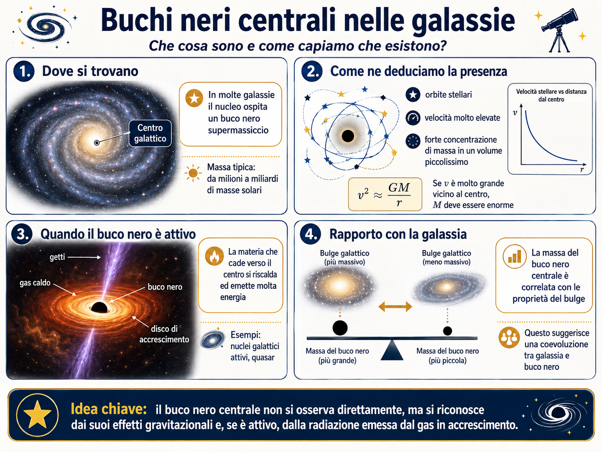

# Buchi neri supermassicci nei nuclei galattici

Molte galassie ospitano al centro un **buco nero supermassiccio**, con masse da milioni a miliardi di volte quella del Sole.

Il PDF chiude la parte disponibile con il caso della galassia di Andromeda, M31, e con l'idea che le osservazioni del moto di stelle e gas vicino al centro possano rivelare la presenza di una massa centrale molto compatta.

## Come si scoprono

Non osserviamo direttamente il buco nero come un oggetto luminoso. Lo deduciamo da effetti come:

- moto molto rapido di stelle vicino al centro;
- moto del gas;
- emissioni energetiche se il buco nero sta accrescendo materia;
- struttura del nucleo galattico osservata ad alta risoluzione.

## Analogia 

> Se vedi persone correre in cerchio sempre più velocemente attorno a un punto invisibile, puoi sospettare che lì ci sia qualcosa che le attira.

Allo stesso modo, se le stelle vicino al centro galattico orbitano molto rapidamente, serve una grande massa concentrata in poco spazio.

## Il caso di M31

La galassia di Andromeda è un ottimo esempio perché è vicina e ben osservabile. Nel documento viene mostrata un'immagine del nucleo di M31, con una struttura complessa e una componente associata alla posizione del buco nero centrale.

## Per non creare equivoci

Un buco nero supermassiccio non “risucchia tutta la galassia”.

Le stelle orbitano nel potenziale gravitazionale complessivo della galassia. Il buco nero domina soprattutto nella regione più interna.

> [!warning] Frase utile
> “Il buco nero centrale non è un aspirapolvere cosmico: se il Sole diventasse improvvisamente un buco nero della stessa massa, la Terra continuerebbe a orbitare quasi come prima. Cambia tutto solo se ci si avvicina molto.”

