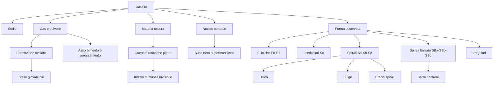
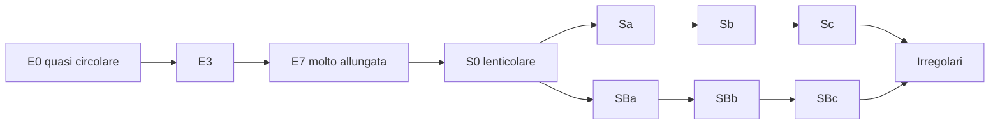
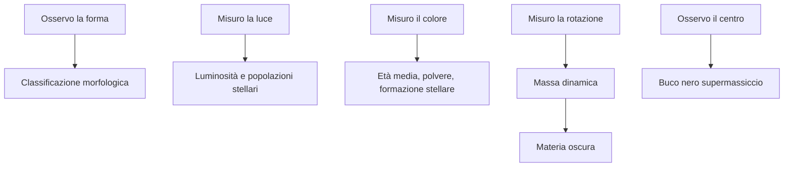

# Mappa concettuale sulle galassie

## Mappa generale

## Mappa della sequenza di Hubble

> [!warning]
> Questa mappa è didattica. La sequenza non va interpretata come un percorso evolutivo obbligatorio da E0 a Sc.

## Mappa “osservo - deduco”

