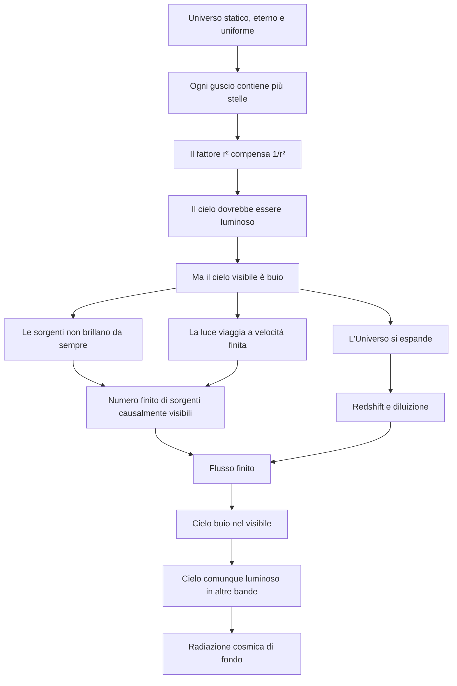

# Paradosso di Olbers

> [!abstract]
> Se l’Universo fosse infinito, eterno, statico e uniformemente popolato da stelle, ogni direzione dello sguardo dovrebbe terminare sulla superficie di un astro. Il cielo notturno dovrebbe quindi essere luminoso. Il fatto che sia invece scuro nel visibile rivela che almeno una di queste ipotesi è falsa.

## Percorso principale

1. [[8.1 - Il problema e le ipotesi]]
2. [[8.2 - La dimostrazione matematica]]
3. [[8.3 - Le false soluzioni]]
4. [[8.4 - Storia del paradosso]]
5. [[8.5 - La soluzione cosmologica moderna]]
6. [[8.6 - La CMB e il cielo nelle altre bande]]
7. [[8.7 - Dove va a finire la luce]]
8. [[8.8 - Questioni avanzate]]
9. [[8.9 - Errori frequenti e FAQ]]
10. [[8.10 - Bibliografia e fonti]]

## Mappa concettuale

## Risposta essenziale

> [!success] Risposta
> Il cielo è buio nel visibile perché le stelle non esistono da sempre, la luce può raggiungerci soltanto da una regione causalmente limitata e l’espansione cosmica riduce e sposta verso lunghezze d’onda maggiori la radiazione più antica.

