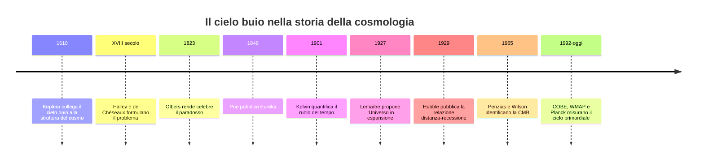

# Storia del paradosso

Il paradosso porta il nome di Heinrich Wilhelm Matthias Olbers, ma la domanda è più antica.

## 5.1 Prima di Olbers

Già Johannes Kepler si interrogò sulle implicazioni di un cielo pieno di stelle. Nel XVIII secolo Edmond Halley e Jean-Philippe Loys de Chéseaux formularono versioni mature del problema.

De Chéseaux notò con chiarezza la compensazione fra:

- indebolimento della singola sorgente;
- aumento del numero di sorgenti con la distanza.

## 5.2 Olbers

Olbers rese celebre il problema negli anni Venti dell’Ottocento. La memoria originale è generalmente datata al 1823; in molte ricostruzioni divulgative compare anche il 1826.

La soluzione da lui favorita era l’assorbimento della luce da parte di materia interposta. Come visto, questa spiegazione non può funzionare indefinitamente in un Universo eterno, perché la materia assorbente si riscalderebbe e riemetterebbe.

## 5.3 Edgar Allan Poe e *Eureka*

Nel 1848 Edgar Allan Poe pubblicò *Eureka: A Prose Poem*.

Poe intuì un elemento fondamentale: anche in uno spazio enormemente esteso, se le stelle hanno iniziato a brillare in un passato finito, esisteranno regioni tanto lontane che la loro luce non ha ancora avuto il tempo di arrivare fino a noi.

Il ragionamento introduce implicitamente:

- velocità finita della luce;
- età finita della popolazione luminosa;
- orizzonte causale.

> [!quote] Parafrasi dell’idea di Poe
> Le zone buie possono corrispondere a direzioni dalle quali nessun raggio stellare ha ancora avuto il tempo di raggiungerci.

Poe non formulò il moderno modello del Big Bang, ma anticipò qualitativamente un ingrediente decisivo della soluzione.

## 5.4 Kelvin

Lord Kelvin, nel 1901, diede una trattazione quantitativa legata al tempo necessario perché la luce stellare riempisse il cielo. Edward Harrison riportò in seguito l’attenzione su questo contributo.

## 5.5 Lemaître e Hubble

Nel XX secolo il quadro cambiò radicalmente:

- Georges Lemaître collegò le soluzioni della relatività generale a un Universo in espansione;
- Edwin Hubble mostrò osservativamente la relazione fra distanza e recessione delle galassie;
- il modello cosmologico divenne dinamico;
- la scoperta della radiazione cosmica di fondo fornì una traccia osservativa dell’Universo caldo primordiale.

> [!info] Precisione storica
> La relazione fra velocità di recessione e distanza è oggi spesso chiamata **legge di Hubble-Lemaître**, per riconoscere il contributo teorico e osservativo di Lemaître precedente alla pubblicazione di Hubble.

## Una cronologia più ampia

## Perché il nome di Olbers è rimasto

Olbers non fu il primo a formulare il problema e la sua soluzione tramite assorbimento non era corretta. Il suo nome rimase perché la sua esposizione rese il paradosso celebre e lo trasformò in una domanda canonica della cosmologia.

## Continua il percorso

- [[8.5 - La soluzione cosmologica moderna]]
- [[8.10 - Bibliografia e fonti]]
