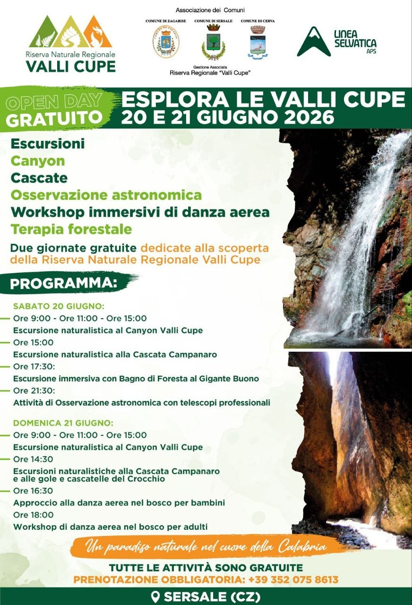
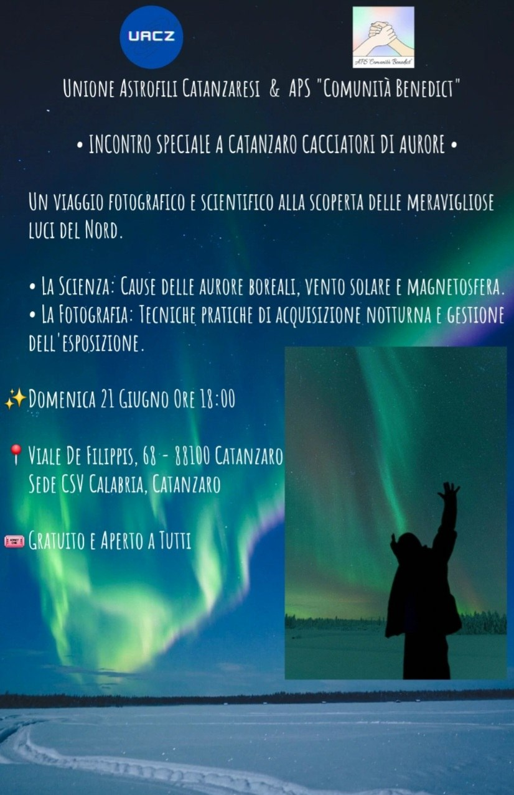
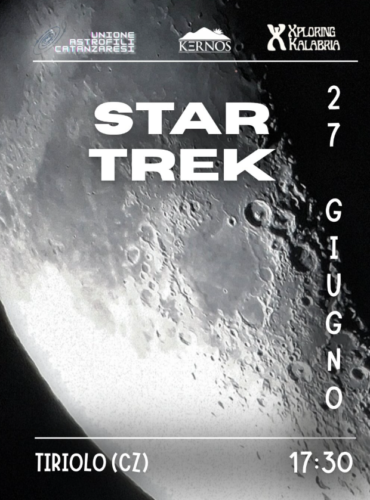

| #   | Data                     | Appuntamento                      | Luogo                               | Stato             | Note                                                                                             |
| --- | ------------------------ | --------------------------------- | ----------------------------------- | ----------------- | ------------------------------------------------------------------------------------------------ |
| 1   | Sabato 20 giugno 2026    | Open Day Valli Cupe               | Valli Cupe                          | Confermato        | Locandina:                                                 |
| 2   | Domenica 21 giugno 2026  | Conferenza “Cacciatore di Aurore” | Da definire / indicato in locandina | Confermato        | Locandina:                                          |
| 3   | Sabato 27 giugno 2026    | Escursione Monte Tiriolo          | Monte Tiriolo                       | Confermato        | Escursione astronomica/naturalistica               |
| 4   | Venerdì 24 luglio 2026   | Lezione sulla Cosmologia          | Da definire                         | Da confermare     | Data con punto interrogativo: verificare conferma                                                |
| 5   | Sabato 25 luglio 2026   | Monasterace         | Monasterace                        |     |                                      |
| 6   | Venerdì 31 Luglio        | Evento Castello di Squillace      | Castello di Squillace               | In organizzazione |                                                                                                  |  
| 7   | Sabato 1 agosto 2026  | Evento Scolacium                  | Scolacium                           | In organizzazione | Evento da organizzare                                                                            |                                                                    |
| 8   | Mercoledì 12 agosto 2026 | Campus delle Stelle a Serra       | Serra San Bruno                     | In organizzazione | Ritiro tra astrofili con possibile pernottamento in tenda o B&B, escursioni e pasti in struttura |
| 9   | Venerdì 14 agosto 2026   | Evento Scolacium                  | Scolacium                           | In organizzazione | Evento da organizzare                                                                            |
| 10   | Venerdì 21 agosto 2026   | Evento Castello di Squillace      | Castello di Squillace               | In organizzazione |                                                                                                  |
| 11  | Sabato 22 agosto 2026    | Evento a Girifalco                | Punto da stabilire                  | In organizzazione | Evento da organizzare                                                                            |
| 12   | Sabato 5 Settembre 2026   | Monasterace         | Monasterace                        |     |                                      |
| 11  | Sabato 26 settembre      | Evento con il Cicap               | Parco dell'agraria                  | In organizzazione | Evento in fase organizzativa                                                                     

Fossato
forse 7 e 28 agosto

Tiriolo
16 Agosto
29 Agosto

Tirivolo
12 settembre
