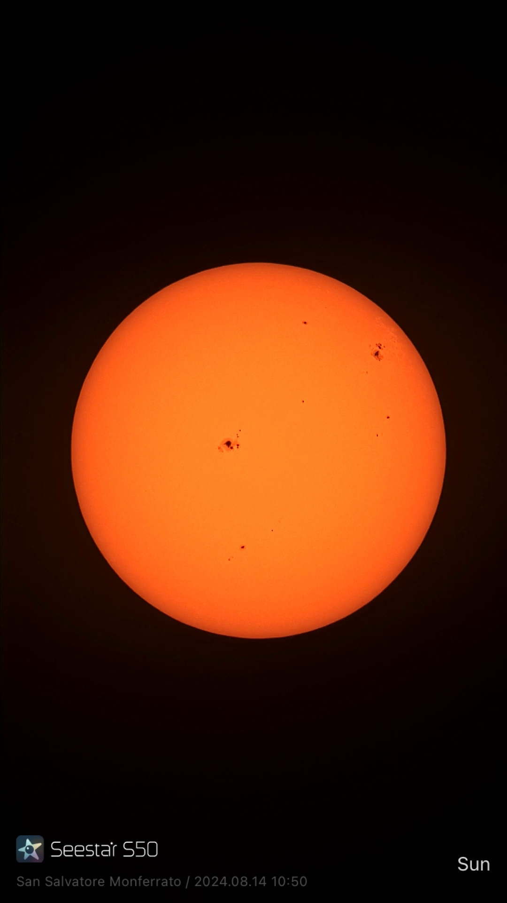
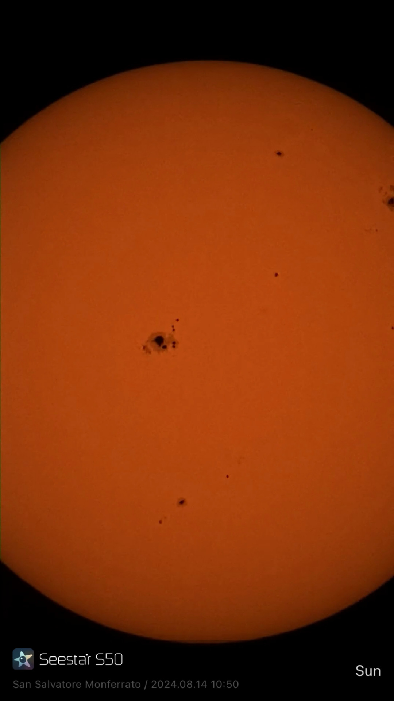
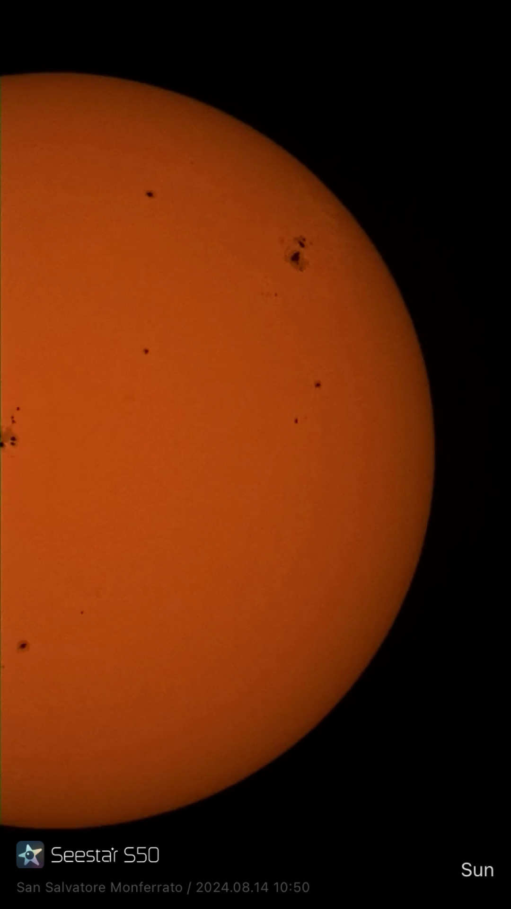

- Il Sole è la **stella più vicina a noi**
    
- Fornisce **luce, calore e energia**
    
- Tutti i pianeti, compresa la Terra, **gli ruotano attorno**
    
- Noi lo abbiamo osservato **come veri astronomi**, misurando la sua posizione nel cielo

