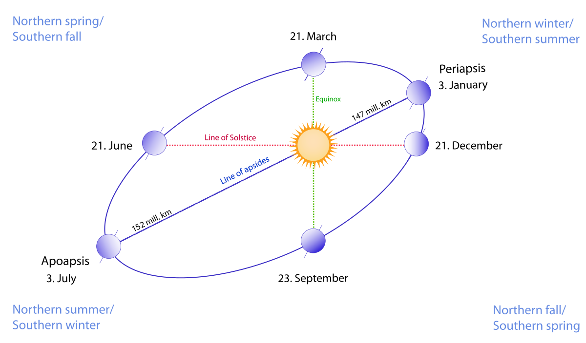
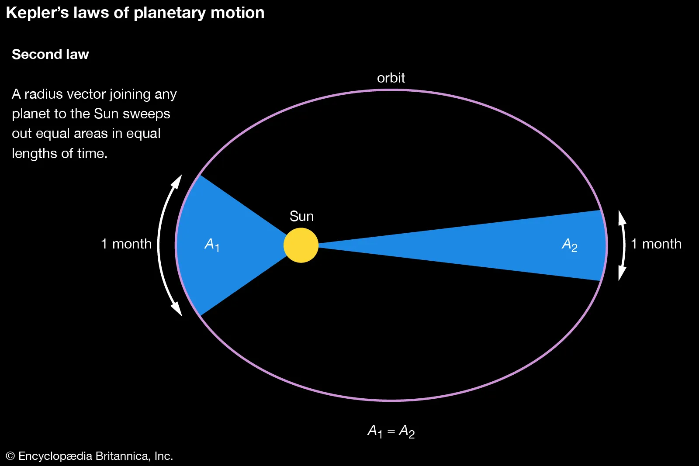

- La Terra **ruota su se stessa**
    
- Un giro completo = **24 ore**
    
- È la causa di:
    
    - giorno 
        
    - notte 
        

quando misuriamo il Sole durante la giornata, **lo vediamo cambiare posizione**.

3. Moti di Rivoluzione e Rotazione: Il _Perché_ delle Vostre Misure

Moti di Rivoluzione (Le Leggi di Keplero)

# **Prima Legge (Orbite Ellittiche):** I pianeti ruotano attorno al Sole su orbite a forma di **ellisse**, e il Sole occupa uno dei due fuochi. L'ellisse può essere descritta come un "cerchio allungato".

  ◦ Le orbite planetarie sono tutte ellittiche, sebbene quelle terrestri siano quasi circolari (l'eccentricità della Terra è solo 0,017).

   ◦ **Riferimento alla misura:** Voi avete misurato la posizione del Sole in diversi momenti dell'anno. La variazione che avete registrato è una conseguenza di questa orbita non perfettamente circolare e della velocità non uniforme. Il punto più vicino al Sole è chiamato **perielio** (per la Terra, circa il 3 gennaio), e il punto più lontano è l'**afelio** (circa il 4 luglio).

# **Seconda Legge (Velocità Variabile):** I pianeti non si muovono a velocità costante.

   ◦ Il pianeta si muove **più rapidamente quando è più vicino al Sole** (perielio) e **più lentamente quando è lontano** (afelio).

   ◦ Questa legge afferma che il raggio vettore (il segmento immaginario che unisce il Sole al pianeta) spazza aree uguali in intervalli di tempo uguali.

   ◦ **Conseguenza per le stagioni:** A causa di questa variazione di velocità, la Terra impiega più tempo a percorrere metà orbita (dall'equinozio di primavera all'equinozio d'autunno, 186 giorni) rispetto all'altra metà (179 giorni), influenzando la durata delle stagioni nell'emisfero boreale.

# **Terza Legge (Legge dei Periodi):** C'è una relazione matematica tra il periodo (T) di rivoluzione (il tempo che impiega un pianeta a completare un'orbita) e la sua distanza media (r) dal Sole.

   ◦ **Il concetto:** I pianeti più lontani impiegano più tempo a girare attorno al Sole rispetto a quelli più vicini.

   ◦ **La formula:** Il quadrato del periodo di rivoluzione (T2) è proporzionale al cubo della distanza media dal Sole (r3) (T2=kr3).
    
    $$ T^2 = k r^3$$

• **Le Leggi di Newton:** Le leggi di Keplero descrivono _come_ i pianeti si muovono; la legge di Gravitazione Universale di Newton spiega il _perché_. La forza di attrazione è la causa dell'orbita ellittica.