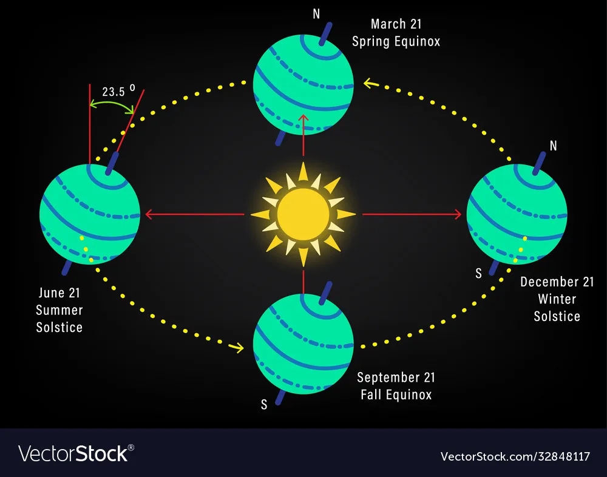
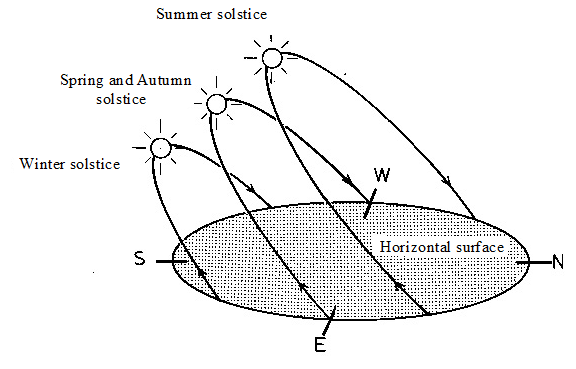

- L’asse terrestre è inclinato di circa **23,5°**
    
- Non è “dritto” rispetto all’orbita
    
- Questa inclinazione provoca:
    
    - le **stagioni**
        
    - il cambiamento dell’**altezza del Sole sull’orizzonte**
• **L'Inclinazione:** Le vostre misure di altezza solare (angolo del Sole sull'orizzonte) variano durante l'anno perché l'asse terrestre è inclinato rispetto al piano della sua orbita.

• **Il Legame con i Vostri Dati:** L'altezza massima (e minima) che avete registrato utilizzando il sestante coincide con il solstizio d'estate (Sole alto) e il solstizio d'inverno (Sole basso). Questa variazione è dovuta al modo in cui l'inclinazione dell'asse espone i nostri emisferi al Sole durante la rivoluzione.

